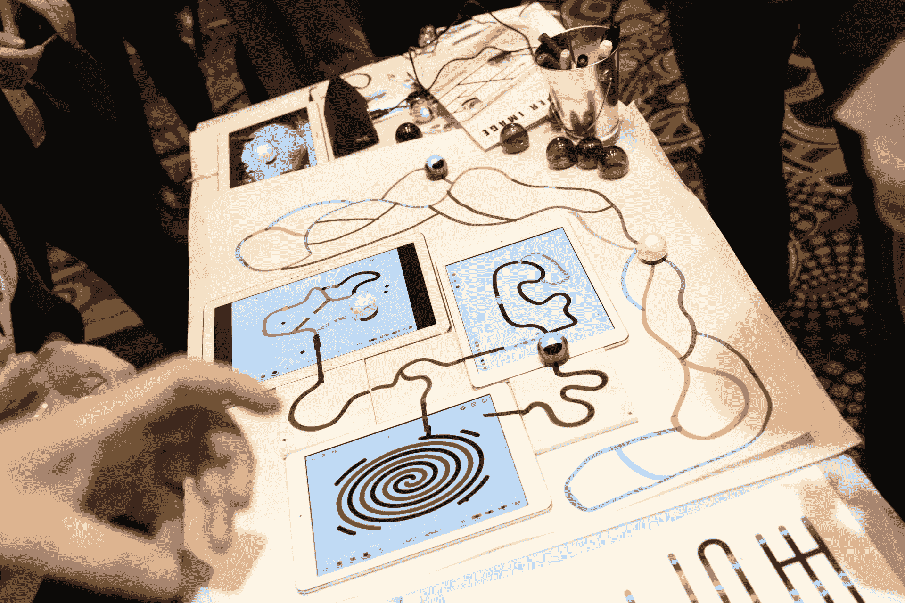

# Ozobot 的微型机器人使用弯弯曲曲的线条和谷歌的块状来教孩子们编码 

> 原文：<https://web.archive.org/web/https://techcrunch.com/2015/01/05/ozobots-tiny-robots-use-squiggly-lines-and-googles-blockly-to-teach-kids-to-code/>

【YouTube https://www.youtube.com/watch?v=CHOOA7dpaJw&w=560&h=315]

教育领域最大的变革之一是推动孩子们变得更懂计算机，然而最大的障碍之一是让学习和编写编程语言的过程变得不那么枯燥。南加州的一家初创公司找到了一种解决这一问题的创新方法，使用一个高尔夫球大小的机器人，跟随你用脂肪、彩色毡尖标记绘制的轨迹，或在平板电脑屏幕上描绘的等效物，或两者兼而有之。

这款机器人被称为 Ozobot，在去年的消费电子展上首次亮相就大受欢迎。在最近一个假期的首次销售(每个 Ozobot 50 美元，包括一些游戏、应用和其他使用它的软件)以及来自男孩女孩俱乐部、童子军国家 STEM 倡议和 SAS 课程路径等组织的大量教育支持之后，Ozobot 制造商 Evollve 推出了该产品的新版本，允许你使用谷歌用于构建可视化编程编辑器的库 Blockly 来编写 Ozobot 的命令。

新版本将于今年晚些时候推出。

Ozobot 的神奇之处在于，让它正常工作非常简单——从而迅速吸引用户并鼓励他们尝试做更多的事情。微小的 Ozobot 机器人——现在可以在 iOS 和 Android 上工作，今年晚些时候可能会在微软上工作——通过跟随你在纸上或屏幕上绘制的线条移动，你可以通过改变线条的颜色来定制它们的行为。目前的一些行动选项包括让 Ozobot 旋转一圈，或加速(涡轮增压)。

这就是编码方面的用武之地:现在你可以使用 Ozobot 机器人自带的软件“编程”机器人移动。以后会陆续到来。从长远来看，该公司告诉我，他们的计划是开放 Ozobot 的控件，以便与各种计算语言配合使用。目前，我们的目标不是教授 Python 或 C++之类的编程语言，而是让年轻人了解如何构思一系列命令，并将它们与视觉效果联系起来。

这其中也有社会因素。“孩子们变得太孤独了，所以我们真的试图用 Ozobot 专注于物理世界的一些东西，”首席执行官兼创始人 Nader Hamda 告诉我。

许多电脑游戏是为了纯粹的游戏乐趣而制作的，但正如《我的世界》所展示的那样，有时这可能会导致另一种副作用，即乐趣被重新用作教授编码和计算力学的平台。

Ozobot 采取了一种略有不同的方法:它将教育目标直接融入了产品的最初目的，同时仍然试图让它变得有趣，并让那些只想利用微型机器人的基本构建模块和可定制的弯曲线条来构思游戏的人可以使用。

Hamda 告诉我，Evollve 已经从一批天使投资者那里筹集了数百万美元的资金，现在正开始与机构风投进行谈判。

