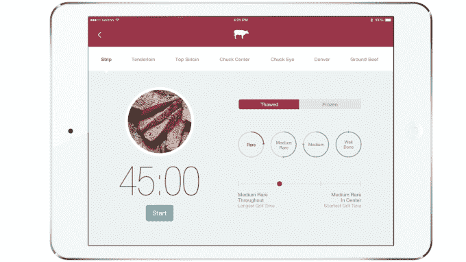

# Palate 是一款智能烤架，可省去烹饪工作 

> 原文：<https://web.archive.org/web/https://techcrunch.com/2014/09/09/palate-is-a-smart-grill-that-takes-the-work-out-of-cooking/>

虽然标准的乔治·福尔曼长期以来一直是忙碌的高管们的首选，但现在是老乔治挂靴的时候了。 [Palate Smart Grill](https://web.archive.org/web/20230216193052/http://www.palatehome.com/) 亮相 TechCrunch Disrupt SF 2014 并发布。

这款智能烤架可以根据重量、成分和所需的熟度完美地烹饪几乎任何食物，并且可以通过您的移动设备进行控制。

首席执行官埃里克·诺曼说:“有了 Palate 智能烤架，你只需在 iPad 上轻点几下就可以开始烹饪，烤架会执行精确的温度烹饪过程，完全按照你想要的方式烹饪食物。”“有了智能烤架的技术，即使客人迟到一个小时导致用餐延迟，食物也能完美烹饪；食物不可能煮得过熟或欠熟。”

[gallery ids="1053660，1053661，1053662，1053663，1053664，1053665，1053666，1053667，1053668，1053669"]

你会问，这是什么巫术？我会让诺曼解释:


palate smart grill 的精确温度烹饪方法不包括真空密封食物和将其浸泡在水中。取而代之的是，食物被放置在一个完全封闭的台面电烤架上，烤架上有烹饪板，烹饪板中嵌入了传感器，可以测量温度并将温度控制在 0.2 摄氏度以内。家庭厨师使用 iPad 来指示食物所需的熟度，这是在精确控制的低温下实现的，当家庭厨师准备好提供食物时，她可以通过在高达 600 华氏度的温度下烧烤和烧烤食物来轻松地对食物进行最后的润色，所有这些都是使用同一设备。Palate 智能烤架可以在任何温度下精确烹饪，并达到比市场上任何电接触烤架更高的温度，因此客户可以完全替换现有的烤架。

几个月前我们看到了这款设备，简而言之，它棒极了。从里面出来的食物是根据程序设定的轮廓完美烹饪的。光是灼热的功能——高温下的焦糖化过程——就非常值得门票的价格。

该产品由埃里克·诺曼、唐·诺曼和吉姆·赖克创建，今天在旧金山的 TechCrunch Disrupt 上发布。

[gallery ids="1056239，1056238，1056237，1056236，1056235，1056234"]

**评委问&答**

**问:**人们对此很狂热吗？答:人们想要美味的食物

**问:**你的目标是谁，你是怎么确定的？
**答:**我们要识别的初级用户就是这些想要最好肉的美食爱好者。人们重视方便。当他们的美食家朋友告诉他们这个的时候，他们会想要的

**问:**有哪些步骤？连我都能做这个这么容易吗？A: 只需轻轻一碰……你就能做出这种牛排，没问题

问:能说说设计吗？
**答:**真漂亮。我们希望你的柜台上有值得骄傲的东西

问:制造流程是怎样的？
**答:**对于硬件开发来说，把一些关键部分分解出来并不稀奇，所以我们已经这么做了。是我们的电子板在驱动它，我们的传感器。它有一些我们设计的机制…我们将会众筹制造(在稍后的时间)。

问:这里的技术防御能力如何？答:这项技术有几项专利……但这不仅仅是在这里或那里做一点小小的调整。为了让它正确，我们必须让一切都正确——热设计、控制算法——这样它就永远不会超调，这对这些人来说是一个巨大的转变。你必须考虑食物内部发生了什么，你甚至不能把温度计放进去

**问:**大部分处理都发生在设备上吗？
**答:**它的控制部分发生在设备上……食谱在后端。

**问:**你认为这和以前从未做过饭的人在自己家里做大厨有什么关系？
**答:**我们的 dev 主厨就是一个很好的例子……他真的被……水分流失不足而震惊了。这食物确实多汁。那些人会被吹走的

问:我能用这个做鱼吗？
**答:**鱼很神奇

**问:**你有海拔的意识吗？
**答:**这里应该不是主要影响。我们正在探测热质量和热量。我们控制所有的热量