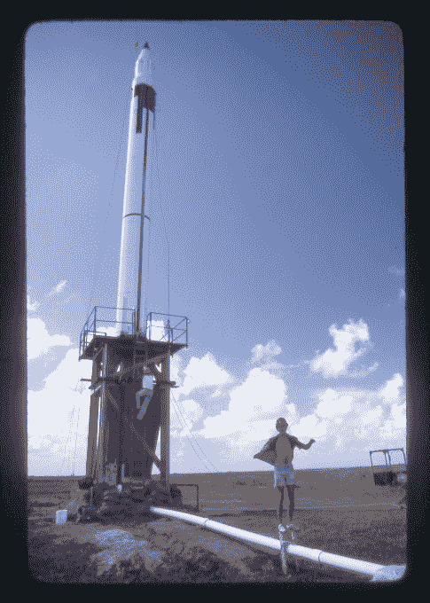
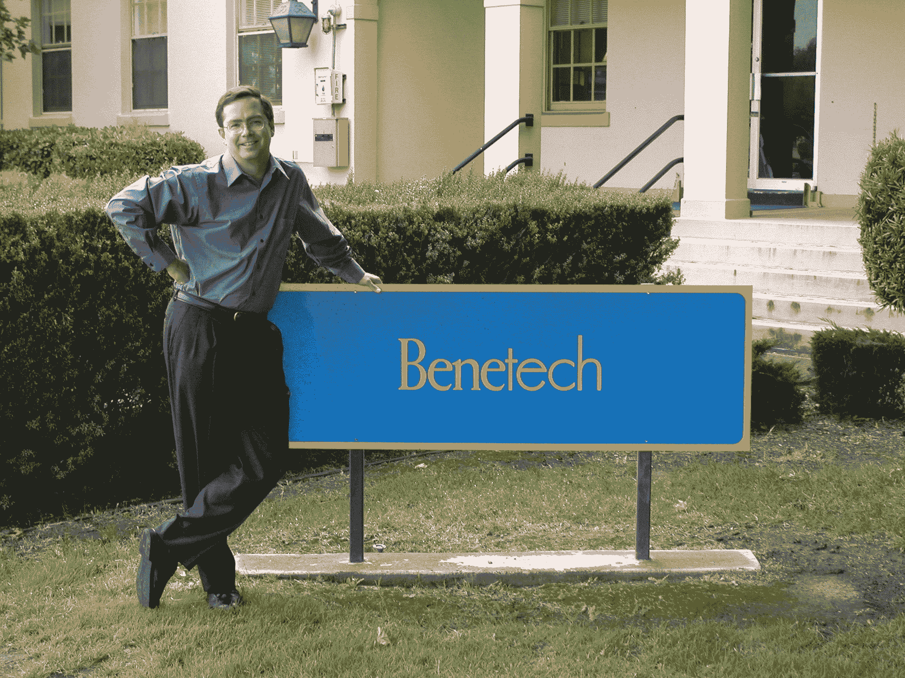

# 帕洛阿尔托非营利组织 Benetech 赢得了教育部 4250 万美元的拨款，这是对创始人 Jim Fruchterman 寻求帮助盲人的肯定

> 原文：<https://web.archive.org/web/https://techcrunch.com/2017/11/01/palo-altos-benetech-wins-42-5m-dept-of-education-contract-to-help-the-blind-read/>

总部位于帕洛阿尔托的非营利组织 Benetech 的创始人吉姆·弗鲁克曼在 9 月底收到美国教育部的一封电子邮件时松了一口气。

在联邦财政年度还剩一天的时候，该部门重新为一项长期的残疾人阅读项目提供了资金，并第三次选择了 [Benetech](https://web.archive.org/web/20230228161825/https://benetech.org/) 来运营这个为期五年、耗资 4250 万美元的项目。这意味着 Benetech 可以继续运营 [Bookshare](https://web.archive.org/web/20230228161825/https://www.bookshare.org/cms/) ，为 50 万有阅读障碍的学生提供数字材料，包括失明和阅读障碍，Fruchterman 可以忘记 Benetech 10 月份的裁员计划。

Fruchterman 今年 58 岁，是加州理工学院的毕业生，心情愉快，笑容可掬，他经常去国会山，但对他来说同样重要的是，他现在结束了。

“不得不不断回到华盛顿并说，‘嘿，我们是为盲人和诵读困难儿童服务的最大的项目，这是一个巨大的干扰。我们的成本效益比你以前做的要高 10 倍。这不是很好吗？民主党和共和党都喜欢残疾儿童，对吗？”Fruchterman 翻了个白眼，嘲笑自己的挫败感。

在硅谷竞争异常激烈的初创企业领域，弗鲁特曼是一个非常不寻常的人物，这不仅仅是因为他在华盛顿花了很多时间，或者喜欢从事公益项目。早在没有人听说过社会企业家精神的时候——企业家的能量和技能可以用于社会公益而不是投资者的利润——Fruchterman 是最早的先驱之一。与比尔·盖茨或皮埃尔·奥米迪亚等慈善界的富有技术人员不同，弗鲁特曼不会等到赚了几十亿美元后才去做好事。事实上，他从未发过财，他有意退出了硅谷的致富竞赛。

相反，Fruchterman 从硅谷的剧本中吸取了一页来解决持续的社会挑战，比如帮助残疾人阅读。他的方法是使用慈善家的资金，就像创始人使用风险种子基金来启动概念一样，然后，如果他们成功了，就筹集更多资金来实现自我维持的非营利收入模式。

Bookshare 一直遵循这一模式，从基金会拨款开始，通过即时的数字手段，为以前依赖盲文书籍和美国邮件等实物产品的盲人和诵读困难者提供阅读工具。今天，美国教育部为学生提供这项服务，成年人也可以自己订阅，每年 75 美元。

然而，Benetech 不仅仅是 Bookshare。Fruchterman 创建了该组织，以容纳一些正在进行的项目，包括人权、环境和其他领域。事实上，Benetech 为新的努力提供了孵化器，比如目前的一项倡议，即让社会服务像最近的披萨店一样容易找到，以及为需要技术帮助的非营利组织提供咨询服务。

“没有人像吉姆这样专注和专注，”斯科尔基金会总裁兼首席执行官萨莉·奥斯伯格说，“他在技术创新的商业世界和潜在的社会影响之间建立桥梁的能力是他在社会企业家领域的真正优势。”该基金会在过去十年中向 Benetech 提供了近 260 万美元的资助

赢得斯科尔奖。莎莉·奥斯伯格在左边。

这个模型也是有效的。这家拥有 70 名员工的公司去年实现了 1340 万美元的年收入，其中 80%来自 Bookshare 等运营项目。其余部分来自捐赠者，其中大部分来自硅谷。总的来说，Benetech 项目已经获得了 900 万美元的非盈利风险资本，并且已经吸引了近 1.07 亿美元的后续赠款或收入。

> 我从单个企业的企业家开始，到企业组合的领导者，再到希望帮助整个硅谷软件和数据生态系统改变弱势群体和为他们服务的社会部门的人。

Fruchterman 已经为他的工作积累了许多荣誉，包括麦克阿瑟奖学金和社会企业家斯科尔奖，但在过去一年对 Fruchterman 的一系列采访中，这些荣誉从未出现。对话倾向于他在其他非营利组织“担任一个小时的首席技术官”时学到的东西，这为他的关键见解提供了无尽的燃料:在许多非营利部门，技术的使用很少或根本不存在。

在最近的一篇文章中，Fruchterman 呼吁进行一场“[软件革命，以实现更大的社会公益](https://web.archive.org/web/20230228161825/https://www.recode.net/2017/3/22/15011658/social-sector-technology-entrepreneurs-philanthropy-investment)”，以解决“社会部门尚未从硅谷最擅长的事情中充分受益:使用软件实现规模，并使用软件解决方案中固有的数据来不断改善服务，识别新的机会并展示影响。”

这是 Fruchterman 的硅谷思想家:他今天追求的市场开放不仅仅是帮助盲人阅读，而是将良好的意图与硬技术结合起来。“这是我职业发展的一部分，”Fruchterman 说。“我从单一企业的企业家开始，到企业组合的领导者，再到希望帮助整个硅谷软件和数据生态系统改变弱势群体和为他们服务的社会部门的人。”

36 年前，这位年轻的加州理工学院毕业生同样雄心勃勃，尽管他当时的主要兴趣是火箭，或者可能获得诺贝尔奖。那是 20 世纪 80 年代初，在一个遥远的宇宙中，里根政府让私营公司开发火箭成为合法，国防支出因“星球大战”导弹防御计划而激增。

Fruchterman 当时在斯坦福大学攻读电子工程博士学位。他和他的朋友喜欢招待企业家们吃饭，一天晚上，火箭初创公司 GCH 公司的创始人加里·c·哈德森来到他们的宿舍。Hudson 在找工程师，他做了一个简单的筛选测试。他问了弗鲁特曼两个问题:

“你最喜欢的科幻小说作家是谁？”

“保罗·安德森，”弗鲁特曼回答道，并引用了《T2》《幽灵骑士》《T4》《T5》《T6》《暗影 T7》等许多作品的作者。

哈德逊表示赞同，并问道:“你最喜欢的保罗·安德森角色是谁？

弗鲁特曼回答说，那是安德森技术史系列中的[少尉弗兰德里](https://web.archive.org/web/20230228161825/https://en.wikipedia.org/wiki/Dominic_Flandry)，已故人族帝国的星际飞船飞行员出身的詹姆斯·邦德。

哈德逊摇摇头。在他看来，正确的答案是尼古拉斯·范·瑞恩(Nicholas van Rijn)这位自由主义冒险家，也是同一系列中的另一个角色。

1981

在第二个问题上，哈德逊给了弗鲁特曼一个机会，当场给他提供了一份工作。弗鲁特曼无法抗拒。哪个热爱科幻的工程师能做到？1981 年，他离开斯坦福大学，去桑尼维尔为 GCH 工作，该公司得到了休斯顿太空服务公司和一位名叫大卫·汉纳的房地产投资者的支持。不久之后，1981 年 8 月 5 日，GCH 试图在得克萨斯州马塔哥达的发射台上试射其创新的火箭发动机设计 [Percheron](https://web.archive.org/web/20230228161825/https://en.wikipedia.org/wiki/Conestoga_(rocket)) 。倒计时达到点火，但发动机在发射台上爆炸了。

Fruchterman 捡起了火箭鳍的一部分——这是一个比大多数人更好的创业纪念品——然后他和几个同事回到硅谷，试图为一家新的火箭公司筹集 2 亿美元。没有人报名，但弗鲁特曼还是决定不再继续攻读博士学位。

“天哪，”Fruchterman 坐在他的 Benetech 办公室里说，他的办公室位于绿树成荫的加利福尼亚街，离斯坦福大学校园大约一英里。“我意识到我找到了我想做的事情；比起做研究，我更喜欢做东西。

在与弗鲁特曼的交谈中，这种“天哪”的事情经常发生，就像他的阿奇漫画式的帅气和阳光的性格一样，令人信服。很难将这种感觉与固执、有原则的工程师相提并论，这位工程师不会放弃最终会改善数百万盲人生活的技术产品想法。这是在 Bookshare 之前和火箭灾难之后很久。

Fruchterman 故事的这一部分开始于 Sirloin & Brew，这是位于山景城埃尔卡米诺的硅谷聚集地，现已停业。Fruchterman 和他的一位来自 GCH 的同事 Dave Ross 会见了惠普芯片设计师 Eric Hannah，他有一个芯片的新想法，这种芯片可以与扫描仪和软件一起工作，以识别打印页面上的字符。

“我对这个想法感到非常兴奋，”Fruchterman 说，“因为我在大学时有这个想法，用模式识别为盲人制造阅读机器，汉娜说他有办法做到这一点。”

Fruchterman 与 Ross 和 Hannah 一起发现了后来成为 Calera 识别系统的东西，在那里他们推出了首批 OCR 技术之一，该技术使用机器学习来“阅读”几乎任何文字，而不仅仅是预编程的文字。

“我们所做的是收集几百万个字符的例子，对它们进行比较，将它们聚集在一起，然后建立一个算法，它会说，‘这看起来像一个 A’，尽管它以前从未见过这种字体。”

在 Calera 的前七年，Fruchterman 一直在思考 OCR 技术如何帮助盲人。1987 年，在 OCR 技术运行良好后，Fruchterman 和工程副总裁 Ross 决定建立一个 skunk works，以研究他们是否可以让 OCR 技术与 Votrax 一起工作，VO trax 是一种早期的 PC 语音合成器技术。

“这听起来真的很糟糕，”Fruchterman 说，“但我们可以扫描一页，语音合成器可以读回来。”他和罗斯终于有了一个可以用电脑和扫描仪向盲人大声朗读文本的原型。

Fruchterman 带着演示去了 Calera 董事会，完全期待着立即进入市场。相反，董事会问市场有多大。Fruchterman 回应说，这可能是一个 100 万美元的市场，实际上低估了 5 倍，尽管 Fruchterman 认为市场规模不是问题所在，帮助盲人阅读才是问题所在。董事会不这么看。Calera 从投资者那里获得了 2500 万美元，他们预计 Calera 将获得巨额回报。小市场不是获得 20 倍回报的途径。

“我们吵了一架，”弗鲁特曼回忆道。“我是说，‘但是盲人需要它。’他们说，‘是的，但是我们创造了就业机会，我们正在为养老基金投资，我们必须赚钱来实现我们的社会目标。致力于一个一年一百万美元的产品会让我们无法赚到我们承诺用投资换来的所有钱，这是一个相当公平的说法。我不能真的不同意，但我也有点去，'哇。所以好的技术不会被制造出来。那确实激怒了我。"

弗鲁特曼辞职了。他在卡莱拉工作了七年，做过几份工作，从首席财务官到营销副总裁，并准备好迎接新的挑战。他也下定决心要造一台阅读机器，所以他向董事会提出了一项建议，希望能在不损失自己财产的情况下制造出这台阅读机器。

作为某些竞业禁止的交换，Calera 同意以略高于成本的价格许可他使用 OCR 技术，以便 Fruchterman 可以创建两家公司:一家是盈利性的，将 OCR 用于邮政应用(这是 Calera 选择不追求的市场)，另一家是非营利性的，为盲人制造阅读机器。Fruchterman 分别创建了 RAF 和 Arkenstone，并成为这两家公司的首席执行官。

“我告诉我的妻子，我只会做 501c3 一年左右，然后全职回到常规技术部门。但最终我两者都做了六年，才意识到我必须做出选择。”

阿肯斯通的表现比弗鲁特曼希望的要好。他以不到一半的价格向盲人客户提供了 Calera OCR 技术，这是一种标价为 6000 美元的 PC 协处理器卡，并附赠了 DECtalk 语音合成器。Fruchterman 预期的市场迅速起飞。三年后，阿肯斯通获得了 500 万美元的收入和 501c3 的地位，这在美国国税局眼中是一只奇怪的野兽，在那些日子里，501c3 的地位与医院和慈善机构联系在一起。这引发了美国国税局的审计，阿肯斯通顺利通过了审计。

> 对我来说，很明显我更喜欢做有益的技术工作，而不是常规的盈利性工作。

在经营英国皇家空军和阿肯斯通公司几年后，Fruchterman 意识到他不会像对妻子承诺的那样回到正规的技术工作岗位，他想完全专注于阿肯斯通公司。这样做的金融开放是以典型的硅谷方式出现的:1995 年，他的前雇主 Calera 被其竞争对手，传奇的罗伯特·诺伊斯公司 Caere 收购，Fruchterman 的股份被收购。

这笔不算大的(以今天的标准来看)60 万美元的意外之财足以扩建他在帕洛阿尔托米德尔菲尔德路的两居室、一个卫生间的牧场式住宅，并帮助送他的三个孩子上大学。

“我妻子和我说，‘哎呀，我们想不想多赚几百万？’我意识到我可能会在英国皇家空军呆很多年，但我真的觉得技术永远是我的，而不是购买硅谷连续企业家的老鼠赛跑。他从盈利性的英国皇家空军(RAF)辞职，专注于阿肯斯通，该公司仍是一家运营公司。

“我的朋友们都很震惊，”他说，“但对我来说，很明显我更喜欢做有益的技术，而不是常规的盈利性工作。它们都很有挑战性，坦率地说，我看到了一块休闲地。其他人都挤在盈利领域，总是试图说服风投投资更多的钱，而在这里，没有人在技术领域永远存在，你可以产生很大的影响。真正改变的是财务设定点。我从“如何实现高利润的投资”转向“如何实现盈亏平衡的良好投资”。(答案是)放弃赚钱，只做好技术，想办法实现收支平衡。”

“为什么会有人这么做？”当然，这是一个显而易见的问题。硅谷的人不都梦想着发财吗？

Fruchterman 从两个方向来回答这个问题:家庭和学校。他在芝加哥郊外的一个天主教家庭中长大，有六个孩子，他的父亲是国际收割机公司的律师，所以服务的理念是他家庭精神的一部分。技术是家庭谈话中的一个大话题，但“对我们来说，创业意味着拥有一家干洗店或一家中餐馆，我们有点想，‘你为什么要这么做？’另一方面，我们家总是期望你会做好事。那是真的。"

作为一名高中生，Fruchterman 说他也对他所在的天主教男子高中 St. Viator 的例子印象深刻，那里的老师“过着服务和回馈的生活”。他们和我一样热爱计算机和数学。他们真的是很好的榜样，本来可以有更赚钱的职业，但他们选择了教育。”

数学系的系主任在大二的时候让他学习微积分，并把他带到了加州理工学院，通过背诵加州理工学院的“欢呼”来逗乐这个年轻的 Fruchterman，这首歌也挂在办公室的墙上:

*“余弦，正切，双曲正弦，*
*三点一四一五九*
*E 到 X DY DX*
*滑尺，Slipstick，*
*Tech，Tech，Tech！”*

“首先，我是一个科技极客，”弗鲁特曼喜欢说，“不是一个社会活动家，”这是这位加州理工学院毕业生最自豪的话，但毫无疑问，社会问题拥有他的想象力和生活目标。

即使在他全职在阿肯斯通为盲人开发技术产品后，他也在不停地寻找新的问题来解决。侵犯人权的行为名列前茅，特别是在 20 世纪 90 年代初揭露了掩盖 1981 年萨尔瓦多大屠杀的真相之后，在那次大屠杀中，萨尔瓦多士兵杀害了至少 800 名平民。

他想知道技术是如何防止这种悲剧的，他和一个朋友在斯坦福碟形小径上散步很长时间——硅谷的许多想法都是在这里形成的——头脑风暴极不可能的高科技解决方案，包括保护弱势群体的力场。他的结论是，真正的机会是提供关于滥用的及时、可操作的信息。埃尔莫佐特的行凶者和其他人一样被时间的流逝所掩盖。

Fruchterman 有一些关于技术如何能有所帮助的想法，他把这些想法告诉了像大赦国际和人权观察这样的组织。他惊讶地发现“他们的技术水平真的很低，他们想要帮助，但没有钱。”弗鲁特曼想帮忙，但阿肯斯通也没钱。

2000 年初，Fruchterman 有了一个意外的突破，就像 Caere 收购 Calera 一样，将创造一个处理更多项目的机会。一位名叫迪克·钱德勒的商人突然提出以 500 万美元收购阿肯斯通。钱德勒还承诺继续生产阅读机器。Fruchterman 接受了这一提议，并用这笔资金入股了一家名为 Benetech 的新 501c3 公司，该公司借鉴了硅谷的一切，除了利润动机。

“本质上，我们采用了标准的风险投资模式，并为了社会公益而调整了每一项投资标准。Benetech 所做的是指挥同样的一套人才和动力。只是财务设定点不同而已。我们希望创建盈亏平衡的好企业。”

2001 年，吉姆在莫菲特菲尔德原贝内泰克公司的办公室

Fruchterman 利用 1999 年网络泡沫破裂的机会，以很高的租金租下了公司目前的办公室(包括小隔间！)并开始了两条轨道:一条是筹集所谓的风险资本——实际上是来自捐赠者的限制性和非限制性赠款——因为 500 万美元不会持续太久，第二条是启动项目。

其中一个项目是他工作的下一个阶段，通过数字化几乎所有的阅读材料来帮助盲人阅读，从数字音频书籍(以前是磁带)到驱动电子机械盲文阅读器的数字盲文文件(以前是盲文书籍)，再到面向阅读障碍读者的基于 iPad 的听和跟读系统。

斯科尔基金会、T2 奥米迪亚网络和社会利润网络投入了近 400 万美元来开发这项技术，2007 年，Benetech 赢得了教育部的第一份 Bookshare 合同。

Brian Meersma 是 Bookshare 的一名受益者，他是康奈尔大学的一名大四学生，正在学习工业和劳工关系，患有阅读障碍。梅尔斯马从小学开始就是 Bookshare 的客户，在小学时，他的残疾非常严重，基本的理解都是一个挑战。

“为了得到单词，我不得不读得很慢，以至于我不知道它的意思，”他说。如今，梅尔斯马通过 Bookshare 获得了他的教科书和阅读乐趣，book share 有一种适用于 iPads 的模式，将加速音频与文本相结合，并与音频同步突出显示。梅尔斯马经常向 Bookshare 团队发送改进服务的想法，并请求向图书馆添加新书。

“在很多方面，”梅尔斯玛说。“Bookshare 真的给了我上大学的机会。能够进入一个我可以自己阅读的图书馆真的打开了可能性。”

人权是 Benetech 的另一个早期目标，Fruchterman 在 2002 年聘请了人权数据方面的领先专家 Patrick Ball，将他的[人权数据分析小组](https://web.archive.org/web/20230228161825/https://hrdag.org/) (HRDAG)纳入 Benetech 的保护伞下，他们在那里工作了 12 年，研究数据问题，如估计无法进入的战争地区的平民死亡人数，并开发了 [Martus](https://web.archive.org/web/20230228161825/https://www.martus.org/overview.html) ，这是一种自我加密和自我复制的信息收集和管理工具，帮助人权调查人员保护他们的数据免受窥探。

Martus 代表了 Fruchterman 认为可能有助于人权调查人员更快地揭露 El Mozote 事件，并可能使萨尔瓦多内战更快结束的那种工具。世界上数百个人权组织试用了 Martus，其中几十个将该工具投入常规使用，特别是在危地马拉、缅甸和中非国家。

“Martus 从未出现过与安全相关的错误，这是 Benetech 工程师的功劳，”Ball 说。他补充说，与此同时，Martus 并没有像他最初希望的那样被广泛采用。“我们发现很难让人们使用他们不熟悉的工具，”鲍尔说，“新工具确实会增加焦虑。许多人只是更喜欢使用 YouTube、WhatsApp 等熟悉的工具，或者仅仅是纸张。

此外，在过去十年中，随着威胁的性质发生显著变化，移动平台在默认情况下也变得更加安全。Martus 的最初设计适用于“砸了就抢”的情况，如秘密警察占领电脑或入侵服务器，但今天，鱼叉式网络钓鱼攻击可以在设备上放置恶意软件以读取机器内存中的数据，这种威胁超出了 Martus 的范围。

在鲍尔看来，马特斯的经历是一个警示性的故事。即使最好的技术和最好的意图有时也不会带来预期的结果。鲍尔在挑战他的福音派技术专家朋友和前同事吉姆·弗鲁特曼时，将这一观察进一步发展，他认为社会部门的一些技术创新实际上可能对一些社区是危险的。

例如，关于边缘群体的数据和机器学习，如无家可归者或贫困社区的居民，可能最终会落入警察手中或告知“预测犯罪”算法。“冒险从这里走到那里是硅谷所喜欢的，”鲍尔说，“但是(在许多项目中)风险不是由破坏的人来承担，而是由被破坏的社区来承担。这正是我担心的。”

Fruchterman 描述 Benetech 多年来的项目就像风险投资家描述他们的投资组合一样:任何数量的失败，一些单打和双打，以及非常少的本垒打，Bookshare 更像是一个大满贯。

Fruchterman 这些天四处旅行，希望找到愿意资助新项目的捐助者，并向其他社会企业家和技术换福利倡议学习。他的梦想是筹集更多的风险资本，这样他的 Benetech 团队就可以开发出更多的原型解决方案，从而引领下一个 Bookshare。

例如，有没有可能为社交服务创建一个智能搜索界面？今天，需要服务的人不容易发现他们能得到什么。谷歌已经掌握了日常消费服务，Fruchterman 正在与该领域的玩家合作，试图统一他们的工作和数据集。或者，如果有更好的方法来跟踪客户群体，他们无家可归的原因，并标记进展，无家可归的问题也许可以得到解决。这是 Fruchterman 清单上的另一个重点。

如果 Fruchterman 知道一件事，那就是高影响力的项目需要大量的时间和金钱来带来持久的有意义的改变。Bookshare 是 Fruchterman 年工作的成果，于 2007 年与教育部合作推出。他的前同事鲍尔指出，贝内泰克的成功与科技一样，也与时间和考验密切相关。

“这些问题不是一夜之间就能解决的，”鲍尔说。“Benetech 的强大优势在于它的坚持不懈，这使得它能够与许多人接触，并进行大量的迭代。”

这些漫长的周期表明进展缓慢，除非有更多的 Benetechs 参与进来。好消息是 Benetech 不再孤单。“在最初的 10 年里，”Fruchterman 说，“我们认为我们是唯一的。现在，其他团队正在崛起，我看到斯坦福、伯克利和圣克拉拉大学的教学质量大幅提升。”

斯科尔的萨利·奥斯伯格也看到了变化的竞技场。

“像吉姆这样的人可以释放出难以置信的潜力，”她说，“正在成长的一代看到了这种潜力。我们看到不可思议的人才被吸引到非营利组织，就像他们被吸引到商业部门一样。”

Fruchterman 的例子，比他的下一首单曲或全垒打，可能是他离开科技界最重要的平台。