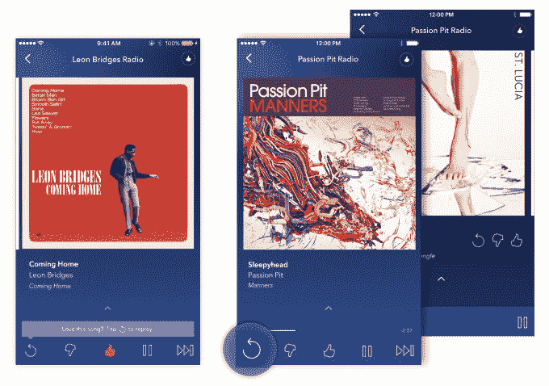

# Pandora 推出每月 5 美元的流媒体服务，提供更多的跳过、重播和离线访问 

> 原文：<https://web.archive.org/web/https://techcrunch.com/2016/09/15/pandora-debuts-a-5-per-month-streaming-service-with-more-skips-replays-and-offline-access/>

证实早先的报道，潘多拉今天宣布推出一项名为“潘多拉 Plus”的新付费音乐服务。虽然这项服务没有提供 Spotify 的真正替代方案，但在点播收听方面，每月 4.99 美元的新无广告选项提供了更广泛的功能，包括跳过更多歌曲、更多重播和支持离线收听。

这项新服务将取代现有的付费选项 Pandora One，后者只专注于消除广告。

就在几天前,[公司证实](https://web.archive.org/web/20221206012253/http://press.pandora.com/phoenix.zhtml?c=251764&p=irol-newsArticle&ID=2201429)已经从三家顶级版权持有者——索尼音乐公司、环球音乐公司和代表大约 20，000 名独立音乐人的梅林网络公司——那里获得了音乐许可证。此外，潘多拉还与索尼旗下的分销商 Orchard 以及其他 30 多家独立唱片公司和分销商达成了协议。

人们的理解是，获得这些许可证将使该公司能够扩大业务，以更好地与 Spotify 和 Apple Music 等点播服务竞争。

据 Billboard 的消息来源称，这一声明似乎也给华纳音乐带来了压力，潘多拉也曾与华纳音乐进行过谈判。鉴于该公司现在宣布了这一新的付费层级，而不是其价格更高的直接竞争对手 Spotify，与其点播服务相关的最终交易似乎仍将到来。( ***更新*** : [华纳交易完成](https://web.archive.org/web/20221206012253/http://www.recode.net/2016/9/15/12933446/pandora-warner-deal-launch))。

也就是说，Pandora 今天还宣布按需选项将于今年晚些时候推出。

来自华尔街日报的一份报告称，每月 10 美元的点播服务将与 Spotify 正面交锋，并将为听众提供数千万首歌曲。

另一方面，Pandora Plus 有大约 200 万个目录，但该公司表示，随着时间的推移，它将变得更大。

“但对我们来说，这真的不是数量，而是图书馆的质量——围绕曲目的策展，”潘多拉产品副总裁克里斯·贝切勒说，他从 Rdio 收购案加入公司。“通过这些新的合作伙伴关系，我们能够利用该库开发更多有趣的功能。”

他举例说:“重播你最喜欢的歌曲的功能是网络电台以前没有的。”

与此同时，离线收听选项将在您失去连接时播放一条简短的信息消息，然后无缝地将您切换到您的四个最佳电台之一，包括您的个性化拇指纹电台和您经常收听的其他电台。

Pandora 的扩张正值许多消费者转向点播流媒体而不是广播服务之际。 [Spotify 本周宣布](https://web.archive.org/web/20221206012253/https://9to5mac.com/2016/09/14/spotify-40-million-subscribers/)其付费用户从今年 3 月的 3000 万上升到 4000 万。相对较新的苹果公司在 iPhone 7 发布会上说，现在有 1700 万人订阅苹果音乐，高于 4 月份报告的 1300 万人。

Pandora 拥有 7810 万用户，但只有大约 400 万人购买 Pandora One。它的用户增长也放缓了，这导致去年 11 月在宣布上一季度听众人数下降后股价下跌。

该公司认为，凭借新的 Pandora Plus，中端产品将吸引更多客户。Becherer 解释说，典型的美国消费者每年在音乐上的花费是 40 到 60 美元——为 Spotify 付费每年大约 120 美元。

“Pandora Plus 更接近人们传统上在音乐上花费的甜蜜点，”他说。

## 面向广告支持客户的视频广告

除了推出每月 5 美元的选项，该公司表示，现在还将为现有的广告支持选项引入新功能。

例如，听众现在可以通过选择视频广告来更好地控制他们的广告体验。这样，他们就可以跳过更多的歌曲，重放更多的歌曲，而不用每月支付费用。

该功能类似于之前推出的“赞助收听”，通过观看视频可以暂时消除广告。

潘多拉通过观察用户的使用行为，聪明地瞄准了这些追加销售的用户。然后，它将根据用户在应用程序中的操作，决定是否显示赞助收听的追加销售、更多跳过和重放的选项，甚至是对 Pandora Plus 的更大升级。

该公司表示，对于潘多拉的广告商来说，视频广告是一种接触更投入、更专注的受众的方式。

这款产品和 Pandora Plus 一起将于今天发布，并在“未来几个月”在 iOS 和 Android 上向移动设备用户推广。潘多拉一号的用户将在这段时间内过渡到新的潘多拉 Plus 服务。

对于澳大利亚和新西兰的客户来说，这两款新产品要到 2017 年才会上市。