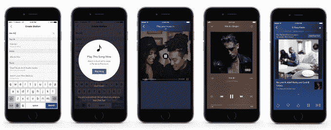
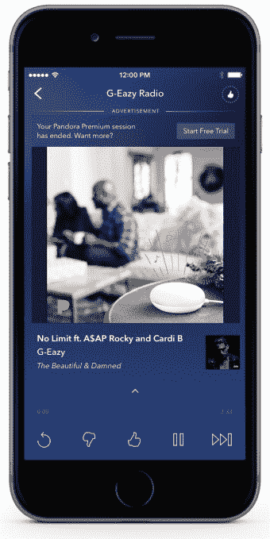
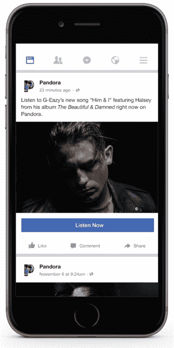

# Pandora 的听众现在可以通过观看视频广告来点播音乐

> 原文：<https://web.archive.org/web/https://techcrunch.com/2017/12/14/pandora-listeners-can-now-watch-video-ads-to-access-on-demand-music/>

流媒体广播和音乐服务 Pandora 今天推出了一种新的方式，让人们无需升级到 [Premium](https://web.archive.org/web/20230307142250/https://www.pandora.com/upgrade/premium) 订阅即可获得点播音乐。电台听众和 Pandora 的中端产品 Pandora Plus 的用户将首次可以选择观看视频广告，以开启点播收听会话。

该公司在其[公告](https://web.archive.org/web/20230307142250/http://blog.pandora.com/us/unlock-access-to-on-demand-listening-experiences/)中解释说，当用户在应用程序中搜索特定的歌曲、专辑或播放列表时，该功能就会出现。然后，他们会看到观看 15 秒视频广告的选项，以解锁免费的点播会话。(广告本身的长度实际上可能是 30 秒，这取决于广告商，但用户可以跳过其余部分，并在 15 秒后解锁会话)。

今年早些时候在 T4 推出的 Pandora Premium 是音乐服务对 Spotify 和 Apple Music 的回应。每月 9.99 美元的服务让 Pandora 用户能够搜索和播放任何歌曲，并创建自己的播放列表。

付费层的加入使得潘多拉今年的应用内订阅收入有所增长——它甚至在第三季度将网飞从 App Store 的票房冠军宝座上赶了下来。该公司还报告称，第三季度付费用户数量有所增加，从 2016 年第三季度的 401 万增加到 2017 年第三季度的 519 万。

然而，潘多拉的大部分收入仍然来自其广告业务——例如，在第三季度，潘多拉 3.786 亿美元的收入中有 2.757 亿美元与广告相关。Pandora 的大多数用户也支持广告。该公司报告第三季度活跃听众人数为 7370 万，低于去年同期的 7790 万；与此同时，用户总数增至 519 万。

这就是为什么该公司有理由加倍投放广告，将用户转化为优质听众——或者至少通过挖掘用户对点播的兴趣来产生额外的广告收入。

潘多拉总裁兼首席执行官罗杰·林奇在一份声明中说:“我们广告支持的听众的最高要求一直是能够直接播放他们想要的特定歌曲、专辑或播放列表。这些新功能通过将基于奖励的广告与我们通过 Pandora Premium 创建的一流点播体验相结合来满足这一需求。这种无与伦比的体验将把听众带到潘多拉星球，并提高溢价意识，同时也为艺术家、唱片公司、出版商和广告商创造新的机会。"

公司[指出](https://web.archive.org/web/20230307142250/http://pandoraforbrands.com/insight/products_the-new-value-exchange/)20 至 49 岁的用户对这类广告更感兴趣，67%的人“更倾向于移动奖励视频广告，而不是其他类型的广告，如不可错过的预滚动广告。”潘多拉表示，Z 世代用户(16 至 19 岁)更喜欢移动付费广告的可能性是其他人的 3 倍。

Pandora 告诉我们，除了搜索内容和获得解锁点播流媒体的提示之外，免费会话也可以通过从外部链接进入应用程序来触发。

Pandora 说，这个通过外部链接开始流的选项是为艺术家设计的功能。

“我们的广告支持用户在我们的优质产品中搜索和播放歌曲的能力不仅对听众来说是改变游戏规则的，对艺术家和广告商来说也是如此，”Pandora 的首席产品官 Chris Phillips 指出。“对于艺术家来说，它为粉丝提供了播放他们音乐的直接链接，从而创造了新的推广途径。对广告商来说，它为品牌建立信任、为受众创造价值提供了新的途径。”

与一些竞争对手不同，流媒体会话包括对背景音乐的支持，还为用户提供了其他 Pandora 功能，如潘多拉音乐基因组项目提供的个性化自动播放选项，该选项将通过独特的推荐接管你的流媒体。用户还可以在空闲时间创建自己的播放列表，下次回来时可以收听。

我们问 Pandora 它是如何定义一个会话的，并被告知它将“持续比一两首歌更长的时间。”我们知道 Pandora 现在实际上仍在测试会话长度，虽然会话最终可能会更长，但不太可能短于几首——比如 3 或 4 首——歌曲。在发布时，Pandora 将测试 15 分钟、30 分钟和 60 分钟的会话长度。

当会话结束时，用户可以立即选择观看另一个视频继续。

这不是 Pandora 第一次提供视频广告来解锁付费功能。相反，新的视频广告是潘多拉现有的[视频加](https://web.archive.org/web/20230307142250/http://pandoraforbrands.com/solution/video-plus/)产品的扩展，于今年 9 月推出。这种广告产品今天已经被用于允许听众观看视频广告，以便访问仅订阅的功能，如跳过更多歌曲或重播曲目。

在今天发布之前，点播视频广告选项已经进行了几周的测试，四分之二的用户接受了奖励，大约 90%的用户观看了至少 15 秒的广告。