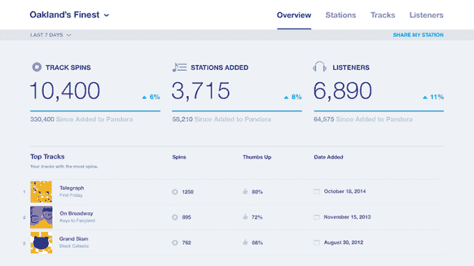

# Pandora 现在向音乐人提供观众数据 

> 原文：<https://web.archive.org/web/https://techcrunch.com/2014/10/22/pandora-now-offers-listening-data-to-musicians/>

# 潘多拉现在向音乐人提供观众数据

Pandora 刚刚宣布了一个名为[的艺术家营销平台](https://web.archive.org/web/20221208074356/http://amp.pandora.com/)，为在互联网广播服务上播放音乐的每个人提供各种听众数据。

在[宣布 AMP](https://web.archive.org/web/20221208074356/http://blog.pandora.com/2014/10/22/artists-on-pandora-introducing-amp/) 的新闻稿中，Pandora 表示该平台将提供每首歌曲的数据(包括总播放次数和竖起大拇指的次数)，以及为每位艺术家创建电台的粉丝数量，以及他们的听众的地理和人口统计数据。

为了让[为新服务](https://web.archive.org/web/20221208074356/http://blog.pandora.com/2014/10/22/artists-on-pandora-introducing-amp/)做宣传，联合创始人蒂姆·韦斯特格伦(Tim Westergren)引用了他自己作为一名音乐家的经历——他回忆起从旧金山开车到特柳赖德去参加一场只有 15 人参加的演出，尽管花了几个小时飞来飞去，分发打印好的邀请函。

“我们当时真的不知道更多，”他说，暗示如果他的乐队有更好的数据，它可能会做出更明智的决定。

威斯特伦接着说道:

> 有了 AMP，我们希望通过消除猜测，让艺术家们日复一日的工作变得更加轻松。从找出哪些歌曲表现良好，以通知单曲或集合列表，到映射艺术家的粉丝群以通知巡演日程，我们的最终目标是帮助所有艺术家建立和维持他们的职业生涯。

多年来，潘多拉一直受到音乐人和其他人的批评，他们说流媒体音乐服务没有支付足够的版税。(也许最令人难忘的说法是，大卫·拜恩提到了 Spotify 和 Pandora，他认为“[互联网将吸走世界上所有的创造性内容](https://web.archive.org/web/20221208074356/http://www.theguardian.com/music/2013/oct/11/david-byrne-internet-content-world)”)有了这些新工具，Pandora 或许能够提出一个更有说服力的论点，即它为音乐人提供了超越金钱支付的价值。

我还猜测，这些数据最终也可能与[潘多拉的新广告产品](https://web.archive.org/web/20221208074356/http://www.adweek.com/news/technology/brands-give-out-one-hour-free-music-new-pandora-ads-160822)有关。

然而，该公司似乎没有为这些音乐人增加任何直接赚钱的方式——当[AMP 主页](https://web.archive.org/web/20221208074356/http://amp.pandora.com/)提到获得报酬时，它只是通过 SoundExchange 提醒访问者该公司现有的版税系统。