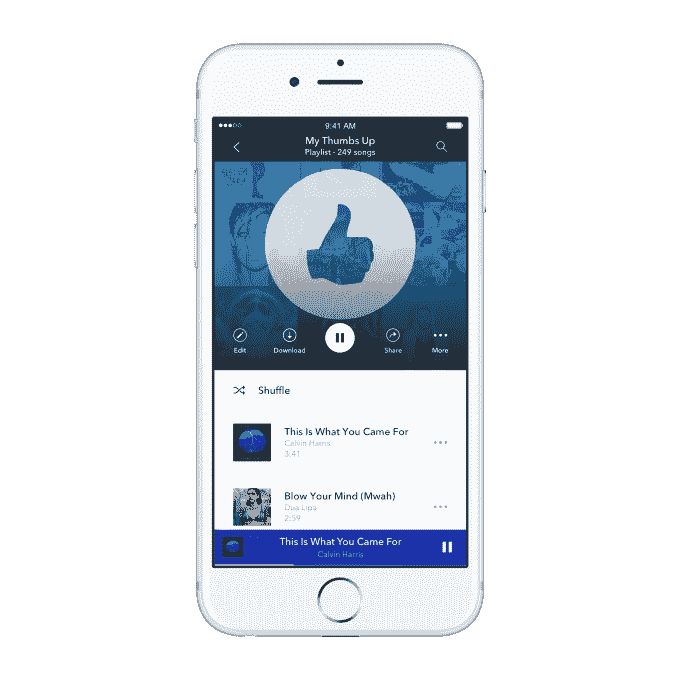

# Pandora Premium 向所有人开放，不再需要邀请 

> 原文：<https://web.archive.org/web/https://techcrunch.com/2017/04/18/pandora-premium-opens-to-all-invites-no-longer-needed/>

该公司的付费点播服务、Spotify 的竞争对手 Pandora Premium 今天对所有用户开放。这项服务从技术上讲是在 3 月在[推出的，但是要求用户申请加入邀请，因为它已经扩大到更广泛的公共可用性。](https://web.archive.org/web/20230128093035/https://techcrunch.com/2017/03/13/pandoras-on-demand-music-service-finally-arrives/)

这项服务本身本质上是 Pandora 自己对点播音乐的旋转，提供类似收音机的收听以及搜索和播放任何歌曲和建立播放列表的能力。它每月收费 9.99 美元，与目前市场上的其他产品持平，包括 Spotify 和 Apple Music。

然而，Pandora Premium 并不是 Pandora 唯一的付费层级。该公司此前推出了 [Pandora Plus](https://web.archive.org/web/20230128093035/https://techcrunch.com/2016/09/15/pandora-debuts-a-5-per-month-streaming-service-with-more-skips-replays-and-offline-access/) ，这是一项每月 5 美元的服务，包括更广泛的功能集——比如跳过更多歌曲、访问更多重播和离线收听。这项服务推出时只有大约 200 万首曲目，而 Premium 上有 4000 多万首。但该公司表示，如今这两种服务提供的内容数量相同。

这项优质服务与竞争对手相比有一些优势，包括其吸引人的设计，这要归功于 2015 年收购的精心打造的 Rdio [及其团队的人才，以及其根据用户在 Pandora 热门广播应用程序上的长期收听历史提供的建议。潘多拉正在关注这些推荐，除了一组你可能喜欢的歌曲之外，还包括新专辑的建议。](https://web.archive.org/web/20230128093035/https://techcrunch.com/2015/11/16/confirmed-pandora-buys-key-rdio-assets-for-75m-in-cash-rdio-files-ch-11-to-shut-down/)

潘多拉还表示，它已经过滤了目录，删除了阻碍其他服务的“卡拉 ok 曲目、山寨封面和宠物声音”，并使用其“音乐基因组计划”技术来帮助用户自动建立他们的播放列表。

然而，尽管其电台应用程序很受欢迎，潘多拉仍在点播音乐领域进行追赶。这项服务现在每月有 8100 万听众，但其中只有一小部分是付费用户。(448 万订阅潘多拉 Plus)。相比之下，Spotify [最近](https://web.archive.org/web/20230128093035/https://techcrunch.com/2017/03/02/spotify-50-million/)的付费用户达到了 5000 万，而 Apple Music】截至 12 月已经发展到的 2000 万订户。

与此同时，最近有[报道称](https://web.archive.org/web/20230128093035/https://techcrunch.com/2017/04/13/pandora-becomes-the-latest-tech-company-to-turn-to-private-equity/)Pandora 正在收购私募股权以扩大业务。

潘多拉[以一场营销活动“听起来像你”拉开了 Premium 今天公开发布的序幕，其中包括大肖恩、街头霸王乐队、米兰达·兰伯特、Questlove、2 Chainz、Amine、Bishop Briggs、Brett Eldredge、Daya、Halsey、凯斯·厄本、Kelsea Ballerini、Lil' Yachty、Maggie Rogers、Nicky Jam、皮特保罗、托马斯·瑞德和齐格·马利等艺术家的参与。](https://web.archive.org/web/20230128093035/http://blog.pandora.com/us/sounds-like-you/)

该活动涉及数字广告、广告牌、影响者计划和社交媒体整合，包括 Snapchat 镜头和滤镜以及定制的 Twitter 表情符号。潘多拉说，广告将鼓励用户查看精选的混音带。

Pandora Premium 现在在 iOS、Android、Chromecast 上运行，并通过 Android Auto、苹果 CarPlay、通用、本田、现代、JVC Kenwood、先锋和斯巴鲁集成到汽车中。它将在未来几个月出现在桌面和其他连接设备上。

[https://web.archive.org/web/20230128093035if_/https://www.youtube.com/embed/4mH1oTMuXEE?feature=oembed](https://web.archive.org/web/20230128093035if_/https://www.youtube.com/embed/4mH1oTMuXEE?feature=oembed)

视频