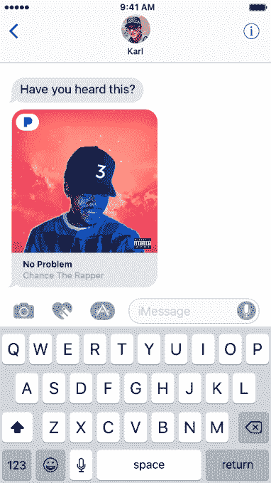

# Pandora 的新 iMessage 应用程序可以让你用短信发送你最喜欢的音乐

> 原文：<https://web.archive.org/web/https://techcrunch.com/2016/10/13/pandoras-new-imessage-app-lets-you-text-your-favorite-music/>

藏在昨天发布的 Pandora 更名应用程序中的还有它的第一个 T2 iMessage 应用程序 T3。该公司表示，事实上，这是第一个推出自己的 iMessage 扩展的第三方流媒体音乐服务。

当然，这并不是说它是唯一一款专注于音乐的 iMessage 应用。

Apple Music 已经可以让你在 iMessage 中分享你最喜欢的歌曲， [Shazam 最近推出了一个类似的工具](https://web.archive.org/web/20230313195359/http://venturebeat.com/2016/10/10/shazam-for-imessage/)，可以直接在 iMessage 中检测和发送歌曲。

然而， [Pandora 的 app](https://web.archive.org/web/20230313195359/https://itunes.apple.com/us/app/pandora-free-music-radio/id284035177?mt=8) 工作方式略有不同。

Shazam 和 Apple Music 的 iMessage 扩展都在用户与朋友分享曲目预览后将用户指向 Apple Music 和 iTunes。

与此同时，Pandora 的应用程序还允许你在聊天线程中发送 30 秒的样本，但如果接收者喜欢这首歌，他们可以点击它来创建一个基于该共享曲目的 Pandora 艺术家站。

如果双方都安装了 Pandora 应用程序，体验会更好，尽管接收者不需要登录才能听到曲目(只需启动电台。)该公司指出，如果你的共享对象没有安装 Pandora，系统会提示他们下载。

显然，通过共享音乐片段播放艺术家电台不如直接找到艺术家并听他们的整首歌、专辑或目录有用，因为这是一种点播服务。然而，鉴于 Pandora 的安装基数超过 7800 万用户，更有可能的是，你的朋友在他们的手机上安装了 Pandora，而不是任何其他第三方音乐服务，包括截至 9 月份拥有 4000 万订户的 Spotify，甚至是在 iPhone 7 发布会上宣布订户已增至 1700 万的 Apple Music。

为了分享歌曲，你只需在手机上播放潘多拉电台时启动 iMessage 应用程序。

[gallery ids="1401045，1401048，1401046，1401044，1401049"]

当前曲目会立即在 iMessage 扩展中的“正在播放”下弹出。潘多拉的策展人还会精心挑选适合分享的歌曲，包括当前热门歌曲和流行歌曲。

作为奖励，该应用程序包括十几个贴纸，你可以用它们来注释你的信息。这些都是相当基本的——竖起大拇指和放下大拇指，一颗心，嘴唇，悲伤和快乐的表情符号，以及一些像“火灾”或“堵塞警报”等这样的表情符号。

贴纸包里还有几个版本的新潘多拉标志。为什么？呃…因为品牌？

在昨天的应用程序更新中， [iMessage 扩展已经到来，但是像所有的 iMessage 应用程序一样，它只有在你运行 iOS 10 时才有效。](https://web.archive.org/web/20230313195359/https://itunes.apple.com/us/app/pandora-free-music-radio/id284035177?mt=8)