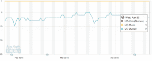
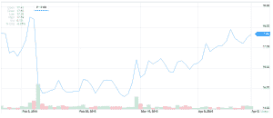

# 潘多拉的 Q1 收入超过预期 2.308 亿美元 

> 原文：<https://web.archive.org/web/https://techcrunch.com/2015/04/23/pandoras-q1-beats-estimates-with-230-8-million-in-revenue/>

# 潘多拉的 Q1 以 2.308 亿美元的收入超出了预期

潘多拉第一季度的收益超出了华尔街的预期，收入为 2.308 亿美元，每股亏损 12 美分。

它的活跃听众人数——虽然逐年增加——却一季比一季减少。该公司表示，今年第一季度用户收听了 53 亿小时的音乐，活跃听众人数为 7920 万人，高于去年同期的 7530 万人。在上一个季度，[有 8150 万活跃听众](https://web.archive.org/web/20221206211917/https://beta.techcrunch.com/2015/02/05/pandora-q4-falls-short-with-268m-in-revenue/)收听了 52 亿小时的音乐。

潘多拉的股票在盘后交易中下跌了 6%,在正常交易结束后上涨了 1%。

订阅和其他收入同比增长 32%，达到 5200 万美元，而广告收入为 1.787 亿美元，同比增长 27%。该公司继续认为其大部分收听发生在移动设备上，1.811 亿美元的收入来自移动收听。这并不令人惊讶，因为 Pandora 一直保持在 App Store 排名的前 10 位。

分析师预计，非 GAAP 基础上的收入约为 2.25 亿美元，每股亏损 16 美分。分析师预计按 GAAP 计算，每股亏损 27 美分，Pandora 每股亏损 23 美分。

尽管 Pandora 在 App Store 和 Google Play 上取得了成功，但它发现自己近年来受到了大型科技公司的攻击。苹果在 2013 年发布了 iTunes Radio，最近还收购了 Beats，预计将整合到 iTunes Radio 中。2013 年，谷歌还推出了自己的音乐服务 Google Play All Access。今年三月，[亚马逊为其亚马逊 Prime](https://web.archive.org/web/20221206211917/https://beta.techcrunch.com/2015/03/23/amazon-prime-music-takes-on-pandora-with-addition-of-prime-stations-on-ios/#.yx4hxw:Fuhg) 会员增加了无广告音乐电台。

在报告了第四季度的收益后，潘多拉的股票迅速下跌，在低于分析师预期后下跌了超过 17%。但在那份报告发布后的几个月里，Pandora 的股价大幅回升，在公布第一季度收益之前，收盘价约为 17.68 美元。

本季度科技公司的收益有点喜忧参半。脸书[未能达到分析师对收入](https://web.archive.org/web/20221206211917/https://beta.techcrunch.com/2015/04/22/facebook-q1-2015-earnings/)的预期，谷歌今天公布的收益显示[未能达到每股收益](https://web.archive.org/web/20221206211917/https://beta.techcrunch.com/2015/02/05/pandora-q4-falls-short-with-268m-in-revenue/)的预期。与此同时，微软[的收益和收入都超出预期。](https://web.archive.org/web/20221206211917/https://beta.techcrunch.com/2015/04/23/microsoft-beats-in-its-fq3-with-revenue-of-21-7b-eps-of-0-61/)