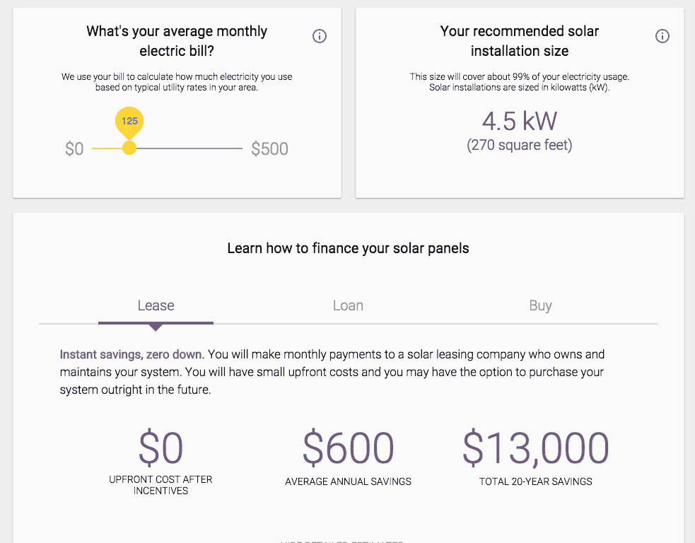

# 谷歌的天窗项目告诉你太阳能在你的屋顶上会有多好

> 原文：<https://web.archive.org/web/https://techcrunch.com/2015/08/17/panel-panel-on-the-roof/>

# 谷歌的天窗项目告诉你太阳能在你的屋顶上会有多好

谷歌现在可以让你看看你的房子是否是安装太阳能电池板的好地方。谷歌工程负责人卡尔·埃尔金(Carl Elkin)出资 20%的项目天窗(Project 天窗)向你展示，使用谷歌地图和它所拥有的关于你家周围环境的数据，你的屋顶可以产生多少太阳能。这意味着它可以考虑当地的天气，你的屋顶的方向，以及附近的树木和建筑物有多少阴影落在上面。

遗憾的是，这目前只在旧金山湾区、弗雷斯诺(谷歌告诉我们它位于加州中部)和波士顿(据我们所知，这是东海岸的一个主要城市)有效。

开始时，你只需输入你的地址和一些关于你每月电费的数据，这个工具会告诉你推荐的太阳能装置的大小，以及购买或租赁硬件的费用。

如果你想继续安装太阳能，这个工具还可以让你联系当地的太阳能供应商。谷歌表示，这些列表是受赞助的，所以当它为这些公司创造销售线索时，有可能会得到一点回扣。

[https://web.archive.org/web/20221209205252if_/https://www.youtube.com/embed/_BXf_h8tEes?feature=oembed](https://web.archive.org/web/20221209205252if_/https://www.youtube.com/embed/_BXf_h8tEes?feature=oembed)

视频

