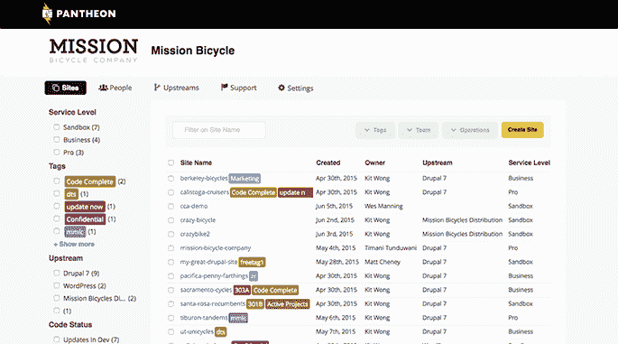

# Pantheon 为其 WordPress 和 Drupal 托管和管理平台 TechCrunch 筹集了 2900 万美元

> 原文：<https://web.archive.org/web/https://techcrunch.com/2016/07/20/pantheon-raises-29m-for-its-wordpress-and-drupal-hosting-and-management-platform/>

WordPress 和 Drupal 托管服务公司 Pantheon 今天宣布，它已经筹集了 2900 万美元的 C 轮融资。此轮投资者包括之前的投资者 Foundry Group、OpenView Investment Partners 和 Scale Venture Partners，以及新投资者 Industry Ventures，它们向此轮投资了 850 万美元。

这一新轮融资是继 2014 年万神殿 2150 万美元的 B 轮融资之后，该公司的总融资额达到 5700 万美元。

正如 Pantheon 首席执行官兼联合创始人 Zack Rosen 告诉我的，该公司希望帮助建立网络基础技术，并最终达到为 30%的网站提供动力的地步。不过，就目前而言，他很高兴能够取得进展，达到 1%，他认为公司将在几年内实现这一目标。为了帮助实现这一点，该公司计划在下周推出一个迁移工具包，让网站所有者更容易地将他们现有的网站带到公司的平台上。

【T2

正如罗森告诉我的那样，万神殿现在拥有 15 万个网站，虽然该公司没有公布客户数量，但罗森说，该公司的客户年增长率超过 100%。为了容纳所有这些，万神殿目前有 120 万个集装箱在生产。

在用户群方面，该公司特别关注其代理商。它现在已经与 2，500 家代理商和 50 家经销商建立了合作关系。

正如罗森告诉我的，团队决定像对待最后一轮融资一样对待这一轮融资。“我们控制着我们的支出，在如何配置资金方面非常谨慎，”他补充道。众所周知，融资变得越来越难，Rosen 指出，风投们现在希望看到更多的数字，并在承诺进行融资之前提出更尖锐的问题。不过，他也看到了这件事积极的一面。“当风投没有问他们应该问的那种问题，而应该得到资助的公司得到了资助——然后沿着这条路走下去，他们不会有很好的结果，这对这个行业是不利的，”他说。“这让其他所有人都更难。”

该公司希望利用这一轮新的资金来构建其产品，并使开发者更容易在其平台上建立自己的网站。

作为今天融资公告的一部分，该公司还宣布聘请尼尔·海斯(Niall Hayes)担任工程副总裁，他曾在 KIXEYE 担任技术主管，并在 Zynga 经营 CityVille 工作室。此外，Twitter 的数据服务副总裁兼 Twitter 收购的 Gnip 的前首席执行官克里斯·穆迪(Chris Moody)将加入 Pantheon 的董事会。