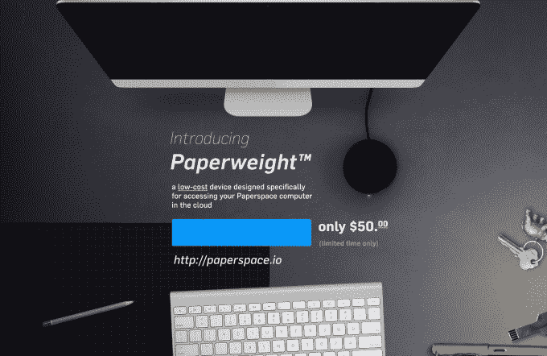
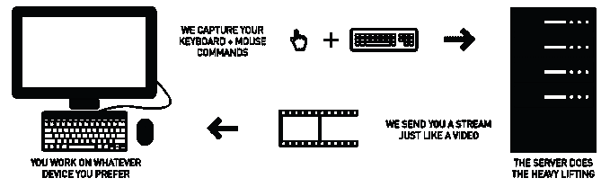
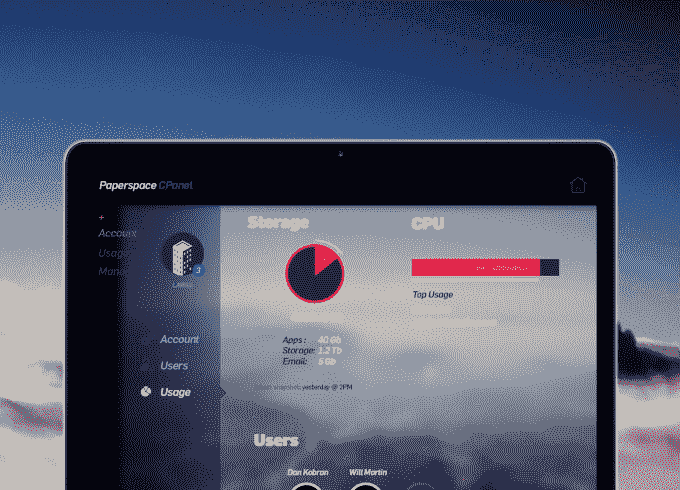

# Paperspace 让任何人都可以访问位于云端的更好的个人电脑 

> 原文：<https://web.archive.org/web/https://techcrunch.com/2015/03/03/paperspace-lets-anyone-access-a-better-personal-computer-that-lives-in-the-cloud/>

想象一下，你再也不用购买昂贵的新硬件来升级你的个人电脑，以获得更快的速度和更大的存储空间。这就是 Y Combinator 支持的 paper space(T1)背后的愿景，这是一家今天推出的新公司，它正在构建一台完整的个人电脑，它生活在云中，你可以从任何网络浏览器访问它。在某种程度上，类似于 VMWare、Citrix 或 Amazon Workspaces 等企业级解决方案，但也针对消费者或“专业消费者”受众，该公司正在销售一种小型硬件设备，可以插入任何旧的台式机或笔记本电脑，以便为您提供按需所需的计算能力。

这款名为[镇纸](https://web.archive.org/web/20230216193052/https://paperspace.io/)的低成本硬件设备将您与 Paperspace 服务器上的远程机器连接起来，您可以根据自己的计算需求选择“基本”或“专业”选项。该设备被视为“零客户端”，因为与瘦客户端技术不同，它内部只有一个小型微处理器——所有处理都在云上进行。

今天，由于亚马逊和其他公司的帮助，有许多通过云获得计算能力的解决方案，但这些服务需要用户更懂技术才能开始。Paperspace 与众不同，因为它的目标是在访问远程云计算机方面提供类似的服务，但它通过一个易于使用的控制台提供服务，日常消费者只需点击一个按钮即可登录到他们升级后的更强大的远程计算机。

联合创始人 Dillon Thompson Erb 和 Dan Kobran 表示，他们在密歇根大学开发建筑行业的技术应用和部署时，产生了 Paperspace 的想法。

为了运行一些模拟，他们需要购买一台昂贵的“野兽”计算机，即使这样，模拟也需要几天才能运行。“我们开始关注云计算，因为它在科学计算领域变得越来越重要，”Erb 解释道。“然后我们开始探索如何让它更容易使用，因为它真的很难启动。”

他说，他和 Kobran 对使用目前可用的解决方案的过程感到满意，这涉及到有时使用命令行，但大多数人并不满意。

“大企业公司和真正的技术人员可以获得这项技术，但其他所有人都被排除在外，”Erb 指出。

最初，我们的想法是针对 Paperspace 的“专业消费者”受众，即需要在易于使用的界面中按需获得额外处理能力的任何人。例如，这包括学生、业余爱好者以及需要运行模拟、渲染、3D CAD 或进行照片和视频编辑的创意专业人士。他们还发现，这对于开发人员或那些需要多种操作系统的人来说可能是有意义的，他们今天可能会运行 Parallels、Fusion 或 Bootcamp 之类的东西。或者，它可以满足那些认为自己的时间更适合实际工作而不是安装远程机器的人的需求。

但创始人后来意识到，还有一个更广阔的市场可以服务，因为一个简单的界面可能意味着学校可以更新过时的计算机实验室，甚至企业客户也可能希望使用它的设备，因为它们比购买普通计算机更便宜，而且员工更容易使用。在某种程度上，该公司将 Paperspace 视为云计算，就像 Dropbox 如何简化文件共享一样——例如，通过 FTP 等解决方案，文件共享多年来一直是可能的，但直到它得到更好的设计和易用性，才受到消费者的欢迎。

使用像 Paperspace 这样的云计算机的好处不仅在于获得处理能力，还在于能够运行桌面程序，比如你不能在谷歌基于网络的 Chromebook 上运行的程序，以及即时传输大文件或通过流式显示快速分享屏幕等。

然而，这一想法并不是要在数据中心与 Amazon Web Services 等直接竞争，而是要通过改进的设计和用户界面，让更多人能够使用虚拟化技术。

“软件是不可知的，”Erb 说。“现在，我们的软件中没有任何东西要求我们在任何特定的堆栈上运行……实际的虚拟机本身——实例——它在哪里并不重要。可能是亚马逊，也可能是谷歌，”他说。相反，该服务是关于利用硬件作为一种商品。

“我们试图制作软件…我们并不真正关心硬件，”Erb 说。“我们就像上面薄薄的一层。”

[vimeo 121088847 w=500 h=281]

创始人使用亚马逊建立了 Paperspace 的第一个版本，但目前正在使用现成的服务器组件，包括云编排软件 Xen 和 Nvidia GRID。但他们说，他们仍在测试不同的解决方案。他们目前还在一个托管中心购买了空间，尽管最终他们希望建立自己的数据中心。

与传统的远程访问方法(如 VNC 或微软的远程桌面协议 RDP)不同，Paperspace 可以通过在客户端利用 Websockets、WebGL 和 asm.js 等新的 web 技术，直接在客户端运行全高清内容。

基本上，创始人告诉我们，如果你的机器可以播放来自网飞的电影，它也能运行 Paperspace。

这项服务本身的售价为每月 10 美元(基础服务)以上，有不同的等级。(TBD 定价。)如今，你可以使用 Windows 7 或 Windows 8 系统，也可以安装 Ubuntu，但对包括 Mac OS X 在内的其他操作系统的支持也在计划之中。您可以在任何月份选择升级或降级基本或专业服务，同时仍然保留您当前的自定义和设置。

[从今天开始，这款镇纸设备可以在有限的时间内以 50 美元的价格进行预购](https://web.archive.org/web/20230216193052/https://paperspace.io/)，TechCrunch 的读者可以使用优惠券代码 **TECHCRUNCH** 购买前 250 件商品，享受 5 美元的优惠。这些设备将于 2015 年底上市。

Paperspace 是一家自筹资金的公司，没有 Y Combinator 的投资，是一个七人分布式团队。