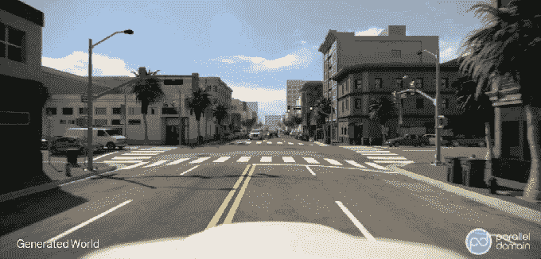
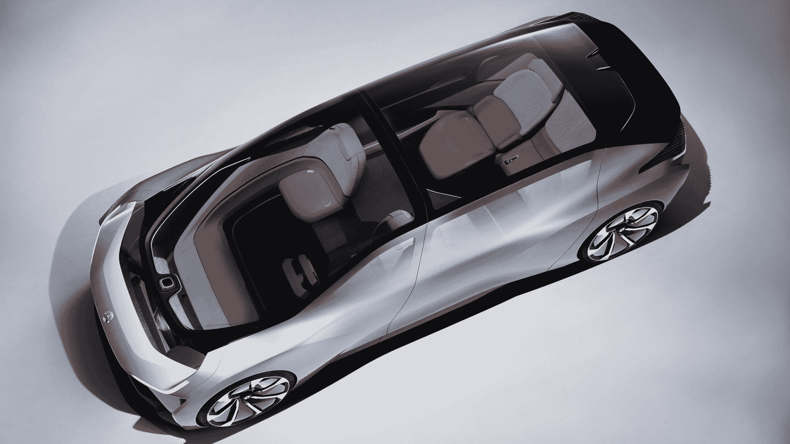

# Parallel Domain 希望在虚拟世界中训练自动驾驶汽车 

> 原文：<https://web.archive.org/web/https://techcrunch.com/2018/05/01/parallel-domain-wants-to-train-self-driving-cars-in-virtual-worlds/>

前苹果和皮克斯员工凯文·麦克纳马拉(Kevin McNamara)正在将他的虚拟世界创作专业知识引入自动驾驶汽车领域。他从 Costanoa Ventures、Ubiquity Ventures 和其他公司获得了 250 万美元。

麦克纳马拉说，在苹果公司，他从事一个自主系统项目，在那里他探索了模拟虚拟环境的自动内容生成。他告诉我，我们的想法是弄清楚如何使用这种技术在自主系统中训练、测试、验证和开发人工智能。

离开苹果后，麦克纳马拉开始着手[平行领域](https://web.archive.org/web/20221225084321/https://www.paralleldomain.com/)。该平台生成虚拟世界，以实现无人驾驶汽车的大规模培训和测试。

麦克纳马拉告诉我:“我们所做的是使用计算机图形来尝试加速安全自动驾驶汽车的开发。”“这个想法是，在模拟中，你可以安全地犯错误，然后从这些错误中学习。在虚拟世界中，你不会在这个模拟中伤害任何人。”

他说，使用真实世界的地图数据、程序性增长算法和生成模型，该平台可以教会汽车如何驾驶，并确保汽车的软件正在学习如何正确驾驶。世界上的所有元素都是可调整和可编程的——车道数、地形类型、山脉位置、道路曲率等等。

最初，计划是将这个平台出售给自动驾驶汽车公司。从那里，自动驾驶汽车公司可以使用并行域来生成 3D 虚拟世界，在其中测试他们的汽车。

麦克纳马拉说:“这本质上就像是为一辆汽车制作一个大型视频游戏。”

Parallel Domain 的第一个客户是 [NIO](https://web.archive.org/web/20221225084321/https://www.nio.io/visioncar) ，一家专注于中国市场的自动驾驶汽车初创公司。通过并行域，NIO 可以请求一个类似城市的界面，包含 20 个街区的自行车道、建筑物、行人等等。在“几秒钟之内”，平行领域可以产生那个世界。

NIO 的电动自动驾驶汽车概念

要明确的是，麦克纳马拉并不是反现实世界的数据。他承认这非常有价值，也是确保汽车知道自己在做什么的最佳方式，但这也非常昂贵。这就是为什么麦克纳马拉设想反病毒公司使用并行域结合现实世界的测试。他说，模拟可以成为一个巨大的加速器，让汽车行驶 10 亿英里。

他说，许多公司都对利用技术将地图数据转化为丰富的模拟世界感兴趣。

“我们也确实认为提供一个内容包有很大的价值”——比如 100 万英里的免费有趣道路，他说。

麦克纳马拉说，总体目标是消除公司在进行大规模模拟时遇到的障碍。那么，从理论上讲，公司应该更有能力更快、更安全地开发产品。

“每天，我们都会看到质疑自动驾驶汽车安全性的头条新闻，”Costanoa Ventures 合伙人马克·塞尔考(Mark Selcow)在一份声明中说。“但 Parallel Domain 的方法有助于在这些车辆到达公共道路之前消除虚拟世界中的许多担忧。”