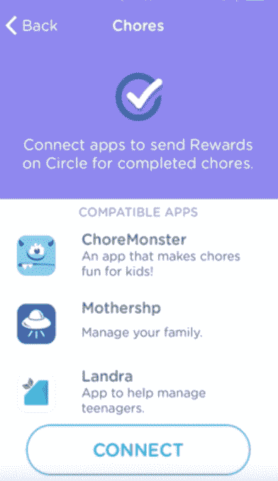
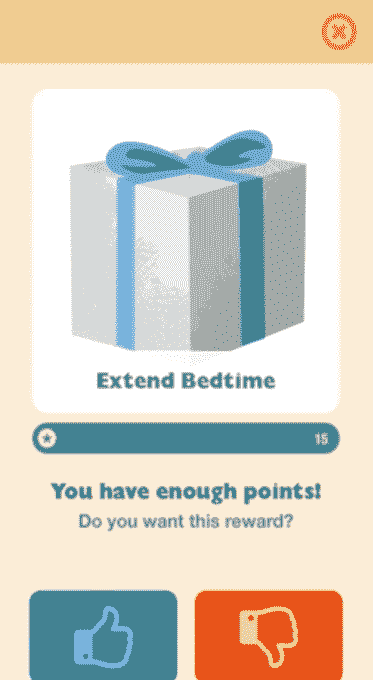

# 家长控制服务“与迪士尼一起圈”有助于分心驾驶、社交媒体、孩子的家务等等

> 原文：<https://web.archive.org/web/https://techcrunch.com/2017/03/08/parental-control-service-circle-with-disney-to-help-with-distracted-driving-social-media-kids-chores-more/>

[与迪士尼一起圈子](https://web.archive.org/web/20230316041444/http://www.meetcircle.com/)，一个帮助父母管理他们家的互联网规则和限制的设备，想要不仅仅是一个现代的网络保姆。通过[提供迪士尼内容](https://web.archive.org/web/20230316041444/https://techcrunch.com/2015/11/04/circle-with-disney-is-a-new-device-that-helps-families-manage-online-usage-and-apps/)的授权选择——如游戏、视频、预告片等——使其服务更具吸引力，它已经从竞争对手的软件解决方案中脱颖而出。如今，它正朝着成为一个更广泛的“智能家庭”平台迈出一步，通过一系列整合，让 Circle 与奖励孩子做家务或满足活动目标的服务、限制分心驾驶的服务、过滤社交媒体的服务等合作。

亚马逊 Alexa 也将与 Circle 合作，允许父母询问他们孩子的屏幕时间使用情况。孩子们也可以问 Alexa 他们自己的时间限制。

该功能被称为“圈子联系”，但它不是完全活在这个时候。

取而代之的是，该公司公布了为来年计划的更大的集成路线图。今天，只有第一个集成——与 [FamilyTech](https://web.archive.org/web/20230316041444/http://familytech.com/) 应用——实际可用。

FamilyTech 有很多应用程序，包括 MotherShp、ChoreMonster 和 Landra，这些应用程序可以帮助孩子通过做家务获得奖励。有了 Circle，这些奖励现在可以添加到屏幕时间或以后的睡觉时间，由父母决定。

今年晚些时候，Circle 将为 Circle Connections 推出更多功能，包括与联网汽车服务 Automatic、自动化助手 IFTTT、Misfit 活动跟踪器和社交媒体过滤器 Rakkoon 的集成。

Automatic 的集成最有趣，因为它允许 Circle 将其实用性扩展到有较大孩子的家庭——这是一个经常被当今父母控制应用程序忽略的领域，这些应用程序似乎更专注于保护孩子免受成人内容的影响或限制屏幕时间。

有了 Automatic，当汽车启动时，父母将能够过滤社交媒体应用程序等分散注意力的应用程序，以免打扰青少年司机。当汽车关闭时，这些受限制的应用程序就会重新启用。

与此同时，Rakkoon 的集成有助于青少年和青少年，因为它可以过滤社交媒体上的可疑内容，包括 Instagram、脸书、Twitter 甚至 iMessage。它还会提醒家长注意色情短信和欺凌等问题。

Misfit 将用屏幕时间奖励活动。

然而，IFTTT 的整合吸引了更喜欢极客的父母。它可以让你做一些事情，比如让你的智能灯泡在就寝时间开始时改变颜色，或者将现实世界的互联网暂停按钮连接到 Circle 的服务。有趣，也许，但不是必要的。

尽管我自己也是一名家长，但我一直对在家中使用严格的家长控制软件或硬件设备犹豫不决，因为它们给互联网的设置和使用增加了另一层复杂性。

相反，我更喜欢平台制造商(如苹果)提供的设备上的控制，应用程序中的控制(如谷歌的安全搜索过滤器)，以及大量老式的良好育儿方式。这意味着我们有一些规则，比如，除非我首先批准该频道，否则不得观看 YouTube 节目，未经批准不得下载应用程序，以及一般限制设备使用。

但我也可以享受只抚养一个孩子的奢侈。我意识到，随着她的成长，持续关注她的活动会变得更加困难。像这样的集成使得 Circle 这样的服务看起来更有吸引力，甚至可能值得设置和配置的麻烦，坦率地说，如果我说的是实话，这仍然有点痛苦。

Circle 是一款 99 美元的设备，通过其网站在线销售，并在零售商的网站上销售，包括亚马逊、塔吉特、百思买和迪士尼商店。在塔吉特百货和百思买零售店也有售。