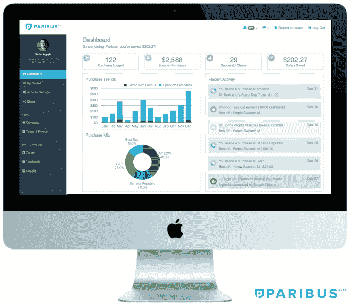

# 当网上价格下降时，Paribus 可以帮你省钱

> 原文：<https://web.archive.org/web/https://techcrunch.com/2015/05/05/paribus-can-save-you-money-when-online-prices-drop/>

一家名为 [Paribus](https://web.archive.org/web/20230222130708/https://paribus.co/) 的新创公司今天在纽约 TechCrunch Disrupt 上成立，希望帮助在线购物者在价格下降时获得退款。今天的消费者知道，电子商务网站上的价格变化比实体店更频繁。仅亚马逊一家每天就进行大约 8000 万次价格变动。但许多人没有意识到的是，当这些在线商品打折时，实际上有一种方法可以把钱退回给你。大多数主要零售商都提供某种价格匹配保证，但消费者利用这种选择往往很麻烦。

总部位于布鲁克林的 Paribus 希望通过跟踪与您在线购买相关的价格变化来解决这个问题，然后在价格下降时，按照特定商店的专门程序代表您提出索赔。

为此，该系统首先要求用户使用 Paribus 网站向其电子邮件提供商进行认证，如 Gmail、Yahoo Mail、Hotmail/Outlook 或 iCloud。这使得初创公司能够扫描你的收件箱，寻找与你在线购物相关的收据。

Paribus 的联合创始人兼首席执行官 Eric Glyman 解释说，这个想法基本上是为在线购物者提供一种“设置好就忘记”的服务。也就是说，在你第一次使用你的在线账户认证后，它会自动为你省钱。

在推出时，Paribus 能够跟踪和匹配来自 20 家零售商的电子商务购买，包括亚马逊、百思买、沃尔玛、塔吉特、布鲁明戴尔、梅西百货、Bonobos、J.Crew 等。它了解每个商店自己政策的细微差别，这对于那些试图自己跟踪销售和价格变化的消费者来说往往是令人困惑的。例如，亚马逊匹配竞争对手的电视和手机价格，但只匹配自己的其他商品价格。

与此同时，不同的商店对你如何提交索赔都有不同的程序——有些要求你使用在线表格，有些要求你提供电子邮件地址，等等。

除了跟踪价格变化本身，Paribus 还可以发现是否有优惠券代码，该代码本应在结账时应用，以节省您的资金并代表您要求差价。

格利曼指出，该公司只有在找到储蓄时才赚钱，因为它收取 25%的佣金。在线零售商将为顾客找到的钱返还到他们的支付卡上。

格里曼在金融服务领域的背景让他在重组陷入困境的公司时寻找省钱的漏洞，他说，在意识到他在网上购买的所有东西似乎都在不同的价格点上波动后，他想到了 Paribus 的想法。

去年夏天，他们与联合创始人兼首席技术官卡里姆·阿蒂耶(Karim Atiyeh)一起创立了这家公司，并一直在与大约 1500 名朋友和家人一起进行测试，他们在过去几个月里总共节省了 1 万多美元。(然而，创始人指出，大多数注册实际上是在上个月。)

现在，该公司正在向公众推出，因此任何人都可以尝试 Paribus 的省钱系统。一旦上线，这家初创公司的目标是在扩展到其他领域之前，扩大其用户群，并为电子商务零售商的长尾提供支持。但从长远来看，Glyman 说，他可以看到 Paribus 与信用卡“现金返还”项目和其他项目一起工作。

然而，他强调，商业模式将始终围绕“成功费”，而不是向第三方出售用户数据。“用户不是产品，”格利曼说。

Paribus 还计划在今年夏天晚些时候推出一款原生手机应用，尽管其目前的网站是针对手机优化的。

该产品应该会吸引各种各样的在线购物者，包括总是担心错过促销代码的交易猎人，甚至是那些被在线零售商新的[“个性化”技术](https://web.archive.org/web/20230222130708/http://www.wsj.com/articles/why-you-cant-trust-youre-getting-the-best-deal-online-1414036862)瞄准的人，这些技术向每个访问者显示不同的定制价格。

这家初创公司有少量朋友和家人的资助，金额未披露，也没有积极筹资。

[gallery ids="1154664，1154663，1154662，1154661，1154660，1154659，1154658，1154657，1154656，1154655，1154654，1154653，1154652，1154651，1154650"]