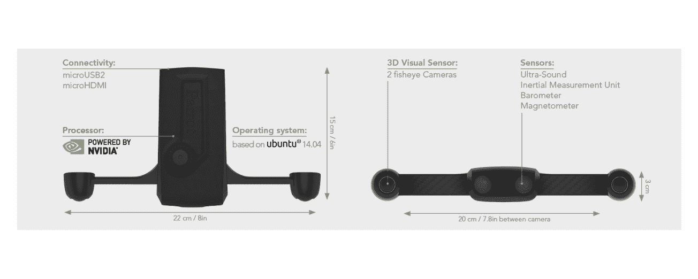
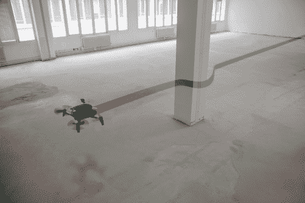

# Parrot 宣布推出一款开发套件，可帮助无人机观察和避开障碍物

> 原文：<https://web.archive.org/web/https://techcrunch.com/2016/09/07/parrot-announces-the-s-l-a-m-dunk-a-dev-kit-that-helps-drones-see-and-avoid-obstacles/>

# 鹦鹉宣布一个开发套件，帮助无人机看到和避免障碍

[鹦鹉](https://web.archive.org/web/20221210060228/http://parrot.com/)，这家法国公司可能以其增强现实最出名。无人驾驶飞机和 Bebop 无人驾驶飞机，今天宣布了[鹦鹉 S.L.A.M.dunk](https://web.archive.org/web/20221210060228/http://developer.parrot.com/) ，这是一种新的开发套件，用于帮助无人驾驶飞机和机器人在室内导航、避开障碍物并绘制周围环境地图。该公司今天在拉斯维加斯举行的年度[互动会议上宣布，S.L.A.M .扣篮(我知道我永远不会厌倦打字)将在今年最后一个季度上市。该公司尚未宣布定价。](https://web.archive.org/web/20221210060228/http://www.interdrone.com/)

4.9 盎司的套件使用 Nvidia Tegra K1 处理器，运行 Ubuntu 14.04，上面有[机器人操作系统](https://web.archive.org/web/20221210060228/http://www.ros.org/core-components/)框架。它使用两台鱼眼相机以每秒 60 帧的速度进行立体成像，还使用一个超声波传感器、一个惯性测量单元、一个气压计和一个磁力计。该套件还配有 USB 和 HDMI 插头。

Parrot 说超声波传感器应该能够探测到 50 英尺以外的物体。

Parrot 预计，开发人员、研究人员和集成商将使用 S.L.A.M.dunk 制作无人机和机器人解决方案的原型，并将其用于自主导航和 3D 地图产品。虽然 Parrot 本身以其无人机而闻名，但该套件也旨在为滚动机器人甚至关节臂工作。“由机器人研究人员为机器人研究人员开发的 Parrot S.L.A.M.dunk 是一个‘即用型’模块，将加速未来无人机和机器人平台应用的开发，”该公司在今天的声明中表示。

对于一家主要以消费无人机闻名的公司来说，这一声明可能会感到不同寻常，但 Parrot 实际上以其 [SenseFly 品牌](https://web.archive.org/web/20221210060228/https://www.sensefly.com/home.html)提供了许多专业无人机，该公司长期以来一直邀请修补程序在其 SDK 的帮助下为其无人机[编写应用程序。今天的公告更进了一步。这也标志着该公司打算将其专业知识应用到更广泛的机器人产品中。谁知道呢，也许这款](https://web.archive.org/web/20221210060228/http://developer.parrot.com/products.html)[鹦鹉 t 恤](https://web.archive.org/web/20221210060228/https://beta.techcrunch.com/2016/05/09/parrots-ceo-is-building-a-new-kind-of-t-shirt/)甚至会配备超声波传感器，在你晚上醉醺醺地蹒跚回家时帮助你避开物体。