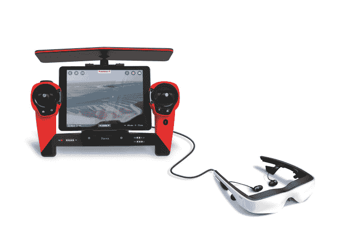

# Parrot 价值 500 美元的 14MP Bebop 无人机将于 12 月试飞 

> 原文：<https://web.archive.org/web/https://techcrunch.com/2014/11/19/parrots-14mp-bebop-drone-to-take-flight-in-december-for-500/>

# Parrot 价值 500 美元的 1400 万像素 Bebop 无人机将于 12 月试飞

Parrot 刚刚降了高清无人机的价格。该公司的 [Bebop 无人机](https://web.archive.org/web/20221007001202/http://www.parrot.com/usa/products/bebop-drone/)将于下月上市，起价为 500 美元。这比 DJI 的入门级 Phantom 无人机便宜几百美元，尽管它配备了相同质量的摄像头和几个新颖的功能，包括可以通过智能手机或平板电脑进行控制..

Bebop 是对更便宜的 AR 无人机的一次重大升级，这在一定程度上有助于在公众的思维模式中安装无人机。就像之前的 AR 无人机一样，Parrot 在 Bebop 中配备了严肃的无人机技术，但却设法保持了较低的价格，并且可以在室内安全飞行。

与类似的 DJI 幻影相比，Bebop 有很多相同的飞行能力。随着更昂贵的范围扩展控制器，Bebop 也有大约相同的范围，2 公里的限制。该无人机能够将捕捉到的视频传输回智能手机，它使用内置 GPS 和朝下的摄像头来帮助无人机在高空飞行时保持不动。

Bebop 依靠基于软件的 3 轴图像稳定功能来保持图像固定不失真。Parrot 解释说，该系统采用 1400 万像素摄像头捕捉的图像，并剪切掉稳定的部分，扔掉边缘上显示无人机运动的部分。这使得相机可以装入 Bebop 的光滑机身，而不是悬挂在下面。

Parrot 还为 Bebop 开发了一个专用控制器，将 Bebop 的范围从 200 米扩展到 2 公里，并允许飞行员在包括 Oculus Rift 在内的 AR 眼镜中查看无人机的摄像头输出。控制器放大连接的智能手机或平板电脑的 wifi 信号，并提供模拟操纵杆和按钮，以实现更精确的控制。但是这种额外的乐趣是有代价的:一个 Bebop 和 SkyController 的价格是 900 美元。

标准版和 SkyController 版将于 12 月在百思买和苹果商店上市，价格分别为 500 美元和 900 美元。

[https://web.archive.org/web/20221007001202if_/https://www.youtube.com/embed/ehjqS5L1Yyc?feature=oembed](https://web.archive.org/web/20221007001202if_/https://www.youtube.com/embed/ehjqS5L1Yyc?feature=oembed)

视频