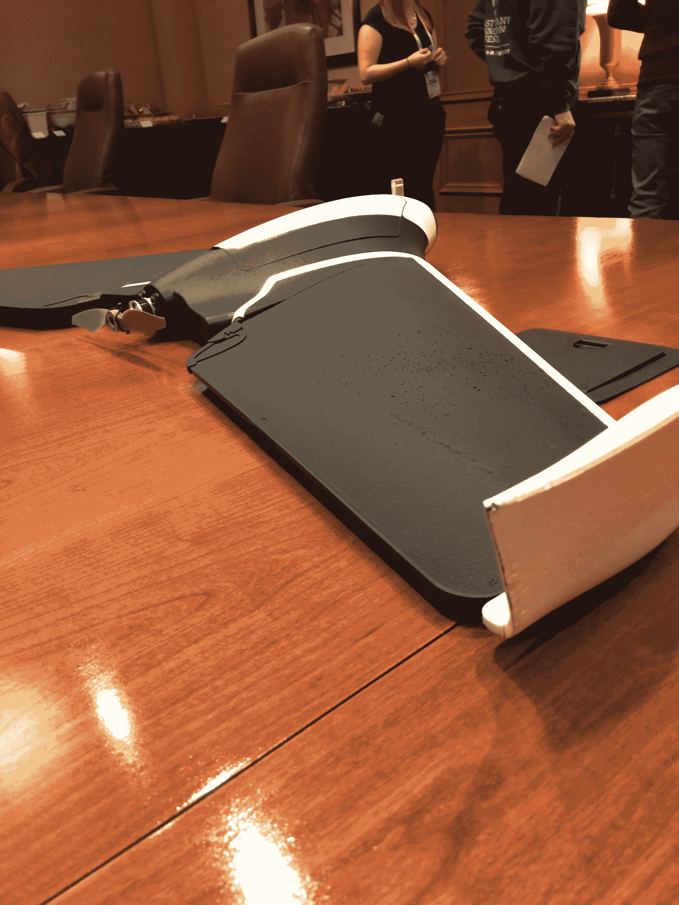
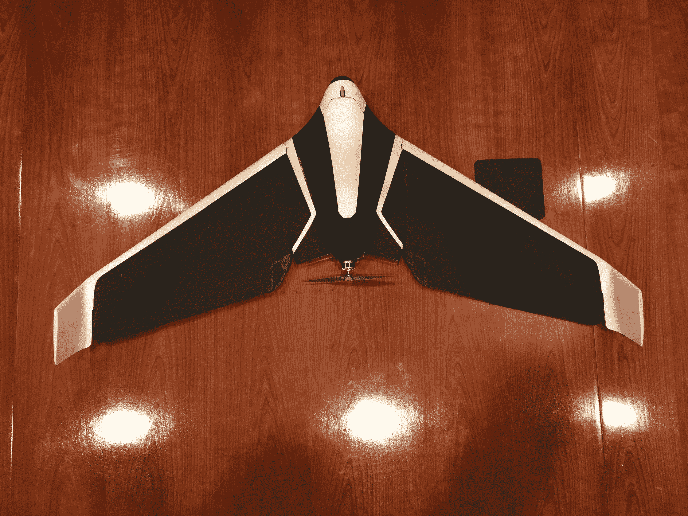

# Parrot 的最新无人机有翅膀

> 原文：<https://web.archive.org/web/https://techcrunch.com/2016/01/04/parrots-newest-drone-has-wings/>

当你想到消费级无人机时，你可能会想到四轴飞行器。但是固定翼无人机长期以来一直是军方和航模界的主要产品，现在 [Parrot](https://web.archive.org/web/20230316053720/http://www.parrot.com/usa/) 凭借其 AR 引领了四轴飞行器热潮。无人机也开始涉足固定翼飞机领域。

该公司过去两年一直在研究的 700 克鹦鹉迪斯科是一种小型固定翼消费无人机，看起来像一架模型飞机。它可以飞行 45 分钟，时速不到 50 英里。无人机前部的 1080 p 1400 万像素摄像头与 Parrot 用于 Bebop 2 四轴飞行器的摄像头相同。

【T2

就像 Parrot 的其他无人机一样，Disco 是通过该公司的 FreeFlight 智能手机和平板电脑应用程序或 Parrot 更专业的 Skycontroller(该团队实际上推荐)通过 Wi-Fi 控制的。

像所有无人机一样，迪斯科配备了一套标准传感器，如加速度计、陀螺仪、磁力计、气压计和 GPS。迪斯科舞厅还有一个[皮托管](https://web.archive.org/web/20230316053720/https://en.wikipedia.org/wiki/Pitot_tube)，通常在飞机上用来测量空速。在四轴飞行器上，空速并不那么重要，但当你想让飞机保持在空中时，空速绝对很重要。

迪斯科不是唯一可用的固定翼消费无人机，但 Parrot 团队强调，迪斯科比竞争对手的无人机更容易飞行。一些固定翼机型需要用户手动设置俯仰和偏航等项目，但只需要快速摇动以定位迪斯科并抛向空中以启动它，这种无人机将更容易升空。

【T2

着陆无疑是驾驶任何飞机最难的部分，对于固定翼模型飞机来说也是如此。正如 Parrot 团队告诉我们的那样，迪斯科将提供自动着陆模式，在这种模式下，飞机将慢慢飞回起飞点，然后慢慢盘旋着陆。

值得注意的是，虽然这是 Parrot 的第一架固定翼消费无人机，但它不是该公司首次涉足这一领域。Parrot 于 2012 年收购了 senseFly，该公司生产一系列固定翼无人机，用于测绘等专业应用。不出所料，这家迪斯科舞厅还配备了 senseFly 的一些自动驾驶软件。

该设备目前处于原型开发阶段，尽管 Parrot 告诉我们，他们希望在 2016 年底之前将 Disco 放在消费者手中。价格是个大问题，但是 Parrot 没有给我们任何提示。