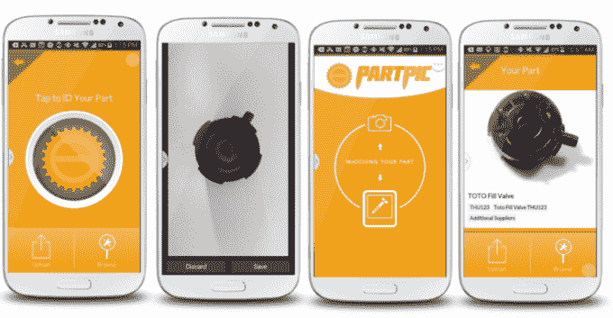

# Partpic 让您更容易为您的 Whozits、Whatsits 等找到维修零件 

> 原文：<https://web.archive.org/web/https://techcrunch.com/2014/09/08/partpic-makes-it-easier-to-find-repair-parts-for-your-whozits-whatsits-and-more/>

# Partpic 让您更容易为您的 Whozits、Whatsits 等产品找到维修零件

你的东西坏了吗？你的小工具的把手掉了吗？你买了吗？该公司将在旧金山的 TC Startup Battlefield 推出，旨在让消费者拍摄更换零件的照片，并立即收到零件编号和订单页面。

【YouTube = https://www . YouTube . com/watch？v=PAELPZZVIrM]

“Partpic 是出于需要而诞生的。从 Google 过渡到 McMaster-Carr，这是一家拥有 100 多年历史的公司，掌握了供应链，但在采用新技术方面发展缓慢，我们的联合创始人 Jewel Burks 非常清楚地认识到零件分销流程中存在许多问题。首席运营官的 Jason Crain 说:“如果供应商和分销商愿意发展，他们就有机会更好地为客户服务。

公司是为企业而建的。目标是为大型供应商提供易于使用的图像识别应用程序，他们试图将仓库物流从“文本/标签”式的检索转变为更有趣的视觉识别系统。

[gallery ids="1054857，1054846，1054855，1054854，1054853，1054852，1054850，1054849，1054848，1054847"]

这家公司是在挫折中创立的。

“Jewel Burks 在一家大型工业分销商从事销售管理工作，他对寻找零件的困难越来越感到沮丧。她见证了她管理的员工和他们服务的客户在试图搜索没有零件号或供应商名称等关键信息的零件时遇到的挑战，”Crain 说。

Burks 聘请了两名佐治亚理工学院的博士 Troy Nunnally 和 Nashlie Sephus 来帮助建立一个图像识别系统，该系统可以快速扫描零件箱，并根据简单的快照对零件编号和样式进行评估。

“这很有趣。每个人都理解我们正在解决的问题，并渴望使用我们的技术。

[gallery ids="1053503，1053504，1053505，1053506"]