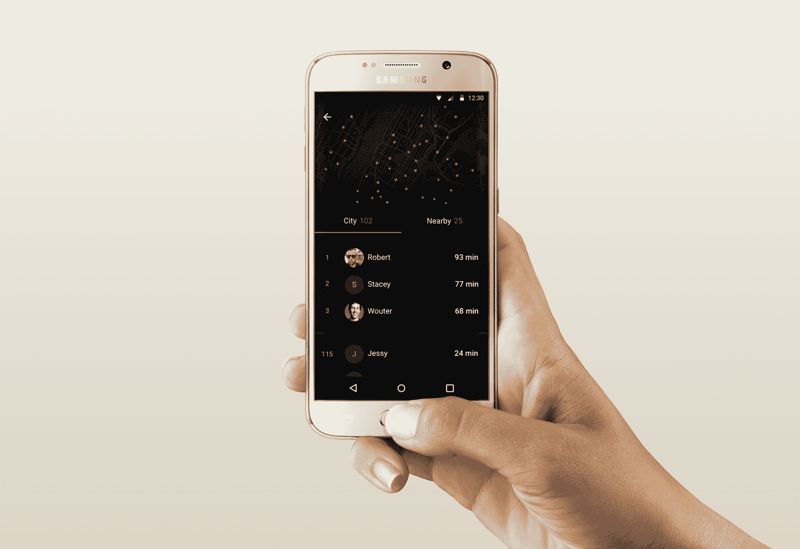

# 被动健身追踪应用人类来到 Android 

> 原文：<https://web.archive.org/web/https://techcrunch.com/2016/01/05/passive-fitness-tracking-app-human-comes-to-android/>

# 被动健身追踪应用人类来到安卓

《人类》在 iOS 上相当受欢迎[，Android 用户现在可以高兴了，因为这款应用程序现在已经在](https://web.archive.org/web/20221221055135/https://itunes.apple.com/us/app/human-move-30-minutes-or-more/id692721875) [Play Store](https://web.archive.org/web/20221221055135/http://play.google.com/store/apps/details?id=co.human.android) 上可用。

作为一个提醒，人类是一个被动的应用程序，旨在帮助你保持健康，目标很简单。每天需要运动 30 分钟以上，保持这个简单的习惯。该公司称之为“每日 30 分钟”，比如当你达到目标时，它会轻轻推你一把。

今天也是新的，该公司刚刚增加了一个新功能，称为人类脉搏。像许多其他健身跟踪应用程序一样，你现在可以在实时排行榜上与你的朋友竞争。与其他健身跟踪应用程序不同，Human 只是在城市中四处移动，所以它不只是比你的朋友们锻炼得更多。

排行榜会比较您今天与朋友和与您生活在同一城市的人一起运动了多少分钟。这是促使你多走路、跑步或骑自行车的另一个好方法。

如果你不喜欢竞争，只是想确保你不会在办公桌前花太多时间，你仍然可以专注于每天 30 分钟。一旦你的应用设置好了，你就可以忘记它，通知会定期告诉你你做得怎么样。

如果你想获得更多信息，你可以不时地打开应用程序，看看你在做什么——当你去跑步或骑自行车时，无需点击按钮，应用程序会自动对你的活动进行分类。但如果你想了解更多细节，还有一个最近推出的时间表，其中包含地图、统计数据和燃烧的卡路里，以了解更多关于你一天的信息。

迄今为止，已有 100 万人下载了 Human，跟踪了 15 亿次活动。而这一切都只是在 iOS 上。今天的 Android 发布是获得更多用户的一个很好的方式。