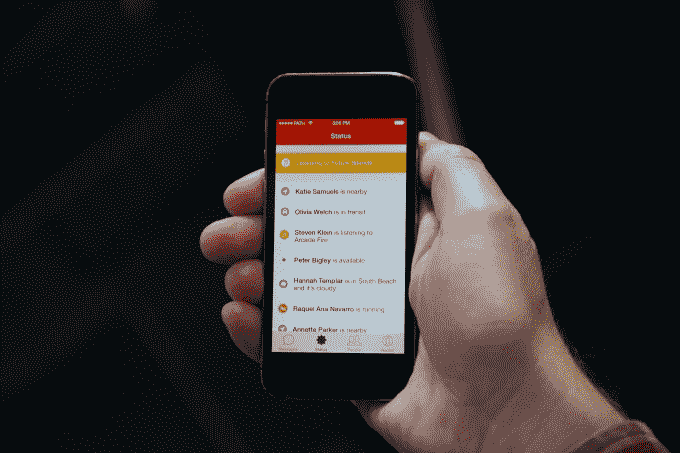

# Path 希望通过收购 TalkTo，发布新的“Talk”应用程序，将商务和消息传递结合起来

> 原文：<https://web.archive.org/web/https://techcrunch.com/2014/06/20/path-talk-talkto/>

对于私人社交网络应用 [Path](https://web.archive.org/web/20230324115621/https://path.com/) 来说，这是艰难的年。在过去的 12 个月里，该公司在许多主要市场的增长令人失望，[裁员](https://web.archive.org/web/20230324115621/https://techcrunch.com/2013/10/15/path-axes-20-percent-of-staff-in-a-realignment-of-the-company/)，一些关键高管[离职](https://web.archive.org/web/20230324115621/https://techcrunch.com/2013/11/07/path-loses-biz-head-amid-rumors-of-over-7m-in-funding-from-dustin-moskovitz/)。尽管 Path 基本上保持沉默，但该公司一直在幕后制定一项计划，以提升其业务。

今天，Path 正在展示它在这段时间里一直在努力的一切——包括推出一款新的独立消息应用程序[，收购商业消息服务 TalkTo，以及该公司新的收入模式的开始。](https://web.archive.org/web/20230324115621/https://path.com/talk)

### Path 的信息宏图

尽管一些大市场的下载量有所下降，Path 仍然看到用户重新使用它的应用。据创始人兼首席执行官戴夫·莫林(Dave Morin)称，该公司每天约有 400 万 dau，而今年年初约有 150 万。东南亚现在是其最大的市场，美国位居第二，但 Path 也看到来自中东的一些用户增长。

让用户回来、推动参与度的主要因素是信息传递。据 Morin 称，自一年前推出该功能以来，它一直是该应用程序中增长最快的功能。

尽管 Snapchat、WhatsApp、Line、KakaoTalk、微信和 Facebook Messenger 等即时通讯平台激增，但这一增长仍在继续。尽管 Path 的信息功能大部分都藏在应用程序一侧的抽屉里。

随着 [Path Talk](https://web.archive.org/web/20230324115621/https://path.com/talk) 的发布，该公司希望通过制作一款完全基于其最受欢迎的功能之一的应用来纠正这一点。新的消息应用程序利用了 Path 团队已经建立的功能。例如，用户可以使用他们现有的路径登录凭据进行连接。

Path Talk 具有环境状态更新功能，可以让朋友知道您何时旅行、何时在附近以及何时电池电量不足。但是它只显示最近的——也是最有趣的——对朋友的更新。

该应用支持基于滑动的快速回复，使用户能够确认消息，或质疑发送给他们的内容。用户也可以发送贴纸，就像他们在旧的 Path 应用程序中一样。它还允许用户轻松地发送电影、音乐和书籍等媒体的链接，以及地图、位置、照片和视频。

Path Talk 还包括一些新功能，如 24 小时后消失的消息和向其他用户发送语音消息的选项，它希望这将使它有别于现有的消息平台。

但其核心是，Path Talk 是作为一种用户通过现有用户已经喜欢的文本、媒体和贴纸的组合来快速表达自己的方式而建立的。

### 核心路径应用程序的更新

尽管 Path 推出了一款全新的消息应用，但该公司仍保留了其核心应用。事实上，它更新了应用程序，以简化导航并增加参与度。

Path 4.0 已经将其所有核心导航移到了应用程序的底部，而不是将不同的功能隐藏在主用户界面两侧的抽屉中。这使得用户可以从应用程序的任何页面访问他们的通知、好友列表和其他功能。

自从发布 Path Talk 以来，该公司已经取消了其原始应用程序中的消息功能。现在，如果安装了 Path Talk，单击消息选项卡将打开它。

如果没有，它将显示用户在此期间累积了多少条消息。这显然是为了鼓励用户安装新的应用程序。

这款应用的一个令人惊讶的变化并未引起人们的注意:Path 取消了对用户可以联系的好友数量的限制。虽然以前用户只能拥有不到 150 个好友，但现在他们可以添加任意多的联系人。

但根据 Morin 的说法，这里最重要的是 Path 将继续支持其核心应用并为其添加新功能。

### 收购 TalkTo 为企业带来短信服务

对于 Path 来说，推出独立的消息应用只是该公司未来商业计划的一部分。另一部分来自其对商业信息平台 [TalkTo](https://web.archive.org/web/20230324115621/http://talkto.com/) 的收购。

TalkTo 背后的想法是基于联合创始人斯图尔特·莱文森(Stuart Levinson)所认为的行为的根本转变，即从通过语音交流到通过文本交流。

消费者已经习惯于发送短信，并从对方那里获得近乎即时的回应。但是与企业的电话交谈往往需要更长的时间——特别是如果有人在得到回应之前被转到不同的客户服务部门。

TalkTo 创始人斯图尔特·莱文森

为了使 TalkTo 用户能够通过文本与企业交流，该公司采取了双管齐下的方法。一方面，它与企业合作，使它们能够直接回答现有和潜在客户的问题。

对于所有那些与它没有业务关系的公司，TalkTo 建立了一个分布式的工作团队，有效地像呼叫中心一样为用户打电话，然后通过文本回复他们的询问。

TalkTo 曾经是[初创公司战地决赛入围者](https://web.archive.org/web/20230324115621/https://techcrunch.com/2011/09/13/talkto-allows-consumers-to-sms-any-local-business-and-get-a-quick-response/)，被以现金加股票的方式收购，但其他条款没有披露。

### 结合商务和信息

通过此次收购，Path 希望最终将同样的功能嵌入到其消息应用中。事实上，Morin 说，Path Talk 将在今年夏天晚些时候发布的下一个版本中，在底部导航栏的“人”旁边添加“地点”。

“我们希望为我们的用户带来一个与众不同的强大的新用例，”Morin 说。“我们希望以用户至上的方式将商务和信息传递结合在一起。”

这不仅意味着它的应用程序增加了一个新功能——附近的消息业务——而且还有可能改变 Path 的商业模式。

自从大约 18 个月前[发布第一个“贴纸包”](https://web.archive.org/web/20230324115621/http://www.techmeme.com/130307/p10#a130307p10)以来，Path 的盈利一直是通过虚拟商品的销售来驱动的。大约六个月后，它在自己的点餐标签销售中增加了[年度订阅服务](https://web.archive.org/web/20230324115621/https://techcrunch.com/2013/09/05/path-mo-money-mo-private/)。

TalkTo 的收入也是基于“高级”模式的[，用户每月支付少量费用就可以让他们的信息“快速跟踪”并更快回复。](https://web.archive.org/web/20230324115621/https://talkto.com/premium/)

但 Path 看到了超越这些收入模式的机会，可以利用 TalkTo 连接企业和客户的能力。

根据 Levinson 的说法，在 TalkTo 上提出的所有问题中，大约有 75%是在表达购买意向。对一些企业来说，这些请求可能被算作“高质量的线索”——换句话说，他们愿意为之付费的东西。这可能会给 Path 带来一条不依赖广告或微交易的新业务线。

### 路径的重新发明？

最大的问题是，“这行得通吗？”

Path 能给用户一个充分的理由去下载另一个消息应用吗？即使他们这样做了，这能证明人们想给企业发短信就像他们想给其他人发短信一样吗？

就其本身而言，Path 似乎认为，它已经围绕消息传递创造了足够引人注目的体验，足以保证一个全新的应用程序。通过状态更新、媒体共享等功能，Path Talk 整合了一大堆功能，使其有别于其他现有的消息平台。

“我们意识到，短信是手机的杀手级应用，”莫林说。“已经有很多人在一对一的基础上处理消息传递。但我们想更进一步…如果它不仅仅是一个消息应用程序，而是一个消息中心，会怎么样？”

至于短信业务，TalkTo 有用户——它只是没有一个商业模式，既符合消费者的利益，也符合企业的利益。但随着 Path 新消息平台的出现，这种情况似乎将会改变。

不管这种将商业和信息结合起来的想法是否真的成功，看起来这并不是 Path 唯一的锦囊妙计。

根据 Morin 的说法，该公司现在正在追求多应用策略，而不是把一切都押在单一用户体验上。这意味着它可以将曾经嵌入其原始核心应用程序的其他功能分离出来，让它们独立存在。

当然，这可能会导致缺乏重点，因为 Path 一前一后地构建和维护多个不同的应用程序，但是嘿——也许这是一件好事。

也许，在过去三年半的时间里，我们一直专注于为核心路径体验添加功能，现在是时候进行试验了。

也许是时候让 Path 往墙上扔一点意大利面，看看有什么粘在上面了。