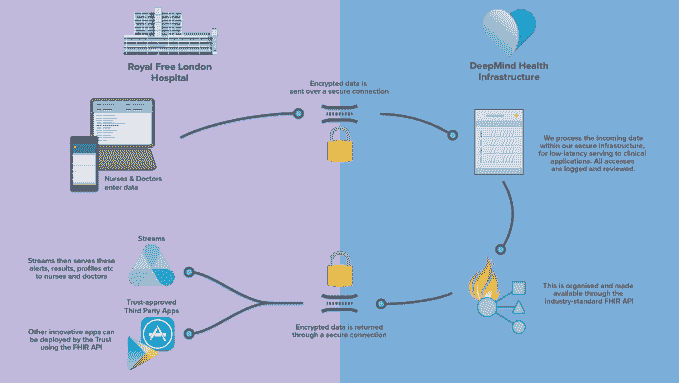

# 患者数据 API 是 DeepMind 进军英国 NHS  的关键

> 原文：<https://web.archive.org/web/http://techcrunch.com/2016/11/22/patient-data-api-pivotal-to-deepminds-push-into-uks-nhs/>

DeepMind Health 与英国国民医疗服务体系(NHS)的首次合作，最初专注于开发一款帮助早期检测急性肾损伤(AKI)的应用程序，今天早些时候在[重新启动——根据与皇家免费 NHS 信托的新信息共享协议，合作范围更广。](https://web.archive.org/web/20230327132239/https://techcrunch.com/2016/11/21/deepmind-health-inks-new-deal-with-uks-nhs-to-deploy-streams-app-in-early-2017/)

该协议至少持续到 2021 年。

根据该协议，正在皇家自由医院的三家伦敦医院接受治疗或已经接受治疗的约 160 多万人的各种数据类型的患者可识别数据(PID，也称为人民的医疗记录)将继续共享(根据该协议，五年的历史住院数据也可访问)。

根据 ISA 1 和 2(即规定如何使用数据的法律合同)共享的数据类型被 DeepMind 描述为“类似的”——一位发言人证实，根据原始安排共享的患者数据因此没有被删除(因为他们认为这是同一安排的延续)。ISA 2 的相关部分，详细描述了共享的数据类型，可以在这篇文章的底部找到。

在这一点上，该项目有一些值得注意的补充——例如，计划创建一个技术审计基础设施，以跟踪和记录个人对患者数据的访问，并在 ISA 中明确承诺，谷歌不会将 PID 用于任何其他目的，也不会将其与其他数据结合，也不会将数据出售给第三方。(尽管我们联系的一位法律专家不太放心，他指出，例如，没有明确禁止谷歌利用这些数据进行营销。)

但在宣布即将于 2017 年初在皇家自由医院推出 Streams 应用程序的公关底部，隐藏着合作的一个主要新方面:为皇家自由开发数据共享访问基础设施的计划，也称为 FHIR(快速医疗互操作性资源)API。

DeepMind 在[流媒体网站](https://web.archive.org/web/20230327132239/https://deepmind.com/applied/deepmind-health/streams/)上顺便提到了这个新的开发项目，并写道:

> 假以时日，我们希望[Streams]能够帮助开启 NHS 的下一波创新浪潮。支持 Streams 的基础设施建立在最先进的开放和互操作标准(称为 FHIR)之上，允许 Royal Free 让其他开发人员构建更容易与他们的系统集成的新服务。

页面下方的常见问题中提供了更多详细信息——显而易见，Streams AKI 应用程序实际上只是 DeepMind 打算创建的底层数据访问和流基础设施的初步展示，旨在通过其 API 促进/代理对 NHS 患者数据的访问，旨在推动第三方健康应用程序生态系统。

DeepMind 写道:

> 目前，[患者的完整病史]信息存在于几个不同的医院系统中，它们不能尽可能高效地相互交流，这对患者护理产生了连锁影响。Streams 将有助于整合这些信息，并允许医生在需要时通过智能手机安全、即时地访问这些信息。但是要做到这一点，Streams 和那些系统需要使用一种共享的计算机语言。
> 
> 我们致力于在开放和可互操作的标准上构建我们的基础设施，即 FHIR API(快速医疗互操作性资源应用程序编程接口),该领域的许多其他人已经同意它将成为医疗技术的新标准。这不仅将确保我们处理的数据处于现代化的基础设施中，还将有助于开发通用的信息处理标准，其他技术专家和临床医生也可以使用这些标准来构建他们的应用程序和其他软件，以改善患者护理(取决于那些寻求所有适当批准的第三方)。

皇家自由与 DeepMind 之间的服务协议合同进一步指出，FHIR API 将归 DeepMind 所有，并在协议的五年期限内授权给信托公司用于非商业的内部使用。

现在清楚的是，DeepMind 和 Royal Free 之间的合作范围有了相当大的扩展，Streams 应用程序本身演变成了一个更通用的临床辅助功能(例如，包括应用内消息等新功能)。更重要的是，DeepMind 使用 Streams 作为试点项目，为患者病历建立信任范围的访问基础设施。

这个更加实质性的基础设施项目似乎更好地解释了最初 ISA 下最初共享的 PID 数据的范围，该 ISA 是 DeepMind 和 Royal Free back 在 2015 年 9 月签署的——尽管在 2 月份公开启动合作伙伴关系时，没有明确提到要建立一个流媒体健康数据访问基础设施，以支持第三方应用生态系统。

Streams 网站上第一次提到 FHIR 是在今天早些时候，当时 DeepMind 还添加了这张关于预期基础设施的解释信息图…

DeepMind 联合创始人穆斯塔法·苏莱曼(Mustafa Suleyman)今天在接受 TechCrunch 采访时将 FHIR API 描述为“我们正在做的事情的核心部分”。“这个想法是，我们基本上创建了一个标准接口，允许第三方开发人员将其应用程序构建到一个规范的 API 中，”他说。“我们试图做的是让不同规模的不同开发人员尽可能容易地构建一个标准化的文件格式…我们不会在决定谁可以构建该 API 方面发挥任何作用。”

因此，理论上，DeepMind 可以在未来向开发者收取访问该 API 的费用——作为其将 FHIR API 货币化的途径——尽管苏莱曼在被直接询问时不会证实这是否是其意图，只是说:“我不知道。”

在最初的数据共享安排下，DeepMind 最初可以访问的数据范围与所述的肾脏应用用例之间的差异解释了今年早些时候爆发的[争议的症结所在](https://web.archive.org/web/20230327132239/https://techcrunch.com/2016/05/04/concerns-raised-over-broad-scope-of-deepmind-nhs-health-data-sharing-deal/)——当时披露了有多少数据从皇家免费网站流向谷歌旗下的公司。远远超过了一个仅仅针对 AKI 的应用程序所需要的。而且，你瞧，DeepMind 对 NHS 信托基金数据的野心确实要大得多。

“为什么 FHIR API 直到今天早上10 点 才公开？”健康数据隐私倡导组织 [MedConfidential](https://web.archive.org/web/20230327132239/https://medconfidential.org/2016/deepmind-try-again-november-2016/) 的萨姆·史密斯质疑道，自从细节公之于众以来，该组织一直对 DeepMind/Royal 免费协议持批评态度。“这份合同是让谷歌做两件事:1 .溪流，2。FHIR API，这是所有数据被复制到谷歌的理由。

“就像如果你想要 Gmail 的漂亮，你必须给谷歌你所有的数据来显示你的广告一样，这个应用程序的交易(包括所有的管理)是你必须为 API 复制数据。复制医院里每个人的数据的合法理由是“我们正在建立一个影子 IT 基础设施。公开的理由是“看，漂亮的应用程序！"那不一定是错的，但是为什么昨天没有提到 FHIR API？"

就其本身而言，DeepMind 坚持认为，它为特定的应用程序用例处理如此多的 PID，或者实际上为计划中的 FHIR 数据访问基础设施处理如此多的 PID，并没有违反任何 NHS 信息治理规则。相反，它表示需要获得所有数据，因为 AKI 可能会影响任何患者。

更广泛地说，它声称它与 NHS 的其他第三方医疗系统提供商，如 Cerner，在信息共享安排的结构上没有区别。尽管史密斯驳斥了这种说法，但他指出，与 DeepMind 仅仅构建一个应用程序相比，Cerner 提供了“整个医院的主要任务关键型 IT 系统”。

我们已经联系了 DeepMind Health 的两位具有临床背景的独立评论者，询问他们对这一点的看法，并将根据任何回应更新这篇文章。

当被问及为什么 DeepMind 没有更快透露其关于 Streams 项目的数据访问基础设施的计划时，苏莱曼说，他亲自谈到了该公司“对开放标准和互操作性的承诺”——并指出其网站上的一段话，该段话提到了“建立协同工作的技术”的目标尽管从这种泛泛的评论到 PID API 现在被揭示为项目的基石是一个相当大的飞跃 Streams 正在发展成为未来第三方医疗保健服务开发者生态系统的展示应用。

还在进行中:ICO 对 DeepMind 和 Royal Free 之间原始数据共享安排的合法性进行调查；以及由英国国家数据守护者进行的[审查，政府任命的数据守护者与卫生部合作，帮助确保公民的机密健康数据得到保护和适当使用，考虑如何为 Streams 项目共享数据。](https://web.archive.org/web/20230327132239/https://techcrunch.com/2016/08/23/deepmind-nhs-health-data-sharing-deal-faces-further-scrutiny/)

尽管监管道路上有这些坎坷，苏莱曼拒绝了皇家自由协作现在必须“重新启动”的想法——将下一阶段描述为不断发展的伙伴关系的“自然进程”。

“在过去的六到九个月里，我们更好地了解了彼此，更深入地与团队会面，制作了一批一次性应用的原型，进行了一些非常早期的用户测试和开发，所有这些都产生了一种非常好的关系——现在我们决定启动一项为期五年的合作伙伴关系，”他说，并补充说:“这增加了关系的强度和深度。”

他还煞费苦心地将数据共享安排描述为高度“透明”——反驳了相反的批评——尽管他承认，“事后来看”，如果皇家免费合作早一点公开，而不是 DeepMind Health 花了四个多月才正式宣布签署 ISA，情况会更好。

“从我们在 2 月份推出 DeepMind Health 的那天起，我们就致力于在透明度和信息治理方面树立新的标准，”他补充道。“我们首先任命了我们的独立评审员——他们是九位公正的、无报酬的、无合同的公共专家，我们邀请他们是为了公众利益来审查我们的。我认为这本身就是史无前例的。”

DeepMind 外部评审小组主席朱利安·胡珀特(Julian Huppert)告诉 TechCrunch，他们的“主要产出”将是年度评审。“我们目前正在朝这个方向努力，”他说。“该审查的确切问题范围尚未最终确定，但计划包括数据安全、信息治理、临床效用、系统交互和整体商业模式。我们将很高兴收到关于覆盖领域的进一步建议。”

“我们将很快委托我们选择的专家对 DMH 系统进行技术审计，费用由 DMH 支付，”他补充道。“DMH 向我们提供了 5 万英镑的预算，但也明确表示，如果我们聘请专家的合理费用超出预算，他们将提供进一步的支持。我们都是不发工资的，除了费用。”

Suleyman 表示，另一个即将到来的皇家免费 PID 数据技术审计基础设施——也是今天早些时候宣布的，计划由 OpenSSL 项目的联合创始人 Ben Laurie(但现在是 DeepMind 的员工)建立——旨在帮助 DeepMind 提供“超越系统中其他任何人今天所做的监督和透明水平。”

“我认为，我们可以验证数据是否根据系统中的信息治理专家和数据控制者批准的策略在技术基础架构中移动，这一点非常重要，”他说。“越来越多的技术能够以数学上的确定性证明加密的证据，即信息已经从一个位置传递到另一个位置，或者已经被某个员工出于特定目的访问过。”

也就是说，他确认技术审计基础设施不会在 Streams 应用程序推出前及时推出——在这一点上将其描述为“一个研究项目”,并在这一点上设定了一年多的潜在推出时间，即在 Streams 启动并运行后很久。

“这是我们正在努力的事情，”他说。“我们认为它将在[2017]年底前原型化。因此，这不是法律要求的事情，这远远超出了要求，但我们认为这是一个额外的安全和透明层，我认为这将增加很多额外的价值。但它不会在 1 月或 2 月或 3 月准备好。”

## 持续的数据共享问题

在讨论关于数据共享安排结构的争议时，苏莱曼尖锐地拒绝了对其访问患者病历范围的批评——试图通过在任务关键型 IT 系统提供商(如 Cerner)和 DeepMind 的 NHS 合作之间进行类比，为 Streams 应用程序共享信任范围的 PID 进行辩护。

他还试图在被“处理”的数据(即信托基金授予作为数据处理者的 DeepMind 的访问权限)和使用 Streams 应用程序的人访问的特定患者数据(即在患者护理发生时)之间建立法律区别。

他重申，目前与 Royal Free 的安排不能让 DeepMind 使用 PID 数据来开发任何其他产品，也不能作为开发 NHS 数据之外的任何机器学习模型的原材料。他说，这将需要签署额外的协议。

“在我们看来，我的直觉是，这些数据不能用于任何其他目的，除非护士或医生希望将其用于直接护理。因此，任何人出于任何目的访问该文件的唯一时间是当临床医生站在患者面前，或外出看望患者，或与同事讨论病例时。这都是直接护理，”他认为。

“如果我们想去做二次研究，或者如果我们想训练一个机器学习模型，或者任何其他需要完全不同的数据架构、完全不同的基础设施、一整套不同的法律协议、一整套不同的信息治理标准等等的事情。我认为，这与我们今天访问数据的术语非常非常不同。我认为人们对此有很多误解……这是完全一致的，它与 Cerner 或 Epic 或 Systems C 或 Allscripts 完全相同。”

“在更广泛的市场背景下提出这些问题真的很重要，”他补充道。“理解今天的同意模式真的很重要，我们一直在遵循这一模式，它完全符合全国每个信托机构(大约 200 个信托机构)的控制器/处理器安排，在相同的框架下运行，即医院作为控制器负责处理患者的数据以改善护理，因此我们的工作是做医院告诉我们的关于开发他们认为将改善护理的软件的任何事情。

“这本质上是同意模式。当您进入医院时，作为对您护理的回报，您同意允许控制者(医院)以其认为合适的方式处理数据，以改善患者护理。除了改善您在住院期间每天接受的直接护理外，它不能对这些数据做任何其他事情。这正是我们一直运作的框架。”

但并非所有人都相信苏莱曼对这一安排的法律合理性的“直觉”。全国数据保护和信息自由官员协会主席乔恩·贝恩斯(Jon Baines)认为，在数据共享协议的结构中，一个“基本的法律要点”仍然被忽视——包括相关各方和监管机构，他们尚未就这一点提供足够的澄清。

他告诉 TechCrunch:“抛开更广泛的道德问题(积极或消极)，我认为有一个基本的法律问题，我在合作伙伴的任何沟通中都没有看到它得到充分解决。”“双方一再表示，Deepmind 在数据保护法中仅具有‘数据处理器’的地位，最近于 11 月 10 日达成的‘信息处理协议’就是基于这一假设。

“然而，法律立场相当明确，一个实体是数据处理者(法律上的责任非常有限)还是数据控制者(实际上负有所有责任)，这是一个事实问题，而不是仅仅在协议中就可以断言的事情。如果 Deepmind 拥有自主权和专业知识来操纵它有权访问的数据——事实当然表明它确实如此——那么监管机构和法院极有可能会认定它是数据控制者。

“如果是这样，整个安排的基础就从根本上改变了。我们面临的情况是，Deepmind 及其所有者谷歌可以访问和控制大量患者的数据，而这些患者几乎肯定不知道这个事实。”

“我认为这迫切需要信息专员的投入，”贝恩斯补充道。“协议各方可以坚持一种观点，相关评论人士可以表达另一种观点，我们需要明确负责促进和执行数据保护法的监管机构的专家意见。”

在这一点上，苏莱曼拒绝接受这样的观点，即它与皇家自由的数据共享安排为 DeepMind 提供了更多的自由，而不仅仅是一个数据处理器，并再次指责对其解释 NHS 信息治理规则的批评是“一种误解”。

“我们处理数据的方式与系统中的所有其他技术提供商、软件提供商以及委托服务的所有其他信托公司完全一致，这一点我怎么强调都不为过，”他说。“从某种意义上说，我承认我们是一家出色的公司，但从另一个角度来说，我认为重要的是要把它放在更广泛的背景下，专注于我们显然试图提供的患者利益。”

当被问及 NDG 对数据共享安排有什么担忧，以及 DeepMind 和皇家自由在他们的新 ISA 中如何解决这些问题时，苏莱曼说 DeepMind 尚未被告知他们的具体担忧。“据我所知，他们仍在考虑他们在这个问题上的立场。我们没有与他们进行任何积极的讨论，但我知道他们正在考虑在这个问题上的正确立场，”他补充道。

NDG 的一名女发言人证实，对最初 ISA 的考虑仍在进行中。“我们也期待收到关于他们新项目的信息，”她指出，并补充说:“正如国家数据卫报在她最近发表的评论中明确指出的那样，利用患者数据开发创新的新治疗方法可以获得巨大的好处。为了患者的最大利益，这必须谨慎和安全地进行，公众必须参与关于如何使用信息和他们的选择的持续对话。"

ICO 的一位发言人也证实，它将继续调查数据共享安排:“我们对皇家免费 NHS 信托基金和 Deep Mind 之间共享患者信息的调查正在进行中。我们正在与国家数据卫士合作，以确保该项目符合数据保护法。我们一直在与皇家自由和深度思维联系，他们提供了有关 Streams 应用程序开发的信息。遵守数据保护法是企业和组织的责任。”

在这一点上，皇家自由的患者可以选择退出即将推出的 FHIR API 下的数据访问 DeepMind 表示，它预计明年年初推出——尽管苏莱曼指出，这些决定是由作为数据控制者的信托基金做出的，并表示，如果 API 最终被视为他们的核心系统，皇家自由可能会决定在未来取消选择。

他说:“他们出于信任做出了决定，只要我们的服务不是他们系统的核心和中心部分，他们将继续为我们的服务提供选择退出服务。”

他还证实，当 Streams 正式部署在皇家免费医院时，DeepMind 将获得报酬。到目前为止，该公司尚未向信托公司收取作为合作一部分的开发费用。他在付款时表示:“我们将因交付一些基础设施工程而获得非常微薄的服务费。”。

ISA 协议中详述商业安排的相关部分已被编辑，因此无法量化费用有多“适中”。无论是什么，随着 DeepMind 商业模式的演变，它都可能会发生变化——苏莱曼重申，DeepMind 健康的最终目标是按绩效支付。

“未来，我真正想做的是改变市场的运作方式。我希望我们能在交付具体成果时获得报酬，这样，当我们能在一些人们真正关心的临床成果上取得进展时，我们总费用的很大一部分就能得到支付。”

当被问及该公司何时会有任何数据来支持其关于应用交付的医疗保健改善临床结果并降低 NHS 医疗保健成本的说法时，苏莱曼表示，到明年夏天，它可能会有一些确切的结果来证明自己的情况。

“我希望到明年夏天，我们将有足够的数据，我们能够开始了解我们实际上有什么样的具体临床影响，我们可以与我们的独立评论者分享这些数据，我们可以与患者和临床医生协会更广泛地分享这些数据，并开始获得反馈，了解这些数据是否是我们正在跟踪的正确指标，这些数据是否是我们希望做出的正确改进。以及我们是否需要再次换挡。”

“据估计，仅仅通过改善整个系统的协调和沟通，就可以减少 40%的重症监护入院人数，”他补充道，并讨论了扩展后的 Streams 应用程序的潜在优势——它不仅包括向有可能出现急性肾损伤、败血症和器官衰竭等疾病的患者发出警报，还包括更通用的临床援助功能，如安全消息和行动请求功能，旨在取代医院寻呼机的作用。

“重症监护是医院系统中最昂贵的领域之一……如果你能减少住院人数，不仅可以节约成本，还能让患者受益匪浅，”他补充道。

虽然 DeepMind 希望在明年夏天之前拥有强大的指标来证明其对 NHS Trusts 的健康宣传的有效性，但其他人希望英国监管机构能够更加清晰地说明这家初创公司对数据保护法的解释的稳健性。

*   在新 ISA 下共享的数据类型如下:

