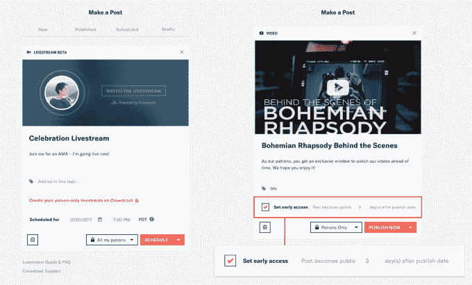

# Patreon 推出 Snapchat clone，仅面向创作者的付费用户 

> 原文：<https://web.archive.org/web/https://techcrunch.com/2017/06/14/patreon-membership-engine/>

广告不足以支持专业的在线内容制作者。因此，Patreon 正在为他们提供新的方式来组织、衡量和娱乐那些使用其平台向他们支付特殊访问月费的粉丝。

100 万名顾客平均每月向 5 万名创作者支付 12 美元，Patreon 今年有望向音乐家、喜剧演员、记者、摄像师和其他内容制作者支付 1.5 亿美元。今天的更新可能会把这个数字推得更高，同时重新定义艺术经济学。

**[关于帕特里翁如何在一年内规模翻倍的更多信息，请阅读我们上个月的深度报道。](https://web.archive.org/web/20221208235022/https://beta.techcrunch.com/2017/05/18/patreon-pushes-as-youtube-stutters/)**

“在过去的 15 年里，分销已经民主化，并且基本上解决了，”Patreon 首席执行官 Jack Conte 说。“不幸的是，在这一过程中，全球艺术融资陷入了危机。不仅对创作者，而且对喜欢艺术的人来说，我们修复财政基础是如此重要。”

顾客关系经理

新的“Patreon 会员引擎”以客户关系经理为中心，这是第一个面向专业内容创作者的 CRM。它可以让用户根据付费多少或何时加入来分类，并提供他们的电子邮件地址——这是 YouTube、脸书、Instagram、Snapchat、Twitter 和其他平台拒绝给创作者的。

这种面向艺术家的销售力量让他们可以通过特别优惠或感谢来联系他们的粉丝，比如向顶级消费者兜售高价商品，同时向他们更昂贵的奖励等级追加销售新的 1 美元订户。垃圾邮件不是一个太大的问题，因为康特说“没有理由辱骂给你每月工资支票的人。”

还有一系列新的内容创作工具。新的早期访问功能允许创作者只向每月支付一定金额的粉丝发布内容，并在公开发布之前设置一个“窗口”。与 Crowdcast 的合作让创作者用他们的 Patreon 帐户登录，并为付费粉丝直播，而 Patreon 支付带宽费用。

Patreon 直播和早期访问

但最令人兴奋和具有颠覆性的是 Patreon Lens，这是一个精简的 Snapchat 故事克隆版，创作者可以分享他们的生活和幕后，只有付费订户才能享受。创作者可以通过 Patreon Lens 从他们的社交媒体中赚钱，而不是在 Snapchat 和 Instagram 上发布他们的即兴内容。

你可以通过 Patreon on Lens 关注你订阅的所有创作者，看看他们每月通过自己故事的总收视率赚多少钱。不幸的是，该应用程序只允许照片和视频捕捉和上传，没有花哨的绘图、贴纸、滤镜或增强现实面具。但 Patreon 将继续修饰它，字幕很快就会出现。

帕特里翁透镜

与此同时，Patreon 正在用新的应用程序和标志设计彻底改革其品牌，并为该平台招募了一批新的 start 创作者。这些人包括[麦克斯威尼的互联网趋势](https://web.archive.org/web/20221208235022/https://www.mcsweeneys.net/)，运动员兼励志演说家[路易斯霍维斯](https://web.archive.org/web/20221208235022/https://twitter.com/LewisHowes)，前 ESPN/世界末日播客记者埃德韦达，加上喜剧演员[蒂姆·海德克](https://web.archive.org/web/20221208235022/https://www.patreon.com/oncinema)，[比尔伯尔](https://web.archive.org/web/20221208235022/http://www.allthingscomedy.com/comics/2/bill-burr)，[艾尔马德里加尔](https://web.archive.org/web/20221208235022/http://www.allthingscomedy.com/comics/1/al-madrigal)，[西奥冯](https://web.archive.org/web/20221208235022/https://twitter.com/TheoVon)和[亚当·卡罗拉。](https://web.archive.org/web/20221208235022/http://adamcarolla.com/)

前 YouTube 职业音乐家和 Patreon Jack Conte 的创始人

有了这些新工具，Patreon 可以改变在线内容生态系统，让创作者放弃他们的收入，希望今天获得小额广告收入份额，未来获得大宗商品或门票收入，并让创作者获得可靠的工资。

还有一个问题是，Patreon 能否从用户支付的 5%的微薄收入中赚到足够的钱。Patreon 预计今年将向创作者支付 1.5 亿美元，但收入仅为 750 万美元。这就是为什么计划为创作者提供额外的优质服务，Conte 告诉我，暗示通过 Patreon 销售商品或音乐会门票的合作伙伴关系。

真的，帕特里翁所要做的就是不断用稳定的薪水诱惑创作者，他们的粉丝就会追随他。“艺术是为数不多的合法垄断之一”康特哲思道。“如果你想听普林斯的，米克·贾格尔不做。世界上没有什么能满足这种欲望。它不可替换，不可热插拔。它不是商品。”