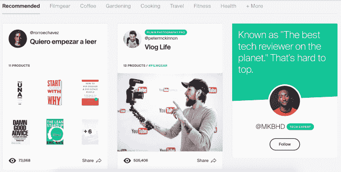
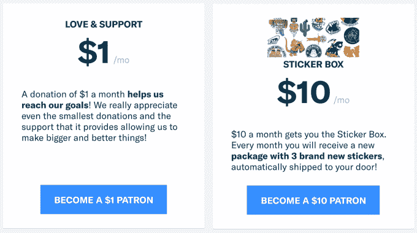
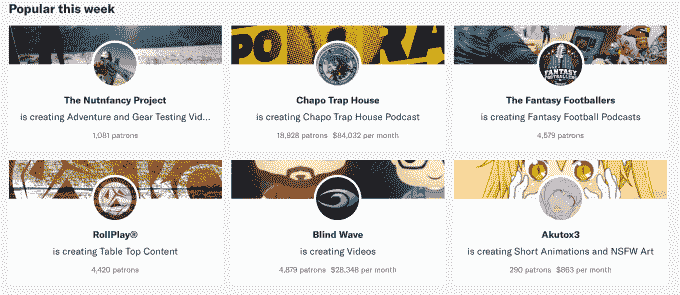

# Patreon 收购套件，让创作者在订阅中捆绑 merch 

> 原文：<https://web.archive.org/web/https://techcrunch.com/2018/06/05/patreon-merchandise/>

如果内容创作者希望出售价格更高的每月内容订阅，提供贴纸、别针、签名照片或 t 恤可以说服粉丝支付更高的费用，并通过物理连接保持他们的忠诚度。这就是为什么赞助平台 [Patreon](https://web.archive.org/web/20221205021942/https://www.patreon.com/) 刚刚收购了 [Kit](https://web.archive.org/web/20221205021942/https://kit.com/) ，这是一家建立商品物流后端的初创公司，这样创作者就不必自己摆弄电子表格和填充信封。

Patreon 的产品副总裁 Wyatt Jenkins 说:“今天，超过 60%的 Patreon 创作者想要或已经在提供某种实物商品。这些初创公司可以共同帮助 Patreon 的创作者开发粉丝订阅的商品，这些商品可能每月支付 10 美元或 20 美元，而不是 1 美元或 5 美元的基本在线内容层。

这笔交易还可以帮助 Patreon 领先于 YouTube 和脸书，这两家公司正在蚕食它的订阅赞助模式。Patreon 现在有 200 万赞助人支持 10 万名创作者。在截至 2017 年的前五年里，它支付了 3.5 亿美元，预计在 2018 年再向创作者支付 3 亿美元，同时抽取 5%的提成。

交易的财务条款[没有披露](https://web.archive.org/web/20221205021942/https://blog.kit.com/patreon-acquires-kit-80ffafa13534)。Kit 团队中 90%的人，主要是产品和工程人才，将加入总部位于旧金山的 Patreon，尽管他们将在今年剩下的时间里作为卫星办公室留在纽约。 [Kit 已经从 Social Capital、Expa、#Angels、Precursor 和斯坦福的 StartX，以及 Ellen Pao 和 Slack 的 April Underwood 等天使投资人那里筹集了 250 万美元](https://web.archive.org/web/20221205021942/https://techcrunch.com/2016/11/15/kit-the-expa-backed-social-network-for-product-reccos-lands-2-5-million-in-seed/)。

“当我们想到 merch 时，它从来都不完全是关于这个东西——贴纸或 t 恤——而是有这种关系。Kit 联合创始人兼首席执行官卡米尔·赫斯特说。

Kit 在转向商品物流和筹集 A 轮融资的过程中，开始与 Patreon 谈判，导致了这次收购。这家初创公司最初是作为社交媒体明星和网络名人通过 Kit 向粉丝推荐产品来赚取联盟营销费的一种方式，Kit 收取推荐费。一些创作者展示了他们的摄影设备、运动服或咖啡因供应品的“套件”,赚取了数万美元。

“我们处在一个一切都朝着正确方向发展的阶段。赫斯特说:“我们已经看到每月活跃用户和创作者收入的强劲增长。”他指出 Kit 的商品总价值已经达到 1500 万美元。值得一提的是，我们没有听说这家初创公司是#crushingit，帕特里翁一再拒绝给出价格的大概数字，所以这可能更像是软着陆。

“通过与 Patreon 的合作，我们似乎能够加快我们正在做的事情。与订阅相比，Merch 非常注重交易，”赫斯特解释道，并宣扬定期支付比一次性购买具有更高的终身价值。“如果你使用 merch 销售订阅，你可以帮助创作者赚更多的钱。”

预备工具包 Patreon 团队

Patreon 的计划是建立一个新的开放式商品供应商平台。创作者将能够在各种 merch 合作伙伴之间进行选择，从那些将他们现有的标志转化为实物的合作伙伴，到那些仅仅根据明星的模糊想法设计项目的合作伙伴。但与此同时，基特不会关闭或放弃其附属计划，因为“我们不想关闭创作者所依赖的任何收入流”，赫斯特承诺。

詹金斯说，“现在创作者必须在不同的 merch 合作伙伴之间做出选择”，没有集体议价能力或足够的数据来知道什么是有效的。“我们可以为所有这些 merch 合作伙伴设定比他们自己能获得的价格更低的价格，”同时减轻创作者不得不摆弄谁得到什么的电子表格并自己邮寄它们的负担。

Patreon 将 merch 货币化的计划还不太明朗，尽管 Jenkins 说，“我们要做大馅饼，我们想分一杯羹。”这个想法是，使用 Patreon 的商品平台将产生额外的费用，超过其从订阅中赚取的微薄的 5%。如果增加一个商品显著增加了某个层级的用户数量，帕特里翁将从 TBD 那里提成。相比之下，YouTube 采取了一种更不干涉的方式，仅仅列出了推荐的商品合作伙伴。

“我们希望创作者能够谋生。这不是一个侧面的骗局。詹金斯总结道:“你必须年复一年地赚更多的钱，你必须能够做像买房子或获得医疗保健这样的事情。“所有其他平台都是‘给我们你的内容，我们会给你一点小小的改变。’这让我们走上了购物之路。创造者们正在乞求施舍。"