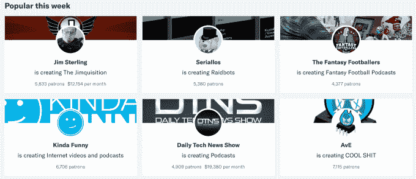
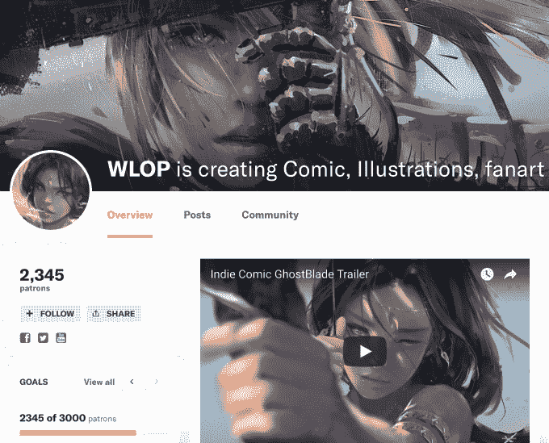

# Patreon 以约 4.5 亿美元的估值进行了大规模融资，以支付艺术家的薪酬

> 原文：<https://web.archive.org/web/https://techcrunch.com/2017/09/14/patreon-series-c/>

在一个艺术免费分享和传播的时代，Patreon 为将内容创作转化为职业提供了新的希望。插画师、喜剧演员、游戏制作人和音乐人使用 Patreon 让粉丝支付每月订阅费，以获得对他们作品的特殊访问。作为交换，Patreon 只收取很少的 5%的提成。

随着 5 万名创作者和 100 万名订阅者平均每月支付 12 美元来观看他们的内容，[帕特里翁](https://web.archive.org/web/20230330073541/https://www.patreon.com/)有望在 2017 年支付 1.5 亿美元。这意味着，尽管规模扩大了一倍，Patreon 今年的收入只有约 750 万美元。

但投资者认为，如果有足够多的艺术家签约并带来他们的粉丝，Patreon 可能会成长为新创作者经济的支柱。TechCrunch 获悉，Patreon 已经完成了一大笔 C 轮融资，三个消息来源证实了这一点。两人说，它对这家初创公司的估值约为 4.5 亿美元，Index Ventures 参与了这轮融资，但没有领投。帕特里翁拒绝对此事发表评论。

[更新:Patreon now [证实，它已经在由 Thrive Capital](https://web.archive.org/web/20230330073541/https://techcrunch.com/2017/09/19/patreon-60-million/) 牵头的 C 轮融资中筹集了 6000 万美元。点击阅读我们对官方资金公告[的报道。]](https://web.archive.org/web/20230330073541/https://techcrunch.com/2017/09/19/patreon-60-million/)

这笔现金应该会给 Patreon 带来所需的力量，与其他帮助创作者赚钱的大平台竞争，包括 YouTube 和脸书新推出的原创视频观看标签。虽然这两家公司拥有庞大的用户群和追求艺术家的团队，但它们只支付了创作者内容广告收入的 55%。通过更多的营销来提高人们的意识，即 Patreon 支付了 95%，粉丝的直接支付带来了比广告浏览量多很多倍的收入，Patreon 可能会取得进展。

## 资助创意阶层

音乐家兼摄像师杰克·康特(Jack Conte)一直难以从自己的工作中挣到足够的钱，他发现像 Kickstarter 这样的一次性项目众筹平台无法提供艺术家专注于创意所需的稳定资本。因此，2013 年，他与人共同创立了 Patreon，“其使命是资助创意阶层”，他在 6 月份告诉我。广告？工资不够。在支持艺术的金融机制中，消费者支付将占据更大的比重。”

到目前为止，Patreon 已经通过 2016 年 1 月的 3000 万美元 B 轮融资筹集了[4710 万美元](https://web.archive.org/web/20230330073541/https://www.crunchbase.com/organization/patreon)，B 轮由 Thrive Capital 牵头，Index 也参与了 a 轮融资。但新资本的大量注入可能会增强创作者对平台的信心。如果他们知道 Patreon 不会很快耗尽资金，他们可能会更热衷于在该平台上建立长期的订户基础。

更雄厚的资金也可以让 Patreon 为创作者开发一套额外的工具，其中一些可以额外收费。“将会有新的机会来为产品创造收入流，”康特向我承诺。他建议，这可能包括销售活动门票或商品，或者更好地帮助创作者理解和与粉丝沟通。这可能会让 Patreon 的收入超过 5%，与 iTunes 或 Spotify 等平台相比，这似乎微不足道。

插图画家 WLOP 向帕特里翁的订户提供 4K 大小的无水印版本

对其有利的是，Patreon 对在其平台上货币化的内容类型相对宽松。色情绘画、成人游戏以及与大麻相关的新闻和娱乐都吸引了 Patreon 的订户。这其中的大部分甚至在脸书或 YouTube 上是不允许的，或者在 PewDiePie 丑闻或本周脸书发布的[新规则](https://web.archive.org/web/20230330073541/https://techcrunch.com/2017/09/13/facebook-monetization-2/)后 [YouTube 的广告启示打击](https://web.archive.org/web/20230330073541/https://techcrunch.com/2017/06/01/youtube-bans-hateful-videos-from-making-money-via-its-advertising-network/)后不能通过广告赚钱。

虽然这是一把双刃剑。帕特里翁已经看到一些右翼政治学者通过仇恨言论筹集资金。它启动了几个，导致了它的另类克隆人哈特里翁的诞生。更多的资金将带来更多的审查，帕特里翁将面临艰难的工作，在编纂和执行这些规则时，走在没有污秽的言论自由的钢丝上。

到目前为止，帕特里翁还没有太专注于帮助人们发现新的创作者来资助。这对它来说是一个增加收入和帮助艺术家的巨大机会。但这也会带来挑战。Patreon 应该在多大程度上推广已经很受欢迎的创作者，他们可能有更好的转化率，即使这使网站有点像回音室？如果这些创作者中的任何一个最终冒犯了他人，那么做出关于谁应该成为焦点的编辑决定也可能使帕特里翁容易受到攻击。

不过，作为一项任务和一项业务，这一切都值得冒险。内容分发正在向网上转移。视频制作者和 Indiegogo 发明者之外的创作者想要稳定的收入。广告平台被证明是限制性的，吝啬的，并且不能带来足够的现金。自动化威胁到旧的职业。互联网能够将小众艺术家和小众观众联系起来。随着与你最喜爱的创作者建立联系的新方式的出现，消费者越来越愿意为接触他们喜爱的人物而付费。

帕特里翁处于所有这些趋势的中心。不是每个艺术家都要挨饿。