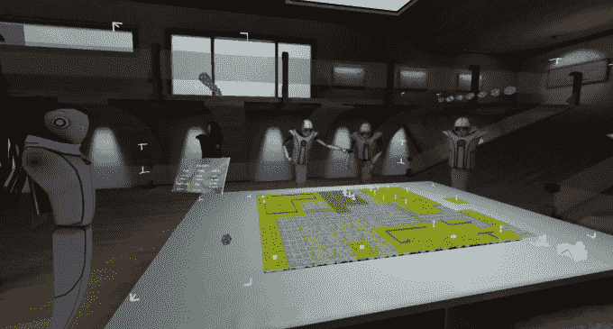
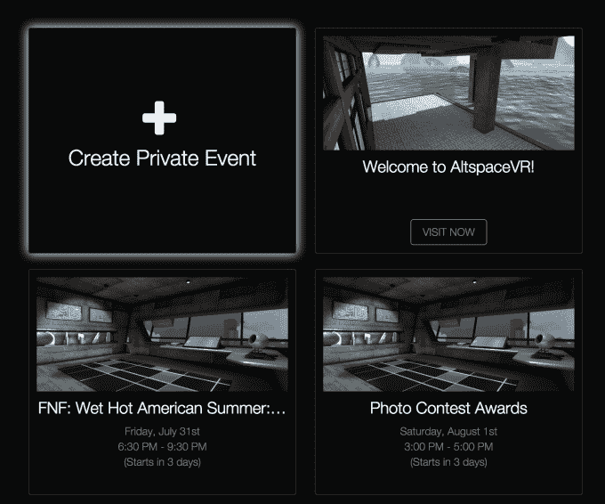
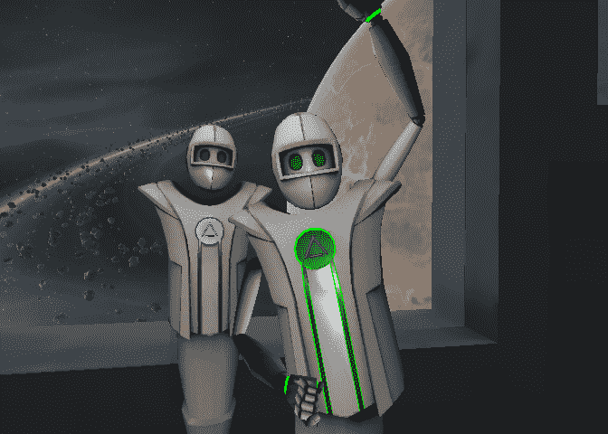

# 虚拟聊天室 AltspaceVR 筹集 1030 万美元出售虚拟活动 

> 原文：<https://web.archive.org/web/https://techcrunch.com/2015/07/29/pay-per-virtual-reality/>

由于 AltspaceVR 的出现，按虚拟现实付费可能成为现实。VR 聊天室和交流平台刚刚筹集了 1030 万美元，为我们提供了一个可以闲逛的数字场所。

但有了这笔资金，AltspaceVR 就需要设计一个商业计划。虽然 AltspaceVR 现在专注于增长，但其联合创始人兼首席执行官埃里克·罗莫告诉我，它最终可以通过出售名人或思想领袖虚拟聚会的入场券来赚钱。

AltspaceVR 桌面游戏程序 V20

[AltspaceVR 成立于 2013 年，经过几个月的测试后，于 6 月](https://web.archive.org/web/20221207151112/https://beta.techcrunch.com/2015/06/12/vr-chat/)正式推出其虚拟现实聊天室平台。在那里，来自世界各地的陌生人以机器人的形象出现，他们可以相互交谈，浏览网页，玩超大的棋盘游戏，或在巨大的数字屏幕上观看视频。该软件旨在运行在 Oculus、Mac 和 PC 桌面以及 3D 电视上，可以配备 Leap Motion 或 Kinect 运动传感器，将用户的手势带入虚拟世界。

罗莫告诉我，“投资者感到兴奋的一件事是平均 25 分钟的用户会话时间。”如今，大多数虚拟现实体验都是快速、一次性的游戏或电影体验，持续时间只有三到五分钟。他们的新鲜感很快就消失了。但由于 AltspaceVR 是由其他真实的人组成的，它不会以同样的方式变得无聊或重复。

新的资金来自 Comcast Ventures，以及回归投资者腾讯、杜比家族风险投资公司、Raine Ventures Lux Capital、西方技术投资公司、Maven Ventures、Promus Ventures、Streamlined Ventures 和 Rothenberg Ventures。

这笔现金将推动 AltspaceVR 团队的发展，使其超过目前的 20 人团队。罗莫告诉我，Comcast Ventures 是一个天然的合适人选，因为“人们喜欢在 AltspaceVR 中做的事情之一就是一起看东西。他们看网飞、Twitch 和 YouTube。我们很高兴康卡斯特对内容了如指掌。他们可以帮助我们了解内容领域。”

到目前为止，现场活动是 AltspaceVR 最受欢迎的一些时刻。例如，一位科学家参观了一个巨大的火山口，并在无人机的帮助下在虚拟现实中捕捉到了它，他带领了一次旅行。当他带领他们穿过火山时，几十名替代者跟在后面——这是一个他们可能永远也不会去的地方，尤其是没有防护装备的情况下。一些人报告说这是他们做过的最好的事情之一，不管是虚拟现实还是虚拟现实。

现在，用户可以收听 AltspaceVR 活动的整个[时间表，从电影和电子竞技的放映到游戏玩家聚会，如最近的桌面游戏周末。AltspaceVR 创建了一个名为 V20 的特殊 VR 酒馆，它直接来自角色扮演游戏。在那里，用户可以在像龙与地下城这样的游戏中竞争。您可以在下面的视频中探索这个空间:](https://web.archive.org/web/20221207151112/https://account.altvr.com/events)

https://www.youtube.com/watch?v=wNNc2a7uneQ

罗莫说，玩家在 Altspace 连续玩这些游戏长达 3.5 个小时。作为人类未来和 VR 成瘾潜力的标志，这有点令人不安，但它肯定是 AltspaceVR 的好兆头。

目前，这些活动是免费的，但如果有足够的吸引力，AltspaceVR 可能会像人们付费观看电视拳击比赛或参加网络研讨会一样收费。如今，喜剧演员路易斯·C·K 在他的网站上出售他的表演视频。但最终，他可能会吸引一群人来观看他在虚拟现实中的生活。

正是这些共享体验的梦想，以及 AltspaceVR 提供的人工面对面接触，说服了马克·扎克伯格购买 Oculus。AltspaceVR 在那之前就开始了，在许多人相信虚拟现实会真正实现之前。两年后，社交虚拟现实不再只是虚构。

我在 Altspace 拍的一张自拍

*【图片来源:[节点](https://web.archive.org/web/20221207151112/https://www.youtube.com/watch?v=_jgAJcmmlVs)*