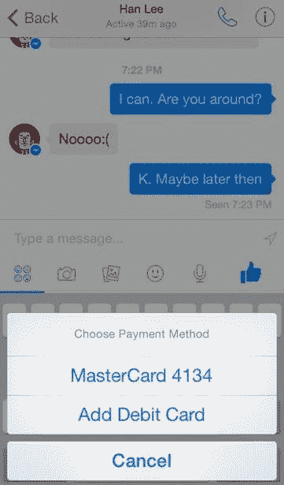

# 黑客截图显示好友间支付功能隐藏在 Facebook Messenger  中

> 原文：<https://web.archive.org/web/https://techcrunch.com/2014/10/05/pay-with-facebook-messenger/>

Facebook Messenger 允许朋友们互相寄钱。根据截图和视频显示，脸书所要做的就是打开这个功能，这些截图和视频是由斯坦福大学计算机科学学生安德鲁奥德使用 iOS 应用探索开发工具 Cycript 拍摄的。

Messenger 的支付选项允许用户以类似于发送照片的方式在消息中汇款。用户可以在 Messenger 中添加借记卡，或者使用他们已经在脸书注册的借记卡。此外，应用程序内的个人密码也能增强支付的安全性。

目前还不清楚脸书是否会通过对转账收取少量费用来利用 Messenger 赚钱，或者免费提供该功能以推动其独立聊天应用的使用。这将取决于前 PayPal 总裁、Messenger 的新负责人 David Marcus。

脸书选择挖走马库斯的原因现在很明显:Facebook Messenger payments 可能会与 Venmo、PayPal、Square Cash 和其他点对点转账应用程序竞争。

脸书首席执行官马克·扎克伯格在公司的 [Q2 收益电话会议](https://web.archive.org/web/20230310211401/https://techcrunch.com/2014/07/23/facebook-messenger-payments/)上表示，“随着时间的推移，[信使]和支付之间将会有一些重叠。[……]支付部分将是推动整体成功的一部分，并帮助人们相互分享和与企业互动。”然而，他敦促华尔街不要说得太多，因为“我们有太多的基础工作要做”，可能还需要一段时间。

他敦促分析师和投资者，如果他们预计这种情况会很快出现，就应该修改对脸书收入的估计。“如果你的模型或任何东西反映出我们可能会这样做，我强烈鼓励你调整这一点，因为我们不会这样做。扎克伯格总结道:“我们会花时间，用多年来一直正确的方式来做这件事。

Messenger 中支付代码的存在是由安全研究员 Jonathan Zdziarski 在上个月[首先发现的。Aude 告诉我，他用 Cycrypt 挖掘了他越狱的 iPhone 上的 Messenger for iOS 代码，并打开了支付功能来获取截图和视频。我联系了公司询问关于信使付款的事情。脸书拒绝置评。](https://web.archive.org/web/20230310211401/https://mobile.twitter.com/JZdziarski/status/509341607100153856/photo/1)

Aude 用特性和代码摆弄了一下。他告诉我，你只需点击一个按钮开始支付，输入你想发送的金额，然后发送。脸书对交易保密，没有向新闻供稿发布任何相关信息。

在奥德调查的版本中，信使支付只适用于借记卡，不适用于信用卡或银行账户。这可能是因为通过借记卡转账处理起来更便宜，而且不需要批准或一些人不知道的号码，比如连接银行账户。Aude 推测“根据我对借记交换率的理解，每笔交易将花费脸书大约 0.4 到 0.5 美元(德宾刷卡费+ ACH 费)。该应用程序没有提到发送费用，所以它可能是免费的，至少最初是免费的。随着时间的推移，他们可能会收取 1 美元的费用。”不过，这一点无法得到证实。

奥德没有将 PayPal 视为 Messenger 中的支付选项，尽管奥德挖掘出的代码中有关于 PayPal 的注释。脸书会自动在其主应用程序中列出你为游戏或广告设置的支付方式。

至于这笔钱实际上是如何转移的，Aude 告诉我，“它使用的机制是借记一个账户，然后使用一些神奇的手段来查找收款人的银行账号，并由 ACH[自动结算所]存入，与 Square Cash 相同。”

目前，支付将是一个人对一个人的，但 Messenger 最终将支持团体支付，根据代码中的说明，解释“在短期内，我们将只支持单一支付附件。未来将支持多个支付附件。”

Aude 告诉我，他认为脸书将在未来几个月内在美国启用该功能，然后最终在世界其他地区启用，尽管该代码可能只是支付功能内部测试的早期阶段。公众还需要一段时间才能接触到。然而，有一天，脸书可能会挑战汇款行业，该行业向外国工人收取高昂的费用，有时为 10%至 20%不等，以汇钱回家给家人。

脸书/WhatsApp、苹果 iMessage、腾讯的微信、Line、KakaoTalk、谷歌 Hangouts、Kik、乐天的 Viber 以及其他公司之间正在进行一场全球短信大战。每个公司都在努力使自己与众不同，有时是通过贴纸、游戏、商业或社交网络。

如果 Messenger payments 取得成功，它可能会创造一个全新的理由来选择脸书的聊天应用程序，而不是其他任何人的。给朋友付费可能是你一个月只做几次或更少的事情，所以为它开发一个独立的应用程序可能没有意义。脸书显然希望将其捆绑到人们日常使用的应用程序中，可以帮助它击败 Venmo 等专用应用程序。

此外，除了点对点支付，该功能还可以建立脸书的借记卡号码和其他支付方式的集合。这些可能会非常有用，因为脸书也在开发一个直接从新闻源进行电子商务购买的[购买按钮。](https://web.archive.org/web/20230310211401/https://techcrunch.com/2014/07/17/facebook-buy-button/)