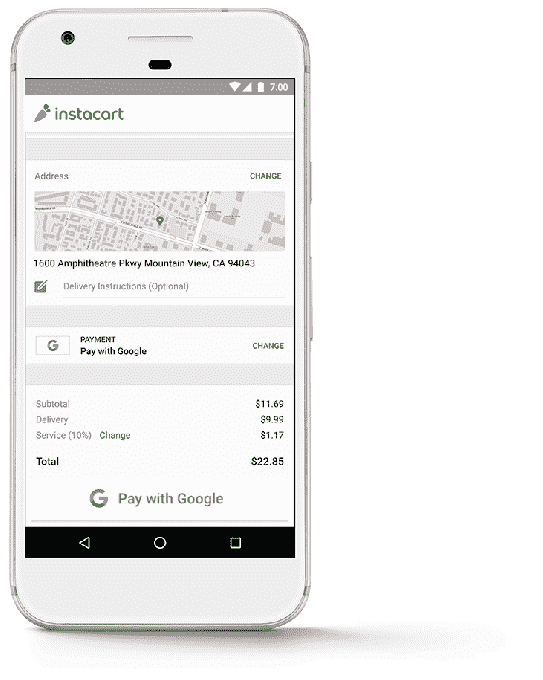
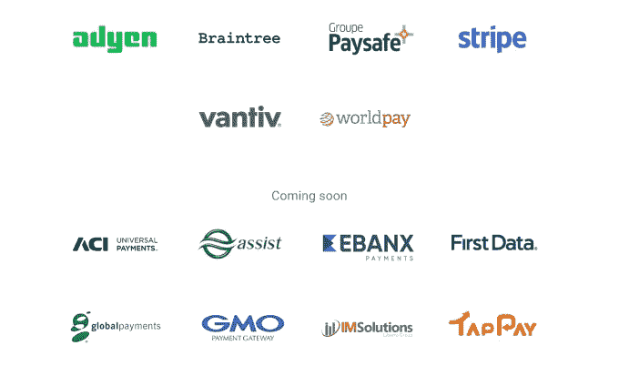
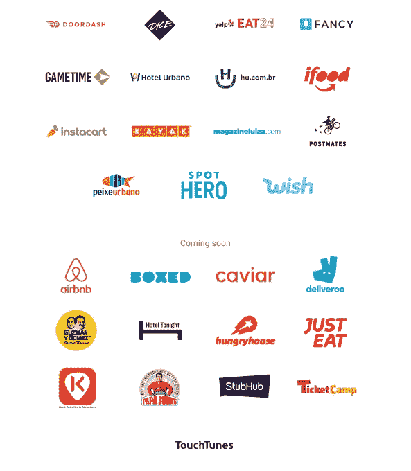

# “用谷歌支付”上线，允许移动用户用任何一张卡支付，而不仅仅是 Android Pay TechCrunch 中的卡

> 原文：<https://web.archive.org/web/https://techcrunch.com/2017/10/23/pay-with-google-goes-live-allowing-mobile-users-to-pay-with-any-card-on-file-not-just-those-in-android-pay/>

谷歌今天宣布，它将推出一种在移动设备上支付的新方式，使用你现有的任何卡——包括那些通过 Google Play、YouTube、Chrome 或 Android Pay 等产品保存到你的谷歌账户的卡。这个“用谷歌支付”选项将所有这些保存的支付选项捆绑在一个界面中，应用程序制造商和零售商只需几行代码就可以实现。

使这一切成为可能的技术，谷歌支付 API(T1)，是今年 5 月在谷歌 I/O 开发者大会(T3)上由 T2 首次公布的。

这里更大的想法是让移动用户更快地结账，并增加零售商的转化率，方法是允许谷歌用户使用客户在谷歌备案的任何支付卡，而不是他们专门保存到 Android Pay 的支付卡。该公司今年早些时候指出，这项功能还将使客户更容易使用谷歌助手购物。

“支付是用户谷歌账户的一个关键功能，”谷歌支付副总裁 Pali Bhat 告诉 TechCrunch。“我们的目标是让用户能够跨设备、跨平台、跨界面使用谷歌账户进行支付。”

当你选择使用“用谷歌支付”结账时，你会看到一个保存在你的谷歌账户中的支付卡列表。要继续，您只需点击您想要使用的卡，谷歌会将这些信息和您的送货地址一起发送给商家，然后商家会处理剩余的交易。

此外，谷歌与 40 多家支付提供商合作，为希望提供“用谷歌支付”的商家简化整合

支付提供商——包括 PayPal 的 Braintree、Stripe、Vantiv、Worldpay、Adyen 和 Groupe pay safe——将继续像以前一样处理交易。其他合作伙伴也即将加入，包括 ACI、Assist、Ebanx、First Data、Global Payments、GMO、IMSolutions 和 TapPay。

因为该选项要求商家使用谷歌支付 API，所以“用谷歌支付”选项还不是到处都可用。但谷歌已经列出了一长串受欢迎的服务，当载入 Chrome 浏览器时，这些服务将通过他们的应用程序和移动网站为客户提供更快的结账速度。

在发布时，支持的服务列表包括 Doordash、Eat24、Instacart、Kayak、Postmates、Wish 和其他服务，但在不久的将来会扩展到包括 Airbnb、棒约翰、StubHub、Deliveroo 等其他服务。(见下文)。

该 API 现在也可以在全球范围内使用，首次与 iFood 和 Magazine Luiza 等合作伙伴一起将它引入巴西等新市场。

目前，谷歌支付可以在移动应用和 Chrome 上使用，但这种情况在未来可能会改变。

“我们从 Chrome 开始，但也计划将这种体验带到其他浏览器。敬请关注，”巴特说。