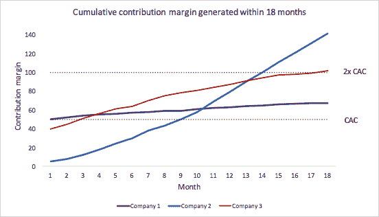

# 回报是一份礼物 

> 原文：<https://web.archive.org/web/https://techcrunch.com/2017/02/10/paybacks-a-gift/>

塔利亚·戈德堡撰稿人

塔利亚·戈德堡投资互联网和软件业务

[Bessemer Ventures Partners](https://web.archive.org/web/20230131024534/https://www.bvp.com/)

旧金山办公室。她对市场、移动视频、自助软件平台、网络社区和房地产技术特别感兴趣。

杰里米·莱文撰稿人

[Jeremy Levine](https://web.archive.org/web/20230131024534/https://www.bvp.com/team/jeremy-levine)

是贝塞麦风险投资公司的合伙人。他的投资包括 Yelp、Shopify、LinkedIn、Mindbody 和 Pinterest。

More posts by this contributor

每年，我们都会遇到数以千计的互联网企业，从行业或垂直行业到产品和商业模式，以及介于两者之间的一切。

从表面上看，这些企业可能没有多少共同点；在内部，我们已经围绕一个单一的指标，适用于几乎所有使用付费客户获取的消费者和/或市场业务。

我们定期与我们的投资组合公司和我们遇到的企业家分享这一指标。我们在这里分享这个指标，是希望创始人在评估他们企业的健康和进步时，可以把我们的回报率作为一个有用的基准。

**投资回收期:****18 个月内累计贡献率** ≥ **2*CAC**

其中:

*   边际贡献=收入–销售成本–可变运营成本。对于互联网和软件业务，可变成本通常包括与托管、支付处理费、入职或实施成本、客户支持、退货、运输和折扣相关的成本。
*   CAC =与付费营销相关的全部成本(付费广告、重定目标、付费推荐、品牌、公关、销售和营销工资等)。).

该规则规定，业务部门应努力在 18 个月内持续产生至少两(2)倍于边际贡献的客户获取支出。我们看到许多公司根据毛利润计算 CAC 回报，但我们认为边际贡献是一个更可靠的衡量标准，因为可变成本对单位经济有重要影响，不应被忽略(双关语！).

这里有三个例子可以说明这种现象在不同的公司中是如何体现的:

*   **公司 1:** 第一次购买就保本，但很少有顾客回来的电子商务公司。达不到目标。
*   **公司 2:** 高频率交易业务，如优步，该公司在最初的几笔交易中可能甚至无法实现收支平衡，但随着时间的推移，使用量会增加，并在 18 个月内达到 2X+。
*   **公司 3:** 中频业务，使用量随着时间的推移而下降，但公司仅在 18 个月内节省了 2 倍。

正如沃伦·巴菲特所说，“最好的公司是那些在一段时间内能够以非常高的回报率使用大量增量资本的公司。”我们的偿还率是衡量这一点并确定一家公司是否有潜力长期盈利的一种方式。

虽然创始人应该考虑许多基准，但我们认为这是一个有吸引力的重要目标。预测未来是很难的，即使一家企业尚未实现这一目标，从投资的角度来看，这对我们来说也绝不是一个障碍，但我们确实希望看到朝着这一里程碑继续前进。(事实上，我们的很多投资组合公司甚至还不到 18 个月！)

我们是如何提出这个基准的？我们根据倍数和内部收益率来评估我们基金的健康状况。风险资本基金的目标是 3 倍的倍数和 30%(或更高)的回报。在 18 个月内产生 2 倍的收购支出会产生大约 60%的内部回报率，这太棒了。

当然，企业仍然需要覆盖其固定成本，许多企业发现他们的 CAC 回报随着他们扩大规模以接触越来越不具吸引力的客户而逐渐下降，因此在客户获取方面投入的每一美元的实际回报要低得多，但可能仍然非常有吸引力。作为投资者，我们很乐意投资一家能持续产生这种回报的公司，我们认为大多数企业家也会为这样的表现而激动不已！

如果您企业的 CAC 回报与我们的回报比率一致，那么您公司的成功可能只受您的执行速度和规模的限制！