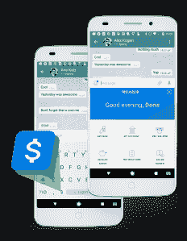

# PayKey 为其面向千禧一代的“社交银行”智能手机键盘筹集了 1000 万美元 

> 原文：<https://web.archive.org/web/https://techcrunch.com/2017/10/19/paykey-raises-10m-for-its-millennial-targeted-social-banking-smartphone-keyboard/>

# PayKey 为其面向千禧一代的“社交银行”智能手机键盘筹集了 1000 万美元

佩基的团队

在争夺千禧一代客户的竞争中，银行面临着越来越拥挤的战场。他们不仅要与 Venmo 等服务竞争，而且许多通讯应用都在增加自己的点对点支付服务。总部位于特拉维夫的初创公司 [PayKey](https://web.archive.org/web/20221025222253/http://www.paykey.com/) 认为他们有一个智能手机键盘的解决方案，让银行客户无需登录银行应用程序就可以访问金融服务。今天 PayKey 宣布，它已经筹集了 1000 万美元的 B 轮融资，由 MizMaa 领投，其他投资者包括 SBI 集团，暹罗商业银行的金融科技子公司 Digital Ventures，SixThirty 和 FinTech71。

这使得 PayKey 的总资金增加到 1600 万美元。PayKey 首席营销官盖伊·塔尔米(Guy Talmi)表示，该公司最初是一款社交区块链应用，但在看到银行在吸引年轻客户方面面临的问题后，创始人“灵光一现，我们可以通过利用智能手机上最有价值和最常用的不动产之一——键盘——来解决金融机构的这个问题。”

在银行将 PayKey 的白标智能手机键盘 API(保持每个机构自己的安全和认证系统)与他们的移动应用程序集成后，他们的客户可以将其安装到他们的智能手机上，并使用它来发送支付，检查他们的余额，并从任何应用程序中访问其他服务。键盘上有一个带有银行标志的按键，点击它就可以打开一个服务菜单。

这个想法是，通过移动额外的一层摩擦，而不是强迫客户离开他们最喜欢的社交媒体或 messenger 应用程序，PayKey 可以帮助金融机构留住年轻客户，他们习惯了 Venmo、Square Cash 和 Zelle 的便利，以及 Facebook Messenger 和 Snapchat 等消息应用程序中的点对点支付服务。

塔尔米表示:“随着这些平台开发和增强自己的金融服务，用户几乎没有理由再使用任何其他应用了。”“我们充当银行和用户最常用应用之间的桥梁，让银行的品牌成为社交和信息体验的一部分。”

PayKey 已经与七家银行签署了商业协议，包括 Westpac、大华银行、Bank Leumi 和一家未透露名称的金融服务提供商，该提供商称是世界上最大的金融服务提供商之一，目前正在推出他们的键盘版本。PayKey 计划在未来六个月内将其客户增加一倍，重点是亚洲，许多 B 轮投资者都在亚洲。这家初创公司还希望开始涉足其他垂直行业，包括电信提供商。