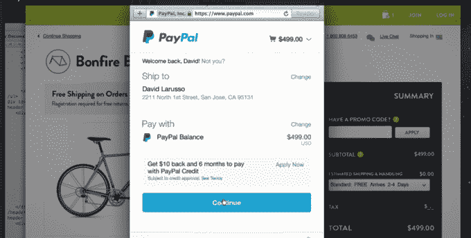

# PayPal 在网上推出即时结账服务“一键式”

> 原文：<https://web.archive.org/web/https://techcrunch.com/2015/04/28/paypal-brings-its-instant-checkout-service-one-touch-to-the-web/>

PayPal 正在网上推出无缝的一键式支付，允许客户从商家网站结账，而无需再次输入用户 ID 和密码。该系统名为 One Touch for Web，是 PayPal 早期手机业务的扩展。

去年秋天，该公司[在 TechCrunch Disrupt 上宣布](https://web.archive.org/web/20221208221908/https://beta.techcrunch.com/2014/08/19/paypal-rolls-out-one-touch-mobile-checkout-for-apps/)全面推出一触式移动支付，随后为消费者在移动设备上购物和支付提供了一种更简单的方式。在移动设备上，该平台是使用从贝宝收购 Braintree 获得的技术构建的[，最初出现在许多应用程序中，例如 Jane.com、ParkWhiz、StubHub 和 Threadless。如今，Airbnb、Lyft 和 Munchery 等其他公司也在使用该系统，其中一些公司称转化率增加了 50%。](https://web.archive.org/web/20221208221908/https://beta.techcrunch.com/2014/08/19/paypal-rolls-out-one-touch-mobile-checkout-for-apps/)

PayPal 商业和下一代商务高级副总裁比尔·雷迪(Bill Ready)表示:“一触即发，商家面临的最大问题是转化率的大幅下降，尤其是在移动领域。”。"而且大部分的购买仍然发生在移动网络上，所以这是非常重要的."

这个想法是，只需一次触摸，客户就不必在每次想用 PayPal 支付时不断输入用户名和密码——这些信息将被存储并在支持的应用程序之间共享。

作为移动优先的产品，One Touch 是有意义的，因为在智能手机的小屏幕上输入信息比在桌面网络上更乏味。事实上，Ready once [指出](https://web.archive.org/web/20221208221908/https://beta.techcrunch.com/2014/09/08/paypal-braintree/)超过一半的电子商务购物体验发生在移动设备上，但只有 10%到 15%的购买发生在移动设备上。下降的原因很大程度上是因为在手机上结账仍然很复杂。

有了 One Touch for Web，网上购物者第一次只需输入用户名和密码，之后，他们就可以在其他商家网站上支付，而无需重新通过 PayPal 认证。

该系统将自动为 PayPal 当前的大多数商家启用..

“对于使用贝宝的数百万商家来说，他们中的大多数都不需要做任何额外的工作就能获得它，”Ready 说。“这样就行了。”

该公司表示，总共有 1.65 亿 PayPal 客户将很快能够利用这一新功能。正如《T2》本月早些时候在易贝财报中报道的那样，PayPal 的净支付总额增长了 18%，达到 610 亿美元，本季度新增 360 万活跃账户。

此举出台之际，竞争对手支付平台 Stripe 在收购自己的客户(在某些情况下，是从贝宝手中)方面取得了重大进展。该公司表示，它现在每年为成千上万家企业处理数十亿美元的业务，包括著名的网络品牌，如 Rackspace、Shopify、Reddit、Foursquare、Dailymotion 等。它还通过 Stripe Connect 为 Lyft、Kickstarter、Indiegogo、TaskRabbit、花式等公司的市场提供动力。而[如今成千上万的](https://web.archive.org/web/20221208221908/https://beta.techcrunch.com/2014/09/30/general-catalyst-commits-10m-for-startups-to-stripes-payments-ecosystem/)应用已经[整合了](https://web.archive.org/web/20221208221908/http://www.engadget.com/2014/09/26/facebook-buy-stripe/)Stripe API 和支付服务，包括推特和脸书。

贝宝的 OneTouch for Web 今天抵达美国，但在未来几个月内将扩展到全球。

[YouTube https://www.youtube.com/watch?v=_0fqD6Wo8aM]