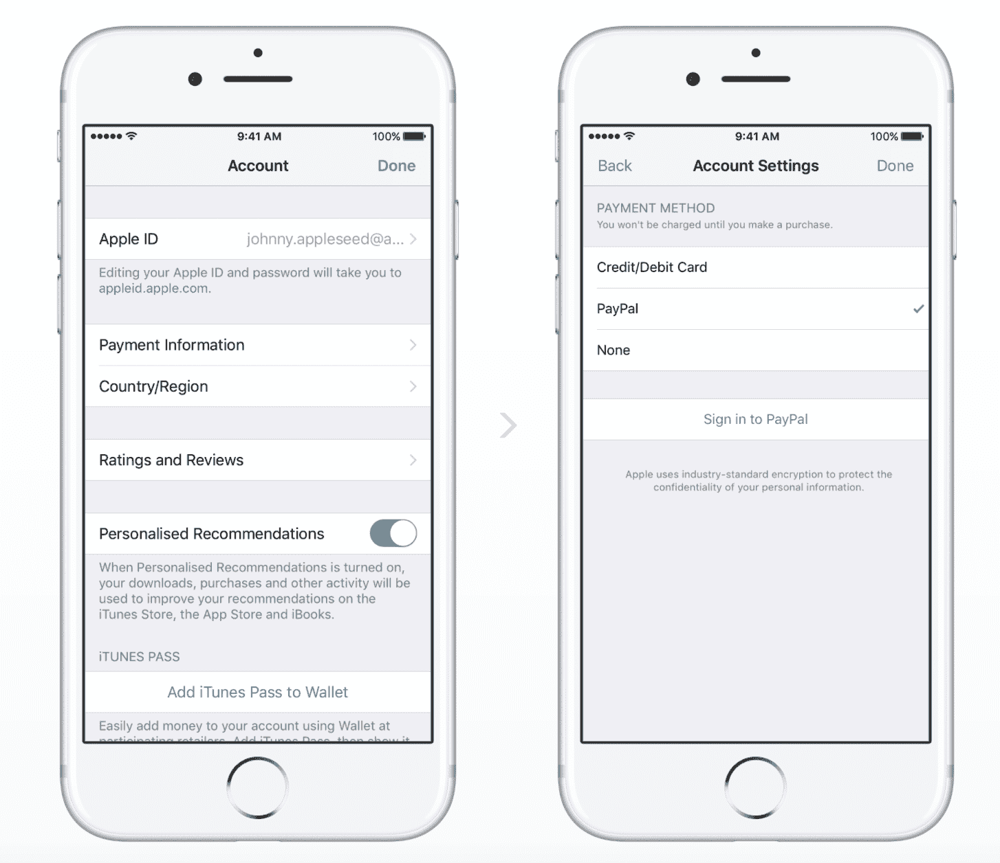

# PayPal 扩大与苹果的整合，将成为 11 个新市场的支付选项

> 原文：<https://web.archive.org/web/https://techcrunch.com/2017/07/12/paypal-expands-apple-integration-will-become-a-payment-option-in-11-new-markets/>

PayPal 今天上午[宣布](https://web.archive.org/web/20230404173601/https://www.paypal.com/stories/us/paypal-now-available-on-app-store-apple-music-itunes-more)扩大与苹果的合作关系，除了在更多市场可用之外，这种支付方式现在将成为 iOS 设备上的一个选项。在今天之前，美国用户在配置苹果账户时可以在 Mac 和 Windows 上的 iTunes 桌面上添加 PayPal 作为他们的支付方式，但这次扩展意味着相同的功能将扩展到 11 个新的国家。

这份名单包括加拿大、墨西哥、西班牙、意大利、以色列、法国、英国、澳大利亚、德国、奥地利和荷兰。

PayPal 今天早上表示，今天开始在加拿大和墨西哥推出，其他国家将“很快”上线但是，据我们了解，该功能实际上已经覆盖了所有新支持的市场。PayPal 似乎也悄悄地改变了其博客文章的措辞，以反映这一点。

一旦添加，受支持市场的用户将能够使用 PayPal 支付他们在 App Store 中的购物，包括应用内购买和订阅，以及 Apple Music、iTunes 电视节目和电影、iBooks 和 iCloud 存储等东西——无论他们使用的是什么设备及其 Apple 帐户。

此外，该公司告诉我们，PayPal 将作为一个支付选项直接添加到 iOS 上，这是以前没有的。这将在所有 12 个市场提供，包括美国和新增加的 11 个其他市场。

这意味着你现在可以在你的 iPhone、iPad 或 iPod touch 上进入你的 iOS 设置，将你账户的默认支付方式切换到 PayPal。这样做之后，您所有的购买都将从 PayPal 支付——不需要信用卡或借记卡。PayPal 表示，这也包括你可能通过苹果电视或苹果手表进行的购买。

当该功能在他们的市场上线时，新老客户都可以将他们的帐户转换为使用 PayPal 作为默认方式。这是通过更改他们在 iPhone、iPad、iPod touch、Mac 上的 App Store、Apple Music、iTunes 和 iBooks store 中的帐户设置，或者通过 Windows PC 上的 iTunes 来完成的。

直接在苹果移动设备上成为一种新的支付选项可能会对支付公司产生巨大的推动作用，该公司还指出，它正在利用其一触式[技术](https://web.archive.org/web/20230404173601/https://www.paypal.com/us/selfhelp/article/What-is-One-Touch-and-how-do-I-use-it-FAQ3033)支持新的苹果 ID 账户集成。

一键式通常用于在首次使用后跳过 PayPal 登录屏幕，以加快网络和移动设备上的结账速度，只要您使用的是同一设备或浏览器。对于苹果，一触式组件是 Apple ID 与 PayPal 关联的方式。这样，当你使用你的 Apple ID 从 App Store 购物时，你就跳过了 PayPal 通常要求的密码字段。

*更新:美国消费者新闻与商业频道[报道](https://web.archive.org/web/20230404173601/http://www.cnbc.com/2017/07/12/paypal-shares-hit-all-time-high-on-apple-deal.html)在苹果合作的消息下，贝宝的股价创下了 56.99 美元的历史新高。*