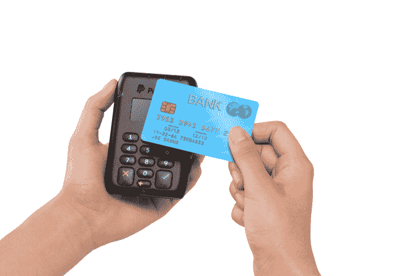

# PayPal 收购了 CurrentC 背后的移动钱包 Paydiant，以提升其游戏与谷歌+苹果 TechCrunch 的竞争

> 原文：<https://web.archive.org/web/https://techcrunch.com/2015/03/02/paypal-paydiant/>

拥有 1.62 亿用户的支付服务公司 PayPal[准备在今年晚些时候从电子商务巨头易贝分离出](https://web.archive.org/web/20221210065337/http://www.sec.gov/Archives/edgar/data/1633917/000119312515062742/d877527d1012b.htm)，今天宣布收购，以帮助建立其针对实体商家的移动业务，并在与苹果和谷歌等其他有望成为科技支付公司的竞争中加强其重点。

它正在收购 T4 的 Paydiant T5，一家开发移动钱包技术的初创公司。反过来，这项技术为大型企业的支付应用提供了动力，如赛百味、哈里斯蒂特超市、第一资本银行，以及——也许最值得注意的是——MCX 的，这是一个商人拥有的网络，正在开发一个名为 CurrentC 的支付应用。

你可能还记得，CurrentC 去年出现在新闻中，当时 MCX 的一些商家——包括沃尔玛、塔吉特、CVS 等大型企业——正在以自己的方式建立 CurrentC，以应对 Apple Pay 和其他解决方案。

PayPal 和 Paydiant 没有透露交易的条款，但它将包括技术、客户关系和大约 70 名 Paydiant 员工。据报道，这是一笔 2.8 亿美元的交易。Paydiant 的首席执行官克里斯·加德纳告诉我，收购预计将在今年 3 月或 4 月完成。

加德纳说，Paydiant 已经从投资者那里筹集了大约 4200 万美元的资金，这些投资者包括 General Catalyst、Stage 1 和北桥。

虽然加德纳和 PayPal 全球倡议高级总监 Anuj Nayar 都强调这次收购不是针对苹果和谷歌的——“Apple Pay 和谷歌制造了很多噪音，但我们从来不是竞争对手,”加德纳坚持说——你不能否认移动支付领域正在升温，似乎在最大的参与者之间形成了一种土地争夺战。

随着苹果终于扣动了 Apple Pay 的扳机，iPhone 制造商的进入受到了如此大的热情，以至于它成为了其他人的催化剂。

Visa 正在进行收购以扩大其提供的服务种类；[销售点设备公司](https://web.archive.org/web/20221210065337/https://beta.techcrunch.com/2015/03/01/ingenico/)正在推出新的 Apple-Pay 和 NFC 兼容硬件。谷歌又开始认真对待支付了。

它有自己的 Android Pay API——桑德尔·皮帅[在巴塞罗纳世界移动通信大会](https://web.archive.org/web/20221210065337/https://beta.techcrunch.com/2015/03/02/android-pay-is-real-and-will-give-developers-the-reins-as-an-api/)的主题演讲中对其进行了命名检查——谷歌最近[也从运营商的合资企业 Softcard](https://web.archive.org/web/20221210065337/https://beta.techcrunch.com/2015/01/16/softcard/) 购买了技术。这也将使谷歌与这些运营商及其客户建立新的联系，这将是其服务获得更大规模的关键。

如果谷歌专注于运营商，而苹果拥有美好但非常具体的设备体验，那么贝宝正在寻找一个与商家接触的领先角色——可以说这是其他公司也在取得进展的一个领域。

这是公司的重要举措。作为一家企业，PayPal 是为在线商务而生的，这仍然是其大部分交易的所在地:在其 2014 年 2260 亿美元的销售额中，不到 20%——460 亿美元——是在移动设备上完成的，其中很小一部分是销售点的实物交易。加入 Paydiant 将为 PayPal 的平台带来更多的销售点数量，也将为 PayPal 提供一条更成熟的路线来应对更多的大型商户市场，为他们提供开发自己品牌的移动钱包和信用卡以及礼品卡和会员卡等其他营销计划的提议。

“随着 Paydiant 的加入，PayPal 成为商家更强大的商业伙伴，”PayPal 总裁丹·舒尔曼在宣布这笔交易的博客帖子中指出。

迄今为止，Gardner 告诉我，目前大多数交易都是使用该公司开发的二维码系统进行的，但更普遍的是，该平台是与设备无关的。巧合的是，为此，PayPal 今天也宣布了一款新的销售点读卡器，允许商家添加 NFC 读取功能，以进行非接触式支付。该阅读器将首先在英国和澳大利亚推出，在今年晚些时候进入美国之前，PayPal 和易贝通常会先在这两个市场进行测试。

对于 Paydiant，加德纳表示，这笔交易是显而易见的，因为它给了其钱包技术更大的规模和火力。如果这是一家较大的初创公司的想法，想象一下其他数百家较小的移动支付和移动商务初创公司的主张。

“这一领域将会有更多的整合，”弗雷斯特公司的分析师托马斯·休松说。“我们将看到更多大公司收购小公司。如果我们看到更多这样的事情发生，我不会感到惊讶。”