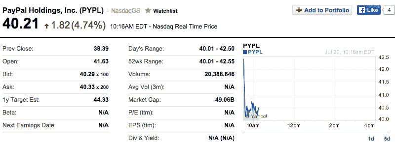
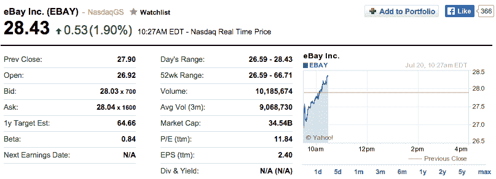

# 贝宝股价上涨 8.3%，此前易贝分拆对贝宝的估值超过 500 亿美元 

> 原文：<https://web.archive.org/web/https://techcrunch.com/2015/07/20/paypal-shares-pop-8-3-percent-following-ebay-split-valuing-paypal-at-more-than-50b/>

# 在易贝分拆对 PayPal 的估值超过 500 亿美元后，PayPal 的股价上涨了 8.3%

所有人都预计贝宝([纳斯达克:PYPL](https://web.archive.org/web/20221225084341/https://finance.yahoo.com/q?s=PYPL) )在与母公司([纳斯达克:易趣](https://web.archive.org/web/20221225084341/https://finance.yahoo.com/q?s=EBAY))的[拆分](https://web.archive.org/web/20221225084341/https://techcrunch.com/2015/05/14/paypal-to-list-on-nasdaq-under-pypl-ticker-after-ebay-spinoff/)后会比易贝更值钱，但没想到*会那么值钱*。经过短暂的“发行时”交易后，PayPal 现在正式成为一家独立的公司。在交易的第一天，股价以 41.63 美元开盘，比周五公开推出前的最后一个临时收盘价高出 8.3%。

以 41.63 美元的股价交易，该公司的估值为 508 亿美元，高于易贝目前 345 亿美元的盘中估值。纳斯达克开盘后几分钟，PayPal 的股价为 40.21 美元。即使市场出现小幅调整，股价仍上涨了 4.74%。

提醒一下，在 PayPal 首次公开募股后不久，该公司于 2002 年 7 月被易贝以 15 亿美元收购。这家公司目前的市值是其上次公开估值的 33 倍。到目前为止，PayPal 已经管理了超过 180 亿笔交易和超过 1 万亿美元的资金。它现在在 200 个国家拥有 1.69 亿消费者。

换句话说，PayPal 不再是闪亮的新金融科技初创公司。这是一家成熟的金融重量级公司，准备再次公布季度收益。它面临着本土巨头的竞争，如阿里巴巴的支付宝，以及新来者，如 Stripe。

今天的拆分对这家支付公司来说是个好消息，因为这将让它有更多的自由来筹集额外的资本和收购其他公司。既然 PayPal 不再仅仅是易贝的子公司，股东们清楚地表明他们想持有 PayPal 的股份，而不是易贝的股份。

此外，PayPal 的高管现在可以不通过易贝发行债券。它还可以收购使用 PayPal 股票的公司等等。对 PayPal 来说，这将是一段有趣的新旅程。

