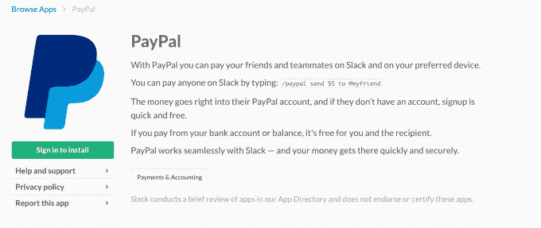

# PayPal 的第一个支付机器人是一款 Slack 应用 

> 原文：<https://web.archive.org/web/https://techcrunch.com/2017/02/07/paypals-first-payments-bot-is-a-slack-app/>

PayPal 今天上午发布了一款新的机器人，旨在让 Slack 用户无需离开他们喜欢的工作聊天平台就能更方便地汇款。该公司声称，这是 PayPal 第一次推出机器人，尽管这不是 PayPal 第一次与更大的通信服务整合。

例如，去年秋天， [PayPal 加深了与 Facebook Messenger 的关系](https://web.archive.org/web/20221007201902/https://beta.techcrunch.com/2016/10/24/facebook-messenger-now-supports-paypal-payments-in-bots-will-track-your-paypal-receipts/)，并增加了用户在聊天应用中跟踪交易的功能。T4 还与商家合作，支持他们自己的聊天机器人在 Messenger 上的交易。

PayPal 也与其他大型平台整合，如苹果的 Siri 和微软的 Outlook.com。

与后两种集成类似，PayPal 的 Slack bot 直接面向终端用户。通过该公司的在线目录，可以作为一个 Slack 应用程序使用 PayPal bot，安装后可以通过键入“/PayPal ”,然后输入命令来使用它。比如:“/PayPal 给@Dave 寄 5 美元。”

这里的想法是，该机器人可以用于同事之间的快速点对点支付，如分享午餐、点咖啡、分摊出租车费、购买团体礼物等。

PayPal 表示，在使用它之前，你需要链接你的 PayPal 账户，并配置你的交易设置，包括当你想审查和批准交易时。

[https://web.archive.org/web/20221007201902if_/https://www.youtube.com/embed/SVHGDU8RsAg?feature=oembed](https://web.archive.org/web/20221007201902if_/https://www.youtube.com/embed/SVHGDU8RsAg?feature=oembed)

视频

PayPal 指出 Slack 的 500 万日常用户是其选择在其平台上推出机器人的原因之一。虽然规模庞大，但 PayPal 也有可能在公司进一步增长和扩张之前，提前进入市场，成为闲置用户的首选支付服务。Slack 今天有企业野心，刚刚发布了面向大公司的产品 Enterprise Grid。

此外，该公司还指出，点对点支付是 PayPal 最常用的功能之一，并引用了 PayPal、Venmo 和 Xoom 在 2015 年处理的 410 亿美元交易。

贝宝机器人从今天开始在 T2 向澳大利亚、加拿大、美国和英国的普通用户开放