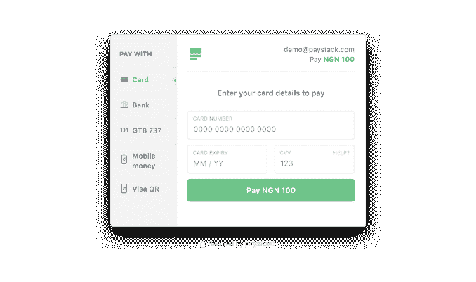

# 雄心勃勃要成为非洲条纹的 Paystack 从腾讯(Tencent)的 Visa 融资 800 万美元...并自我条带化 

> 原文：<https://web.archive.org/web/https://techcrunch.com/2018/08/28/paystack-with-ambitions-to-become-the-stripe-of-africa-raises-8m-from-visa-tencent-and-stripe-itself/>

就技术而言，非洲一直是全球最不发达的地区之一，在所谓的数字鸿沟方面也不太先进。但由于人口众多，一些国家的经济正在快速变化，我们看到了科技领域的巨大连锁效应。如今，在金融服务领域，一家更有趣的初创公司宣布提供一些资金，突显了这一趋势。

拉各斯的一家类似 Stripe 的初创公司 Paystack 宣布，它已经在首轮融资中筹集了 800 万美元。pay stack 通过一个 API 和几行代码为商家和其他人提供在线支付服务。该公司目前在尼日利亚很活跃，其支付 API 与成千上万的企业集成，在两年内，它已经增长到处理所有在线支付的 15 %;该公司的计划是既继续在国内市场增长，又从加纳开始向更多国家扩张。

我将 Paystack 描述为“Stripe 式的”,有趣的是，这轮融资正是由 Stripe 自己牵头的——这不仅标志着后者(曾经是一家 YC 初创公司)在继续增长的过程中，对志同道合的全球创始人和企业虎视眈眈，也标志着 Stripe 如何理解打入非洲这样的地区所面临的挑战，因此看到了与这些人合作并为他们提供支持的机会。

Stripe 的首席执行官帕特里克·科利森在一份声明中说:“Paystack 的创始人技术含量很高，狂热地以客户为导向，而且毫无耐心。”。“我们很高兴能在世界上发展最快的地区之一支持这些人。”

Paystack 的首席执行官 Shola Akinlade 说:“为非洲的企业做准备需要很多当地的细微差别。”他与首席技术官 Ezra Olubi 共同创立了 pay stack，见上图。“Paystack 似乎是唯一这样做的。”

2016 年，Paystack 成为第一家来自尼日利亚进入 Y Combinator 的创业公司，孵化器正在做本轮的一些后续投资。这一轮 A 轮的其他战略投资者包括 Visa 和中国网络巨头腾讯，微信和其他许多服务的母公司。(腾讯也投资了 Paystack 的上一轮:这家初创公司迄今已融资 1000 万美元。)

Stripe 在西方的金融服务领域取得了巨大成功，它开发了一种非常快速简单的方法，将支付集成到任何应用程序或网站中，将过去需要大量集成和协商的工作简化为几行代码。它出现在应用程序开始起飞的时候，人们开始对在网上进行金融交易感到更舒服，只要它们容易做。

Paystack 遵循了类似的模式，尽管更加本地化。

尼日利亚是非洲第一大经济体，但即便如此，它也只是刚刚开始电子商务。市场上还有其他支付提供商在运营——Interswitch 可能是最大的——但 Akinlade 将 Paystack 描述为一种更现代的支付方式。具体来说，它的重点是整合尼日利亚人(很快，非洲其他国家的人)用于接受和支付的各种支付选项，并使每种支付选项都同样易于使用。

易用性掩盖了这样一个事实，即整个非洲的支付选项清单很长，而且很分散。Paystack 使使用支付卡进行支付成为可能，这是许多西方市场的规范，但银行转账以及许多支付途径也是如此，因为许多人“没有银行账户”，即没有使用支付卡建立的银行账户或信用记录。

这些服务包括移动货币服务，本质上是将用户的移动电话账户变成一个存储和支付货币的地方；以及基于 USSD 的服务，这种服务使用手机通信基础设施中更基本的部分来发送信息和汇款(USSD 已经被许多其他供应商使用，这些供应商希望 T2 在新兴市场提供更多的 T4 连接。

这些较新的路线往往更加本地化，但也是支付服务中最重要的路线之一。根据世界银行的数据，移动货币是整个非洲金融包容性增长最快的途径:尽管撒哈拉以南非洲拥有银行账户的成年人比例保持不变，但使用移动货币的人数增加了 20%以上。

整合这些选项需要 Paystack 不仅与所有主要银行合作，还与所有主要移动运营商合作，以涵盖一系列支付方式。

这是一份很长的潜在合作伙伴名单，但 Paystack 创始人与之合作的时间超过了两年。

阿金拉德曾在大学学习计算机科学，在他“厌倦”并决定创业之前，先在喜力工作了两年。

他的第一次尝试是另一种“克隆”:这是 Dropbox 的新兴市场版本，名为 Precurio，拥有超过 20 万名客户。其中一些是尼日利亚银行，他们开始主动询问 Akinlade 是否能在软件项目上帮助他们。在这样做的过程中，他发现了市场中的一个巨大缺口，即围绕电子商务支付建立一家创业公司，涵盖支付链中的多家银行和多个其他参与者。“我很快意识到，这里的支付方式与美国和英国不一样，”他说。

构建一个将许多不同的服务和这些关系结合在一起的产品，不仅对那些不太熟悉这个领域的人来说更具挑战性，而且在市场仍然相对较小的情况下，他们可能对自己做的事情不太感兴趣。Akinlade 表示，Paystack 每月处理的总金额现在超过 2000 万美元——在更大的全球范围内，这仍然是一笔很小的金额，当你考虑到 Paystack 在这些交易中的收入仅为 1.5%时，这一数字就更小了。

尽管如此，随着经济进一步提速，这个地区是全球大型金融服务企业不可忽视的。

“非洲是 Visa 长期增长战略的核心，特别是当你考虑到现金仍然是非洲大陆数百万人的主要支付选择时，”Visa 在中东欧、中东和非洲(CEMEA)的战略合作伙伴、金融科技和风险投资负责人 Otto Williams 在一份声明中说。“我们对 Paystack 的投资符合我们寻求的投资类型，即随着全球商业生态系统的变化和发展，将有助于我们拓展全球商业生态系统，并提供互利的商业机会。”

不仅经济在缓慢增长，而且科技时代也在发生变化。现在已经有大约九家尼日利亚的创业公司通过了 YC。考虑到整个非洲更广泛的机会和开发者的数量，这可能还是太少了，但这是一个开始。