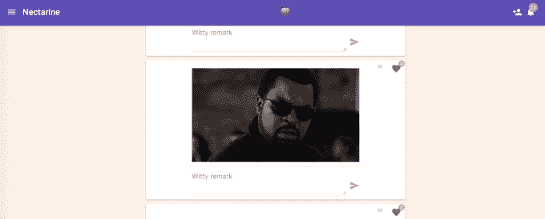

# 桃子得到了一个非官方的网络和 Android 版本，名为油桃

> 原文：<https://web.archive.org/web/https://techcrunch.com/2016/01/14/peach-gets-an-unofficial-web-and-android-version-called-nectarine/>

# 桃子得到了一个非官方的网络和安卓版本，叫做油桃

如果你因为没有 iOS 设备而没有尝试过[桃子](https://web.archive.org/web/20230321223639/https://techcrunch.com/2016/01/08/peach-is-a-slick-new-messaging-app-from-the-founder-of-vine/)，一名开发者已经在[发明了一种叫做“油桃”的东西，](https://web.archive.org/web/20230321223639/https://www.producthunt.com/tech/nectarine)这是一种非官方的 Android 和网页版服务。

就你能做什么和如何互动而言，这是有限的，但你绝对可以查看你的流(以翻转的顺序)，比如帖子和对帖子的评论。如果你还在使用这项服务，它会非常方便……你知道，因为[有些人已经称它为“死亡”](https://web.archive.org/web/20230321223639/http://bgr.com/2016/01/11/peach-messaging-app-iphone-collapse/)

我发现[服务](https://web.archive.org/web/20230321223639/http://peach.cool/)相当有粘性，它的命令行界面或“神奇的词语”是一种有趣的社交信息传递方式。

Peach 的创造者多姆·霍夫曼(Dom Hoffman)加入了产品搜索，给了它“酷”的点头，所以这很好。也许将来第三方开发者会为这项服务创造一些有趣的东西。Peach 团队表示，官方 Android 应用程序正在开发中，但这将暂时为您提供非 iOS 版本的修复。

([通过瑞安·胡佛](https://web.archive.org/web/20230321223639/https://www.producthunt.com/tech/nectarine)上传 GIF)