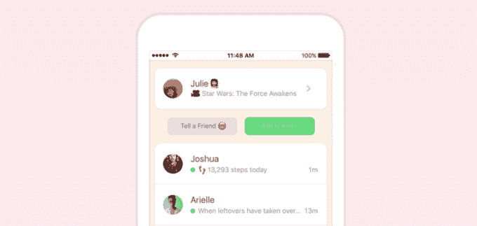
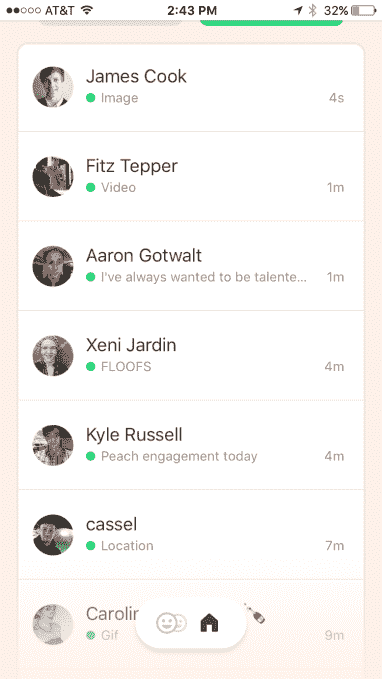

# Peach 是 Vine TechCrunch 创始人开发的一款漂亮的新消息应用

> 原文：<https://web.archive.org/web/https://techcrunch.com/2016/01/08/peach-is-a-slick-new-messaging-app-from-the-founder-of-vine/>

聊天聊天聊天，聊天聊天聊天。我们喜欢，你们也喜欢。消息应用程序在 2016 年(再次)很受欢迎，似乎有一个适合我们所有人的平台。也有面向世界其他地方的大型平台，如 Messenger、WhatsApp、Line、Snapchat 和 Hangouts(以及更多)。

[一个新的应用程序，桃子](https://web.archive.org/web/20221209004249/https://www.producthunt.com/tech/peach-3)，是*非常有趣*。[桃子](https://web.archive.org/web/20221209004249/http://peach.cool/)是 Vine 的创始人多姆·霍夫曼(Dom Hofmann)创造的。但是，它有什么不同呢？嗯，入职非常顺利，如果你熟悉的话，参与体验有点像使用 Slack 命令。入职感觉也很像 Slackbot。

例如，您可以键入“GIF ”,然后系统会提示您查找并共享一个 GIF。输入“Draw”就能画出一幅画。桃子称之为“魔咒”

其他:

> *使用“喊”这个神奇的单词，在一种背景色上用大写字母写几个单词(+ emoji)。
> *使用“绘制”来张贴涂鸦或草图。
> *使用“歌曲”分享正在播放的音乐。朋友们可以点击歌曲，在 Apple Music 或 Spotify 中打开它。
> *神奇的单词“rate”让你付出一切——一切！—1-5 星级。
> *其他魔法字:gif、here、goodmorning、goodnight、电池、天气、move、会议、safari、骰子、时间、日期、电影、电视、游戏。更多的还在路上。

[gallery ids="1260029，1260030，1260031"]

如果您不确定要发布什么，还可以提示您回答一些有趣的问题。所有的东西都会送到你的家里，这就像是一面脸书墙，人们可以在这里喜欢你的东西并发表评论。这里没有“直接”的信息传递，一切都像 Twitter 一样公开。所以，是的，信息，通讯，社交网络，AIM 状态信息，等等。

自然地，甚至有一个“波”的功能，就像脸书戳(或“蛋糕”或其他动作)。它会发送一个推送通知(是的，就像你一样),这样就很有趣了。

从一个屏幕上看着你的朋友实时更新他们的状态也很酷:

YAMA(另一个消息应用)还有空间吗？我说是的，特别是当像 T2·霍夫曼的字节团队 T3 这样的人跳出框框思考的时候。有一点需要注意的是，它看起来像是只针对 iOS 的。不过，肯定是火的快。事实上，我以前见过类似的东西，但那是另一个时代的故事。

试试看，我是"德鲁"。

**更新:** Welp，人家绝对是在尝试。团队遇到了一些技术难题，但他们正在努力解决。