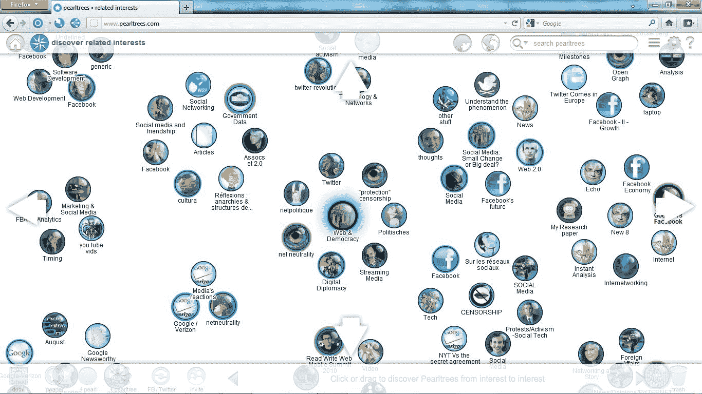
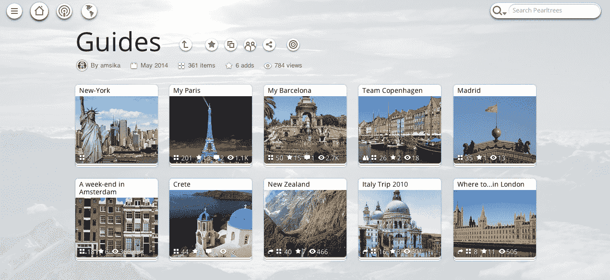

# Pearltrees 彻底重新设计了其在线策展服务，以覆盖更广泛的受众 

> 原文：<https://web.archive.org/web/https://techcrunch.com/2014/05/22/pearltrees-radically-redesigns-its-online-curation-service-to-reach-a-wider-audience/>

总部位于巴黎的在线策展服务公司 Pearltrees 于 2009 年末推出，一直以其基于 Flash 的古怪界面而闻名，该界面允许你将网络书签、照片、文本片段和文档组织成思维导图式的结构。对于理解这个比喻的用户来说，这是一个非常强大的服务，但是它的界面也给新用户带来了进入的障碍。

今天，该公司推出了一个彻底的重新设计，摆脱了 Pearltrees 1.0 的大部分旧包袱。消失的是 Flash 依赖、树形图、代表你的内容的小圆珠和来自[的旧界面](https://web.archive.org/web/20230129091133/https://techcrunch.com/wp-content/uploads/2013/11/1-add-pearls.jpg?w=1024&h=631)的几乎所有其他东西。

以下是 Pearltrees 1.0 的样子:

这是新的版本:

Pearltrees 的使命仍然是允许你在服务上组织你想要的一切(在这方面，它几乎与 Evernote 竞争)。然而，所有“可爱”的图形都被一个[光滑的新现代 HTML5 界面](https://web.archive.org/web/20230129091133/http://www.pearltrees.com/kateward/new-york-trip/id5691914)所取代，它用排列成网格的大正方形取代了小圆珍珠。这是一个非常流畅的体验，让你可以轻松地拖放项目，更重要的是，还可以非常容易地将桌面上任何地方的内容拖到浏览器中，以将其添加到收藏中。

正如 Pearltrees 首席执行官帕特里斯·拉莫特(Patrice Lamothe)上周在我与他交谈时强调的那样，该公司 200 多万名贡献者过去添加的所有现有内容都只是转移到新网站上。事实上，该团队对后端做了一些调整，但 95%的代码实际上保持不变。

[gallery ids="1006263，1006261，1006265，1006267，1006268，1006264"]

拉莫特说:“我们把大家都喜欢的旧版本放到一个可视化的环境中，让每个人都能马上理解。”。他承认，虽然它的用户总是非常活跃，但他们中的许多人不会与外人分享他们创作的任何内容，只是因为旧的界面有点太神秘了。“当你分享一颗珍珠树时，你分享了形状和内容，”他指出，但另一端的人不应该担心形状。“人们不想分享一棵梨树；他们希望分享内容。”

虽然旧界面定义了 Pearltrees 的早期，但 Lamothe 也指出，该公司的使命一直是让人们组织他们的内容，而不仅仅是让他们将内容组织成珍珠形状的树形图。

新的网格无疑消除了早期版本的许多问题。例如，您现在可以看到您保存的项目的完整标题。在以前的版本中，珍珠的圆形通常使之不可能。

尽管去掉了一些多余的东西，这个网站仍然非常直观。举例来说，你仍然可以为你的收藏选择一个背景图片，并且大的正方形(你可以放大和缩小)缩略图现在比以前重要多了。新的体验也更加清晰地突出了 Pearltrees 的发现功能。

在功能方面，这个版本没有什么真正的改变。您仍然可以轻松地协作收藏，存储有限数量的文件(如果您需要更多存储空间，您需要一个[高级帐户](https://web.archive.org/web/20230129091133/https://www.pearltrees.com/s/premium/presentation?l=EN_US))并轻松地四处移动项目。由于屏幕左侧有滑出式目录，您还可以轻松地将项目从一个收藏集移到另一个收藏集。

作为今天更新的一部分，该公司还重新推出了针对 [iOS](https://web.archive.org/web/20230129091133/https://itunes.apple.com/us/app/pearltrees/id463462134?mt=8) 和 [Android](https://web.archive.org/web/20230129091133/https://play.google.com/store/apps/details?id=com.pearltrees.android.prod) 的原生移动应用。他们接受了和他们在桌面上的堂兄一样的以网格为中心的重新设计。

如果你想尝试一下新版本，现在已经有了[和](https://web.archive.org/web/20230129091133/http://pearltrees.com/)(如果你一直喜欢旧版本，你也可以回到旧版本)。

