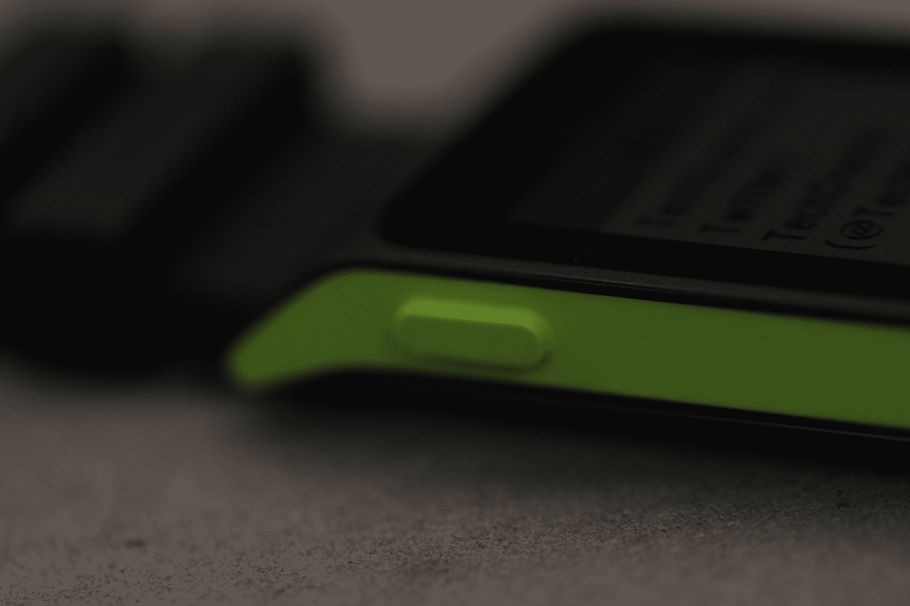
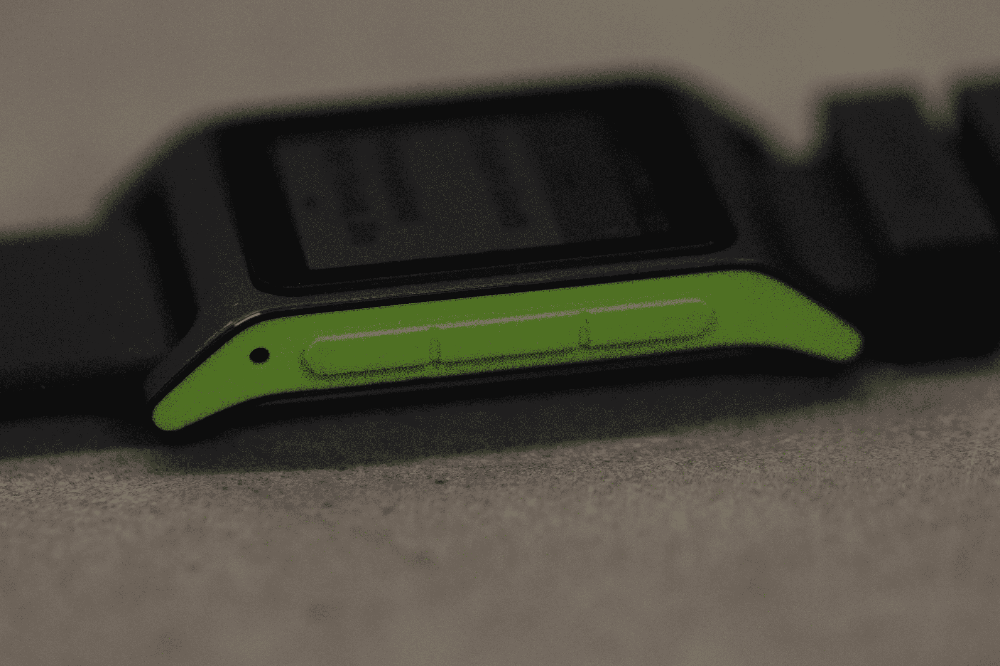
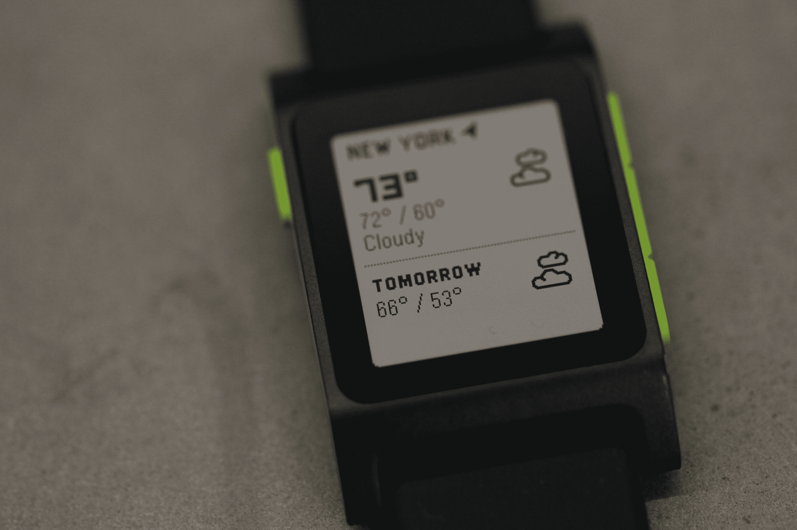
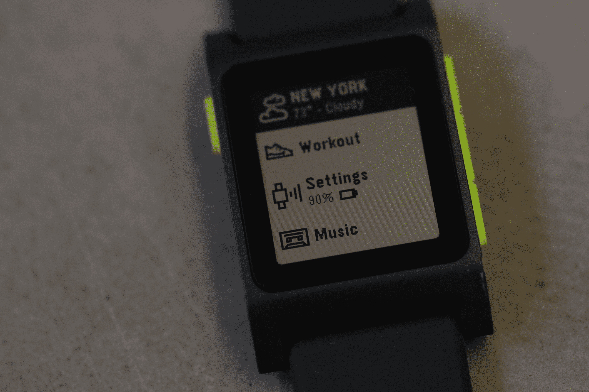
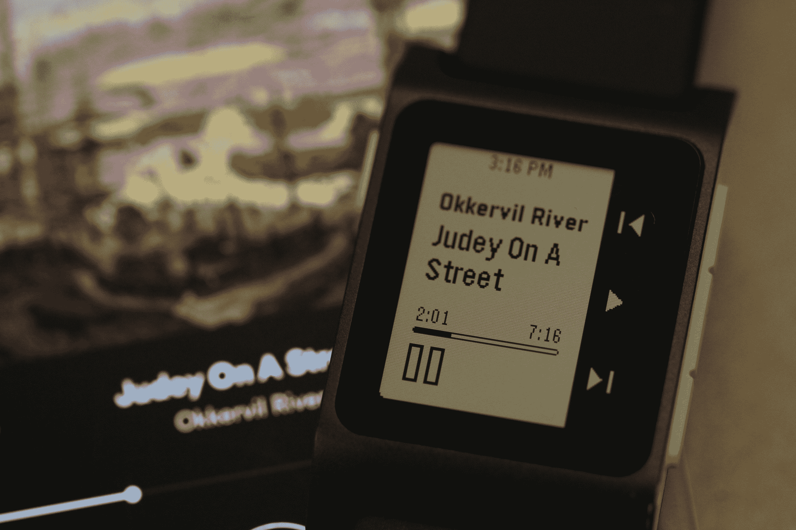
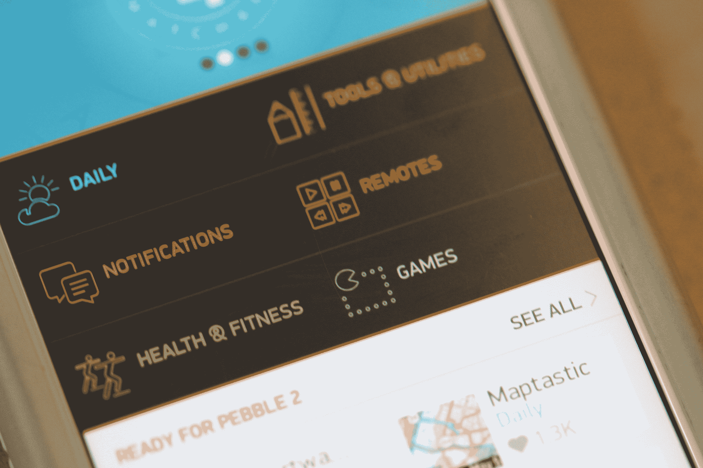
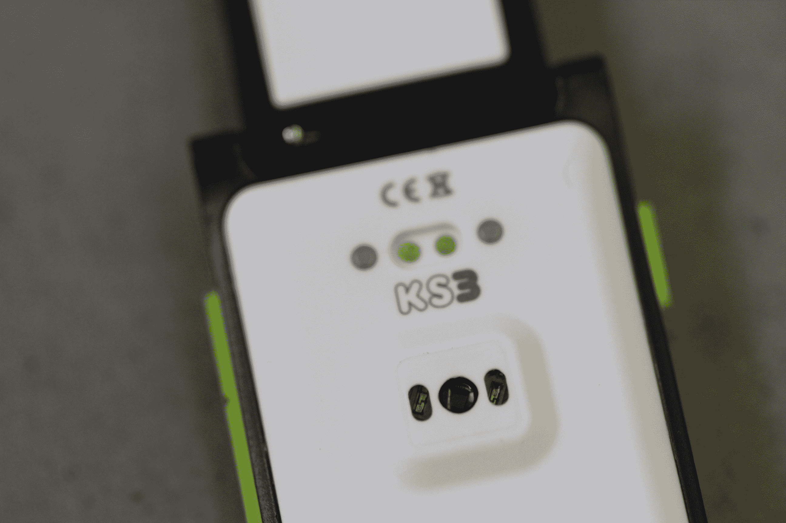
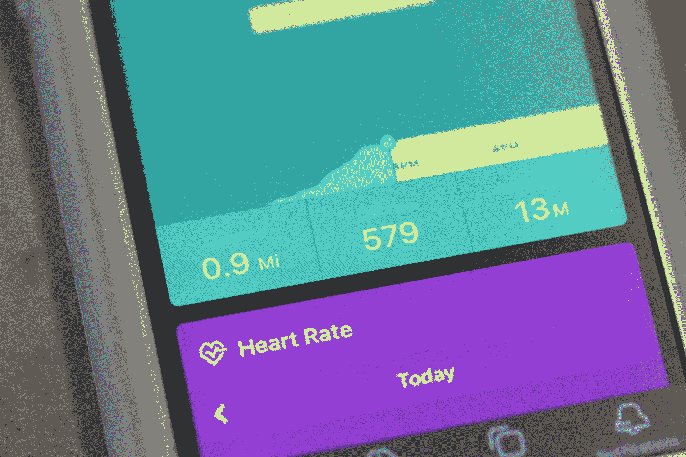
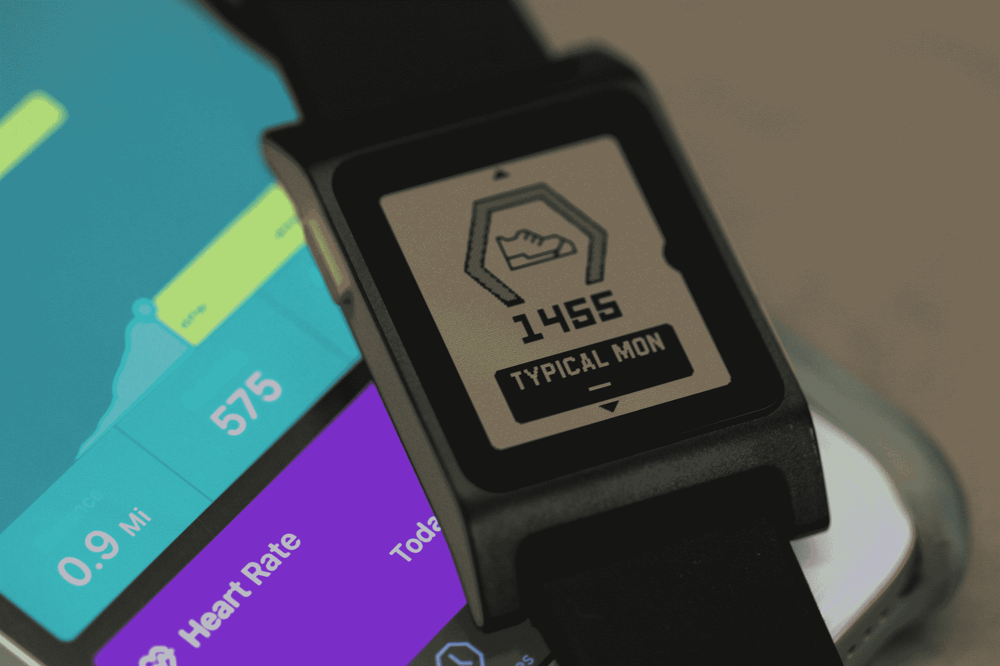

# Pebble 赌简单

> 原文：<https://web.archive.org/web/https://techcrunch.com/2016/10/05/pebble-2-review/>

自 Pebble 首次使用 Kickstarter 为其第一款设备提供资金以来的四年半时间里，事情发生了很大变化。苹果进入了这个领域，三星发布了大约 200 种不同的设备，谷歌试图在几十个新玩家之间建立某种一致性——与此同时，健身可穿戴制造商继续模糊运动追踪器可以做什么的界限。

就其本身而言，Pebble 已经提供了一些新系列，包括 Time 和 Steel，但今年的 Pebble 2 (从技术上讲是第三代)标志着该公司主要系列的第一次真正更新。那么，帮助推出 space 的公司做了什么来应对不断变化的环境呢？不是一吨——这才是重点。

Pebble 仍然是一个简单的硬件，围绕黑白显示屏构建，没有触摸功能。当然，还有一些额外的硬件功能——即心率(最后)——但在一个硬件产品越来越复杂的世界里，Pebble 采取了一种不同的方法，着眼于简单性。

在一个以花哨的功能来衡量进步的世界里，这是一场艰难的比赛，但 Pebble 已经为期待已久的续集打下了坚实的基础，还有几年的软件升级。当然，129 美元的长电池续航时间和始终显示也是不错的起点。

## 如果没有破产

不管你对 Pebble 正在进行的基于 Kickstarter 的商业模式有什么看法，但至少它证明了，尽管竞争急剧增加和一些艰难的经济状况，仍然有足够的兴趣将 Pebble 2/Time 2/Core 活动纳入众筹网站的前三名活动中——事实上，前四名中除了一名之外都属于该公司(另一名由一个尚未交付的冷却器保护)。

第一代 Pebble 的粉丝可能会很高兴地知道，最新版本保持了类似的外形。有一些关键的区别——新版本比原来的版本更薄、更轻、更耐用，该公司对外壳进行了一些美学上的调整，使它稍微更有棱角，并将充电引脚移到了后面。

四个按钮的布局和以前一样——一个在左边，三个在右边。再说一次，这是你与设备交互的主要方式——仍然没有触摸屏。显示器本身是 1.26 英寸，黑白分辨率为 144 x 168，不值得与苹果或三星相比。这只是一个完全不同的球场。

当然，这种相对较低的技术也有许多积极的硬件意义，包括电池影响小和更薄的外形。Pebble 的电池续航时间约为一周——我发现一次充电可以持续使用四到五天。

虽然按照手表的标准来看，Pebble 并不算小(在我一位 5 英尺 4 英寸的同事的手腕上，它显得相当大)，但它比市面上的许多智能手表都要小巧得多——三星的最新产品立即映入我的脑海。

不像很多其他人，我可以把它舒适地塞进我的衬衫长袖里，没什么问题。对于那些希望利用其睡眠跟踪功能的人来说，它还足够轻，可以戴在床上——当然，其他一些智能手表就不一样了。

从美学角度来看，新的 Pebble 和它的前辈一样，注定会有些两极分化。基线设备可能是三星宝路华的斯沃琪，129 美元的价格与之相当。当它的塑料外壳和你的意大利西装不太搭配时，不要惊讶。谢天谢地，该公司也有一些更高级(也更贵)的硬件。

## 时间线中的某处

新的 Pebble 保持了该公司熟悉的时间线用户界面。这很简单，而且因为 Pebble 自己制作硬件和软件，所以运行得相当好。对于那些没有花时间使用该产品的人来说，它很容易上手，以类似于 Android Wear 的卡片系统的方式向后滚动时间。

Pebble 还通过一些简单的动画来充分利用其有限的屏幕分辨率，如 Twitter 的振翅鸟和 Gmail 的展开信封。这是一个很好的小触摸，使基本的黑白布局比大多数健身追踪器更具吸引力。根据种类的不同，通知要么占据整个屏幕，要么位于底部三分之一的位置，就像天气更新一样。

它看起来很好，操作简单，比许多现有的显示器更好看。虽然对于那些习惯了触摸屏即时满足感的人来说，通过侧边按钮浏览所有菜单可能会有点麻烦。

你可以在手表上做很多事情，尽管你需要不时地使用智能手机应用程序，包括设置，任何时候你需要摆弄通知和其他设置，以及更换手表表面和添加应用程序的时候。有 15000 个手表脸和 app。

这就有了很大的重叠空间，但有些重叠空间将被证明是不可或缺的，比如优步 app，它根据预定地点提供简单的接送服务。Pebble 生态系统已经存在了足够长的时间，应用程序开发人员可以学习如何充分利用有限的屏幕空间。第三方肯定也问过这个问题，为什么这个问题从一开始就困扰着 Pebble。尽管如此，如果你想在最基本的东西之外再做些什么，你会发现自己的脑袋已经被 Pebble 2 的硬件限制重重地砸到了天花板。

## 全力以赴

让我们现实一点。在 2016 年，增加基本的健身追踪功能不算是最先进的。Pebble 对该功能的接受似乎有些勉强，最终承认它已经成为可穿戴设备采用的关键驱动因素(如果不是关键驱动因素的话)，并在去年年底认真推出了 Pebble Health，同时在其较新的设备上激活了原生步数和健身跟踪功能——所有这些功能都适用于 Pebble Classic (Pebble 1)和 Pebble Classic Steel。

Pebble 2 和 Pebble Time 2 更进了一步，增加了内置心率监测功能，这是一种位于设备背面的标准光学传感器，每隔 10 分钟左右读取佩戴者的脉搏，以便不会对电池造成太大的损害。

脚步和睡眠跟踪都是通过内置的加速度计来完成的。步伐跟踪还不错，但似乎错过了我的一些步骤。与此同时，睡眠跟踪与现有可穿戴设备提供的一些功能进行了比较，依靠加速度计来确定你在夜间活动了多少。也就是说，它很好地知道了我何时睡着。相关:我真的需要更多的睡眠。

所有这些信息都被输入到直接内置在标准 Pebble 应用程序中的 Health vertical 中。把所有的信息都放在一个地方是很好的，但是感觉有些拥挤。对于那些不仅仅想快速浏览生命体征的人来说，Pebble 最好将它作为独立选项提供。

另一个值得一提的内置功能是音乐播放。功能非常简单——通过 Apple Music、Spotify 等在手机上播放一首歌曲，然后你可以在小屏幕上播放/暂停和跳过歌曲。这是相当有限的功能，但它会让你不用掏出手机来做同样的事情。

如果没有其他事情，这似乎是通过 Pebble 2 的内置麦克风内置语音功能的又一个好机会。

## 保持简单

与四年半前 Pebble 第一次通过 Kickstarter 进入市场时相比，智能手表的格局几乎已经面目全非。Pebble 最初的吸引力很大程度上是因为它是该领域的首批大玩家之一，这家初创公司希望其简单性也是其成功的一大部分。

因此，这款设备并不代表着对其前身的巨大升级。健康功能的增加很好，硬件的整体精简也很好。一直在等待升级到基线 Pebble 的用户会喜欢这里和那里的触摸，当然 129 美元的价格和几天的电池是很好的触摸。

但很难摆脱这样一种感觉:毕竟，在智能手表首次亮相几年后，这家让智能手表闻名于世的公司真的应该做更多的事情来改变现状。