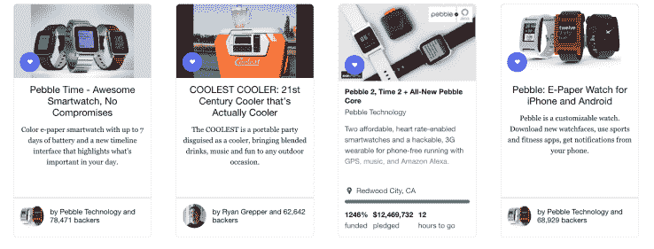

# 最新的 Pebble 活动在 Kickstarter TechCrunch 上获得第三大资助

> 原文：<https://web.archive.org/web/https://techcrunch.com/2016/06/30/pebble-kickstarter/>

# 最新的 Pebble 活动在 Kickstarter 上获得了第三大资助

随着最新的 Pebble Kickstarter 活动以从近 67，000 名支持者那里筹集到 1，280 万美元的资金而告终，成为受欢迎的众筹平台上第三大受支持的众筹活动，是时候向 1，200 万人致敬了。Pebble 的活动进入了 [Kickstarter 资金最多的排行榜](https://web.archive.org/web/20221226124424/https://www.kickstarter.com/discover/most-funded)，周围是一些熟悉的面孔:前四名中的其他活动是 Pebble 自己的 Pebble Time、[最酷的 Cooler](https://web.archive.org/web/20221226124424/https://www.kickstarter.com/projects/ryangrepper/coolest-cooler-21st-century-cooler-thats-actually) 和 Pebble 最初的 Kickstarter 活动。

Pebble 首席执行官埃里克·米基科夫斯基(Eric Migicovsky)表示:“我们为展示众筹模式的成功感到无比自豪。“我们为第三次活动的成功感到激动，并感谢所有对我们的支持。”

Pebble 已经运行了该平台上 4 个资金最高的 Kickstarter 项目中的 3 个。令人印象深刻。

当活动首次启动时，我们已经提前了解了新产品,看起来 Pebble 的观众反应非常热情，就像它之前创纪录的 Kickstarter 活动一样。

第一次 Pebble 活动值得注意，因为它让该公司和 Kickstarter 本身在许多人的心目中崭露头角，[凭借令人印象深刻的 1030 万美元的活动](https://web.archive.org/web/20221226124424/https://www.kickstarter.com/projects/597507018/pebble-e-paper-watch-for-iphone-and-android?ref=users)，它为整个众筹行业设立了标杆。当该公司重返第二轮时，它以 2030 万美元为 Pebble Time 进行了一场声势浩大的宣传活动，将之前的记录翻了一番，这是一场战略性的活动，旨在试图从苹果的风帆上偷走一些风；该活动在苹果手表的发布和发货日期之间展开。

## 城里出现了新的 10 大富豪

如果你是那种喜欢记分的人——以下是 Kickstarter 上 10 个最受资助的活动:

1.  [卵石时间](https://web.archive.org/web/20221226124424/https://www.kickstarter.com/projects/597507018/pebble-time-awesome-smartwatch-no-compromises?ref=most_funded)(2030 万美元)
2.  [最酷的酷车](https://web.archive.org/web/20221226124424/https://www.kickstarter.com/projects/ryangrepper/coolest-cooler-21st-century-cooler-thats-actually?ref=most_funded)(1330 万美元)
3.  [卵石 2，时间 2 &卵石核心](https://web.archive.org/web/20221226124424/https://www.kickstarter.com/projects/597507018/pebble-2-time-2-and-core-an-entirely-new-3g-ultra?ref=most_funded)(1280 万美元)
4.  原始卵石(1030 万美元)
5.  世界上最好的旅行夹克(920 万美元)
6.  爆炸的小猫(880 万美元)
7.  欧亚(860 万美元)
8.  《莎木 3 》( 630 万美元)
9.  波诺音乐公司(620 万美元)
10.  带回 MST3K(580 万美元)

如果你错过了 Pebble 的 Kickstarter 活动，Pebble 的首席执行官急切地指出，[Pebble.com](https://web.archive.org/web/20221226124424/http://pebble.com/)的预购仍在继续。