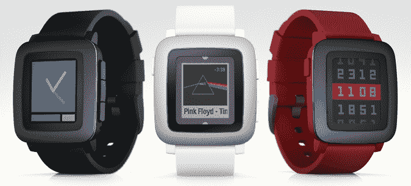

# Pebble Time 在 Kickstarter 上半天就突破了 650 万美元 

> 原文：<https://web.archive.org/web/https://techcrunch.com/2015/02/24/pebble-smashes-through-6-5m-on-kickstarter-in-half-a-day/>

# Pebble Time 在 Kickstarter 上半天就突破了 650 万美元

今天早上，我们注意到 Pebble Time——Pebble 的新彩色电子墨水智能手表——在绝对荒谬的*17 分钟*内突破了其 50 万美元的目标。

我们通常不会对 Kickstarter 的活动进行详细更新，但这一次有点疯狂，不能不注意到。卵石火车就是不停。

活动发起 9 个小时后，Kickstarter 仍在*以荒谬的速度*吸金。它现在坐拥 650 万美元的资金，在该网站有史以来最受资助的五个项目中占据一席之地。

唯一赚得更多的项目？Ouya 控制台(850 万美元)，燕麦片的爆炸小猫纸牌游戏(870 万美元)，原版 Pebble(1020 万美元)，以及最酷的冷却器(1320 万美元)。所有这些人都有一个多月的时间来获得他们的总数；卵石时间已经在*半天*加入了他们的行列。

Pebble 在该平台上的多次成功引发了一些争论，一些人认为他们太成功了，不能转向众筹网站。“这就像看比尔·盖茨、马克·库班和沃伦·巴菲特在西雅图街头乞讨一样”，丹尼尔·库珀在 Engadget 上写道。

但这真的是 Kickstarter 要解决的问题吗？一个人的底线在哪里？对于 Kickstarter 来说，是什么让一家公司过于成功？公众认知？拥有一个成功的 Kickstarter 和继续寻找零售成功应该阻止你回到井里吗？或者我们应该让人们用他们的钱包投票，不要再把 Kickstarter 浪漫化，因为它不是。

你可以在这里找到 [Pebble Time Kickstarter 活动。](https://web.archive.org/web/20221003060839/https://www.kickstarter.com/projects/597507018/pebble-time-awesome-smartwatch-no-compromises)