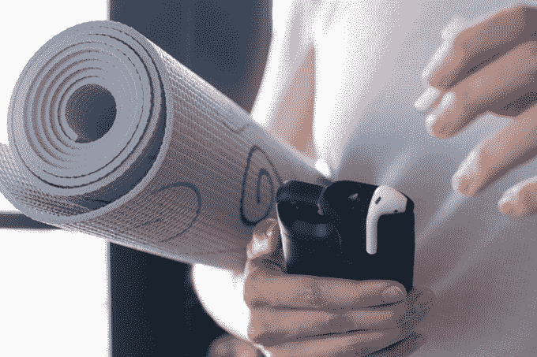

# Pebble 的创始人带着一个可以给 AirPods 充电的 iPhone 电池盒回到了 Kickstarter

> 原文：<https://web.archive.org/web/https://techcrunch.com/2017/09/07/pebbles-founder-is-back-on-kickstarter-with-an-iphone-battery-case-that-also-charges-airpods/>

# Pebble 的创始人带着一个也能给 AirPods 充电的 iPhone 电池盒回到了 Kickstarter

自去年智能手表制造商 Pebble 被纳入 Fitbit 以来，Pebble 的创始人兼前首席执行官 Eric Migicovsky 带着他的第一款新产品回来了。[PodCase](https://web.archive.org/web/20230223153838/https://www.kickstarter.com/projects/581404323/podcase-battery-case-for-your-iphone-and-airpods)没有他上一个项目那样的雄心壮志，但新的 Case 是 Kickstarter 旨在提供的那种聪明的一次性产品。

在顶部，一对 AirPod 插槽位于外壳摄像头切口的右侧，因此用户可以使用保持手机供电的 2,500 mAh 电池为苹果的蓝牙耳机充电。由于 Pebble 首席设计师 Steve Johns 的帮助，工业设计看起来确实很坚固——尽管一开始就不可避免地要与摩尔菲进行比较。

当然，在两位 Pebble 校友和 Glyph 视频耳机制造商 Avegant 的联合创始人艾伦·埃文斯(Allen Evans)之间，PodCase 有着相当坚实的基础。毕竟，在它存在的五年时间里，Pebble 赢得了 Kickstarter 有史以来五大活动中的三个——尽管无可否认，最近的一次活动最终没有给任何人带来好结果，当然，除了 Fitbit。

在与 TechCrunch 的一次对话中，Migicovsky 很快指出了该团队在此次发布中有些非正统的方法。这是一个团队对产品发布的谨慎态度，他们亲眼目睹了启动硬件创业公司的起伏。三人组提供了初始资金，帮助将产品引入 Kickstarter，然后它将在那里随机应变。事实上，该组织拒绝称自己为一家真正的公司，而是在其新的 Kickstarter 页面上称 Nova Technologies 为“一小群技术专家”。

米基科夫斯基说:“有些产品不需要整个公司围绕着它们。“我们可能不需要扩大规模来满足需求，但如果需要，我们可以扩大规模来满足需求。我们不是在建立一家每年销售越来越多这种产品的公司，也不是为了达到我们的收入数字而不得不推出畅销产品。如果它畅销，那太好了。如果没有，也不是世界末日。在这背后，我们还有很多其他项目，在积压中等待。”

对于经历过磨难的创始人来说，这是一种相当禅宗的方法，但 PodCase 是一个非常聪明的第一步，可以减轻随身携带额外 AirPod 充电盒的负担。事实上，它在不使用时将耳机与用户的 iPhone 放在一起，这应该会减少将耳机留在身后的可能性。

pod case Kickstarter 页面已经上线，提供 iPhone 7 和 iPhone 7 Plus 两种尺寸的配件，可以选择在下周手机发布后将订单切换到 iPhone 8。如果该集团达到 30 万美元的目标，预计将于 2 月份开始发货。