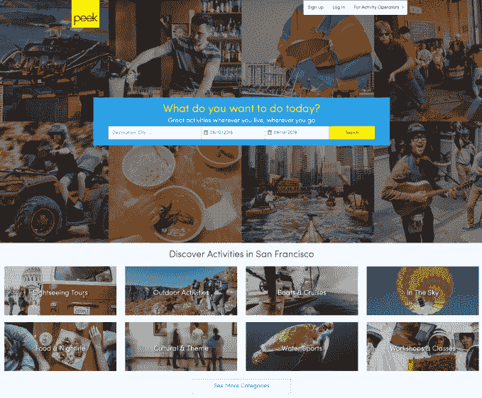

# Peek 融资 2300 万美元，与谷歌合作推动旅游活动数字化 

> 原文：<https://web.archive.org/web/https://techcrunch.com/2018/06/19/peek-raises-23m-and-inks-partnership-with-google/>

旨在将旅游活动行业数字化的美国初创公司 Peek 获得了 2300 万美元的 B 轮融资，并与谷歌建立了合作伙伴关系，这将有助于提高其知名度。

这家总部位于旧金山的初创公司由 Ruzwana Bashir(首席执行官)和 Oskar Bruening(首席技术官)于 2012 年创立，它将自己描述为“活动市场的 OpenTable ”,因为它的目标是让预订活动像餐厅甚至航班一样无缝和直接。

[两年前，Peek 筹集了 1000 万美元](https://web.archive.org/web/20221209204825/https://techcrunch.com/2016/07/28/peek-com-raises-10-million-strikes-partnership-to-bring-tour-and-activity-booking-to-yelp/)，新一轮由 Cathay Innovation 领投，现有的支持者包括前 Yelp 首席运营官·杰夫·唐纳克尔、Kayak 创始人保罗·英格利希、I2BF 和曼塔·雷。Peek 有很多知名的天使投资人，包括 Trulia 和 NFX 的创始人皮特·弗林特，前谷歌执行董事长埃里克·施密特和 Twitter 首席执行官杰克·多西。迄今为止，新一轮投资已经达到了 4000 万美元。

除了这笔钱，这家初创公司还宣布与谷歌合作，将其库存添加到谷歌搜索、谷歌地图和谷歌旅行中。这肯定会有助于提高知名度和增加预订量，而且它增加了 Peek 与 Yelp 等平台的其他合作伙伴关系。

Peek 瞄准了全球活动市场，Bashir 估计该市场价值约 1500 亿美元，美国是这个星球上最赚钱的市场。

“它没有像其他行业那样经历模拟到数字的转变，”她在一次采访中告诉 TechCrunch。“因此，我们正在建设十年前在其他行业出现的基础设施和软件。”

Peek 的商业模式类似于两家资金雄厚的亚洲公司，Klook[从红杉中国和高盛](https://web.archive.org/web/20221209204825/https://techcrunch.com/2017/10/25/klook-raises-60m/)等公司筹集了 9000 多万美元，KKDay[最近得到了日本旅游巨头 H.I.S.](https://web.archive.org/web/20221209204825/https://techcrunch.com/2018/02/22/kkday-raises-10-5m/) 的支持。尽管如此，巴希尔说，数字化空间的问题不仅仅局限于亚洲或新兴市场。

“当你看美国的企业时，超过 70%的企业没有实时在线预订，你仍然需要给企业打电话或发电子邮件，”她解释道。

这是很重要的一点，它强调了 Peek 所采取的方法。与亚洲的竞争对手不同，该公司有一个双面业务，首先是提供预订软件，允许旅游公司在自己的网站上进行预订和销售。它还允许他们从移动设备上运营业务，这对于户外业务越来越重要，因为户外业务在旅行和活动中很常见。

这是吸引他们进入 Peek 的原因，从那里，该公司在其“专业”服务下提供更多服务，也是服务提供商可以加入的面向消费者的平台。这是旅行者(或者更确切地说，是行动者)用来预订活动的平台。“旅行者”的区别很重要，因为 Bashir 说大约三分之一的 Peek 预订来自于在他们自己的城镇做事情的人，所以不是每个人都在旅行。

Peek 创始人奥斯卡·布勒宁和鲁兹瓦纳·巴希尔。

Peek 声称在美国和墨西哥以及巴黎和伦敦等地提供 10，000 次体验。它有 500，000 个评论和评级，每个都经过验证，因为用户只有在预订、支付并完成活动后才能离开它们。

巴希尔说，此外，该公司的软件已经扩展到处理“数亿美元”的预订量。她拒绝透露具体的财务细节，包括收入和利润/亏损，但表示该公司的单位经济“利润很高”，但目前正在寻求增长。

“这一轮的一部分是让我们自己走出去，接触更多的企业，”她补充说。

目前，Peek 仍将重点放在美国，但它也将业务扩展到了墨西哥，因为墨西哥是美国游客的热门目的地。这种关注将在这一轮之后继续，巴希尔坚持认为，在线预订的活动支出估计占 2%，在进入国际市场之前，国内还有大量的潜在增长空间。

然而，她确实表示，与凯赛创新合作的决定部分是出于这样一种认识，即当到了海外冒险的时候，该公司拥有将会有所帮助的经验和网络。