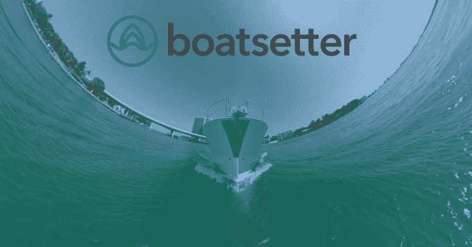
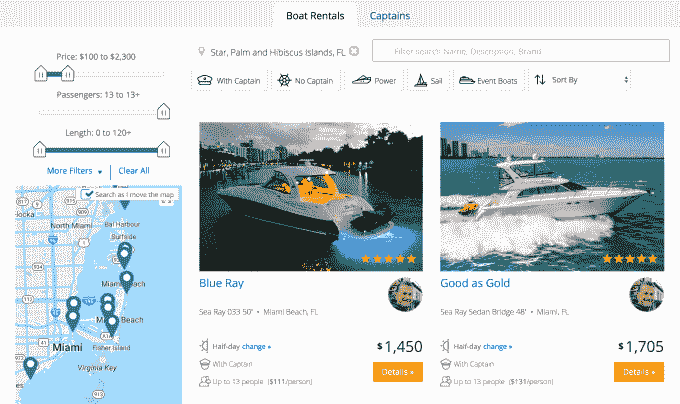
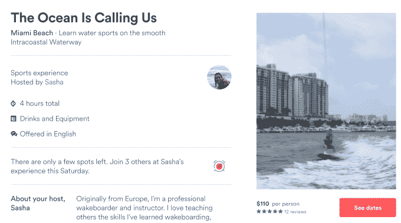

# Airbnb for boats 的初创公司 Boatsetter 收购竞争对手 Boatbound 

> 原文：<https://web.archive.org/web/https://techcrunch.com/2017/08/17/peer-to-peer-boat-rental/>

“在船上”不一定要很有钱或很痛苦。你可以从[船工](https://web.archive.org/web/20230314181742/https://www.boatsetter.com/)那里租一天一加一船长。自从它刚刚收购了竞争对手[海事市场 Boatbound](https://web.archive.org/web/20230314181742/https://techcrunch.com/2013/06/13/boatbound-boat-rentals/) ，现在它已经在全美 300 多个地方拥有船只。

Boatsetter 将从 Boatbound plus logistics tech 及其船只租赁库存中挑选人才。一位熟悉该交易的消息人士称，收购是用 Boatsetter 的股票支付的，价值在数百万美元左右。

这笔交易使 Boatsetter 成为美国，甚至可能是世界上最大的点对点船舶租赁服务。

为了资助未来对其他竞争对手的收购，Boatsetter 还宣布，它已经在 2016 年 12 月的 A 轮融资中增加了 475 万美元的资金，使这家初创公司的融资总额达到 1775 万美元。

“资金的主要用途是 M&A、增长和国际扩张，”Boatsetter 首席执行官 Jackie Baumgarten 告诉我。当被问及她是否会追随欧洲同行 Click To Boat 时，她说，“我认为我们最好准备采取卷起式战略。有机会获得和积累一些球员。整合的时机已经成熟。”

## 每个人都是队长

[Boatbound 于 2013 年](https://web.archive.org/web/20230314181742/https://techcrunch.com/2013/02/20/boatbound-aibnb-for-boats/)推出，远早于 Boatsetter，[从 500 家初创公司、股权众筹平台和船只制造商 Brunswick 筹集了超过 500 万美元](https://web.archive.org/web/20230314181742/https://www.crunchbase.com/organization/boatbound)。

该公司继续处理超过 2500 万美元的预订请求。然而，它也面临着对[安全和保险的投诉，一名妇女在通过 Boatbound 租房后在一次事故中失去了一条腿。这家初创公司没有像 Boatsetter 那样要求人们租用一艘船的船长，这在租用者被吸入船的螺旋桨后延误了救援程序。](https://web.archive.org/web/20230314181742/https://www.buzzfeed.com/johanabhuiyan/a-woman-is-suing-boatbound-for-negligence-and-fraud-after-an?utm_term=.nrZw4YoPgm#.capl8NAQ45)

自从 2016 年[将](https://web.archive.org/web/20230314181742/https://www.geekwire.com/2016/heres-boatbound-airbnb-boats-relocated-hq-seattle/)从旧金山搬到西雅图以削减成本并推动盈利以来，[船上的](https://web.archive.org/web/20230314181742/https://boatbound.co/)安静了下来。现在这个全国性的服务有点奇怪地被一个只在一个州运营的竞争者收购了。

合并后的公司希望事情能够顺利进行，这要归功于 Boatbound 用于路由租赁请求的技术以及 Boatsetter 对保险的关注。

总部位于佛罗里达州的 Boatsetter 是一个三方市场，私人船主和专业租船公司、船长和承租人在这里会面。用户可以从附近的船上挑选，租一艘配有船长的船或挑选一名单独的船长，并以可承受的价格快速出海。由于私人业主只是试图收回一些保持船只漂浮的不间断费用，Boatsetter 可能比通过传统的租赁公司更便宜。

鲍姆加滕实际上创办了一家名为 Cruzin 的点对点划船保险公司，后来与 Boatsetter 合并。这就是 Boatsetter 如何提供 100 万美元的责任保险，200 万美元的船只损坏保险，以及额外的保护伞保险，以使承租人感到安全。

Boatsetter 表示，它有 5000 艘经过审查的船只可用，并准备在今年 5X 增长到超过 10，000 艘出租。这是因为 Boatsetter 只专注于佛罗里达州，而 Boatbound 与全国各地的船只合作。在这种商业模式下，Boatsetter 从船主那里收取 28%的租赁费，从船长那里收取 10%的费用，并向租赁者收取 7.5%的预订费。考虑到 Boatsetter 不拥有或维护任何船只，这些组合成一个健康的利润。

## 体验>占有

现在，这家 27 人的初创公司有了一个新的渠道来追逐估计每年价值 500 亿美元的船舶租赁可寻址市场。赛艇运动员已经与 Airbnb 的新体验平台“T1”合作，让人们付费在 T2 的旧金山湾学习航海，向迈阿密的职业滑水者“T3”学习，或者让巴塞罗那的厨师在船上烹制新鲜的西班牙海鲜饭。

划船者最大的挑战将是培养意识。大多数人认为他们需要大量的金钱或划船技能才能浮出水面。但是世界正在从物质文化向体验文化转变。这就是 Airbnb 爆炸的原因。

人们想做一些惊人的事情，他们可以用照相手机捕捉并在社交网络上分享。他们想要回忆。在你自己的私人船上，很难和朋友一起在海浪上滑行……即使只是下午。