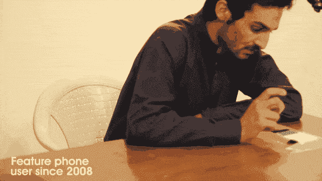
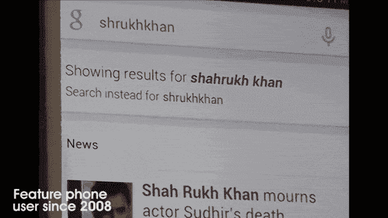
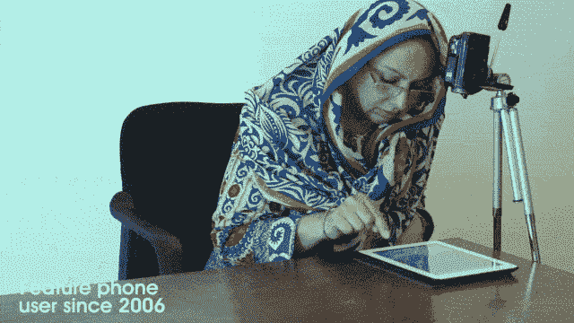
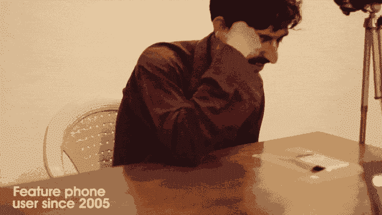
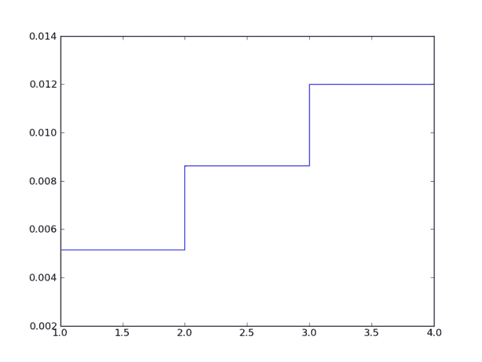

# 窥探 43 亿未联网者的想法 

> 原文：<https://web.archive.org/web/https://techcrunch.com/2014/11/29/peering-into-the-minds-of-the-4-3-billion-unconnected/>

More posts by this contributor

**编者按:** *[哈桑·拜格](https://web.archive.org/web/20230130234017/https://www.linkedin.com/in/baighassan)是一位企业家，他经营着 [ClubInternet](https://web.archive.org/web/20230130234017/http://www.clubinternet.co/) ，一家“连接未连接者”的初创公司。*

在 TechCrunch 最近的一篇专栏文章中，我写了世界上 43 亿离线人口第一次尝试使用互联网时所面临的精神挑战。毕竟，他们以前从未体验过互联网，缺乏 UX 专家所说的基本互联网服务如何工作或为什么使用它们的“心智模型”。在这篇文章中，我将更多地揭示什么样的心智模型被遗漏了，这样世界上最重要的思想家们就可以想出最好的策略来修复它们。

## **缺失心智模型**

为了研究这个问题的可能答案，我和我的团队一直在对未连接/新连接的人进行可用性测试。我们在这些努力中得到了资源丰富的南亚科技孵化器 [Plan 9](https://web.archive.org/web/20230130234017/https://www.techinasia.com/plan9-startup-incubator-shaping-pakistan/) 和当地移动网络运营商的可用性团队的帮助，因此读者可以放心地假设每项测试背后都有非常高水平的标准化和质量控制。以下是从我们的发现中收集到的一些见解。

上面 GIF 中的测试对象的任务是搜索他能想到的最简单的关键词。他选择了“IPL”(板球印度超级联赛的首字母缩写)。他花了大约 10 秒钟键入这些字母——比他在功能手机的键盘上键入相同内容的时间多了 7 秒。换句话说，在智能手机的虚拟屏幕键盘上打字对这个测试对象来说并不方便。

在多项可用性测试中，我们发现，对于几乎所有未连接/新连接的人来说，从功能手机的键盘切换到智能手机的屏幕键盘通常证明是相当具有挑战性的，这使得他们在离开自己的设备时不愿意切换。这是令人沮丧的，因为在智能手机上体验互联网比在最先进的功能手机上体验互联网更有效(因此也更有粘性)。

另一方面，每当联网者转向智能手机时，他们的 QWERTY 键盘心理模型会帮助他们应对，从而产生最小的学习曲线。不幸的是，对于一个不联网的人来说，体验是非常不同的，他最接近键盘的心理模型是按照 ITU E 1.161 国际标准建造的[手机键盘](https://web.archive.org/web/20230130234017/http://www.yorku.ca/mack/hcimobile02-f3.gif)(一种根本不同的动物)。

上面 GIF 中的测试对象的任务是搜索他最喜欢的宝莱坞演员；他选择了“沙鲁克·汗”但是，在多次失败和测试指挥的大力协助下，他才接近正确的拼写。很明显，他的前几次尝试非常糟糕，以至于谷歌的“显示结果”功能根本没有帮助。

总的来说，我们发现，当未联网者刚开始使用互联网时，因找不到他们在找什么(或谁)而产生的焦虑是他们最关心的五大问题之一。严重拼写错误的搜索词和名称是造成这一问题的主要原因。

更糟糕的是，一些智能手机屏幕键盘无意中阻碍了首次用户点击空格键，因为其中一些键盘[在空格键上突出显示了](https://web.archive.org/web/20230130234017/http://imgur.com/WXSOqaD)当前选择的语言——默认为英语。现在想象一下，一个与外界没有联系的人，充其量只能说半懂英语，甚至可能对外语感到恐惧。当试图打字时，他们会想要敲击任何标有“英语”的键吗？事实证明，他们没有(平均而言)，导致了糟糕的拼写和缺少空格的双重打击。

可以预见的是，对于大约 30%完全不识字的未联网者来说，上述问题更加严重。让互联网与他们相关并对他们有用将是一个更大的问题。看起来，读写能力几乎是人们使用当前形式的互联网的必要条件。对于那些离线的人来说，这不是一个好消息。

上面 GIF 中的测试对象的任务是在应用程序启动器的不同页面之间移动。简单对吗？在多次尝试中，她总是试图混合点击和滑动来在页面之间移动，但从未最终确定滑动(这是所述任务的正确动作)。在整个可用性测试中，她对移动设备上手势控制的心理模型一直受到质疑。

总的来说，我们发现，当给与一个移动设备使用时，几乎所有不相关的人都在努力理解什么时候滑动、轻击、双击或挤压。一个可能的原因是，功能手机、电视和收音机——在未联网人群中使用最广泛的三种技术——并没有以任何有意义的方式培养手势控制的心理模型。

我们还发现，重复使用智能手机确实在一定程度上缓解了这个问题，但这是非常缓慢的。总的来说，在 2007 年，当我们体验第一台智能手机(iPhone 1)时，使用智能手机对未连接的人来说没有对我们——连接的人——感觉那么直观。

上面 GIF 中的测试对象一直试图接听 Viber 的电话，不知道当屏幕改变时该做什么。我们在其他类似的互联网服务中也看到了这样的结果。

那么，开发一个在智能手机上接听电话的心智模型会有多难呢？我们发现这比听起来要难，但确实很难做到。然而，这里更广泛的一点有所不同:对于未联网的人来说，使用智能手机并不容易/直观，因为功能手机、电视和收音机是他们对技术的主要体验。所有这些都加强了之前可用性测试的发现。

这里的测试对象的任务是尝试他选择的谷歌搜索。但在整个会议期间，他只是盯着谷歌的主页，表现出最小的好奇心。事实上，不愿参与和近乎嘲笑的态度仍然是会议的主题。受试者后来表示，整个练习毫无趣味，是在浪费他的时间。

这不是异常行为，在文化水平较低或没有文化水平的测试对象中尤为普遍。

## **外卖**

这些可用性测试显示，广泛的精神障碍阻碍了未联网者随时使用数字技术和基本的互联网服务。对于这些未联网的人来说，智能手机是第一个真正的计算设备。

> 所有这些都代表了一个高度复杂、多方面的问题，最终解决这个问题的回报将从根本上改变我们这个物种。

但每一项创新都会带来一系列挑战，智能手机也不例外。似乎线下世界发现这些手机的学习曲线比我们——连接——在切换到我们的第一个此类设备时的体验要平缓得多(这要归功于对数字界面和互联网的更深入的体验)。同样，他们第一次接触互联网服务也充满了摩擦。

因此，仅仅让互联网变得可扩展和可负担得起，并不能让离线的互联网也能负担得起。他们的心理缺口也需要被填补。把它想象成一个经典的阶跃函数(见下图)，从一个离线的心智模型到一个在线模型的跳跃是离散的，高得多。

我们需要能够将这一步变成斜坡的解决方案(即本质上是一个更容易的障碍)。如果我们能做到这一点，我们就能有意义地加速互联网在未联网人群中的扩散。否则会对此感到困惑。

我们这些联网的人认为注册互联网服务或使用智能手机是微不足道的活动。事实上，当我告诉一些非常成功的技术专家——甚至是来自硅谷一些最成功的企业家圈子的技术专家——我的初创公司正在研究一种技术，以数字方式教不联网的人为什么以及如何使用基本的互联网服务，如搜索、社交网络、消息传递、应用商店等时，他们感到困惑。

我能理解这种怀疑，因为我也曾站在这一边。人们很容易认为移动设备和基本的互联网服务是即插即用的；他们完美优化了用户体验，可以随时随地成功搭载任何人。

但现实是，我们生活在一个 43 亿人从未体验过互联网的世界。这些人大多不知道屏幕右上角的 X 是什么，或者“注册”是什么意思，或者用户名和密码是什么，或者取消按钮是红色还是灰色，或者 QWERTY 键盘是如何工作的，或者如何注册移动数据，或者为什么一开始就应该这样做。所有这些都代表了一个高度复杂、多方面的问题，最终解决这个问题的回报将从根本上改变我们这个物种。