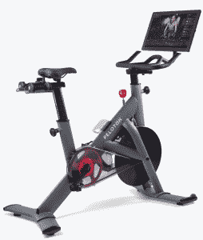
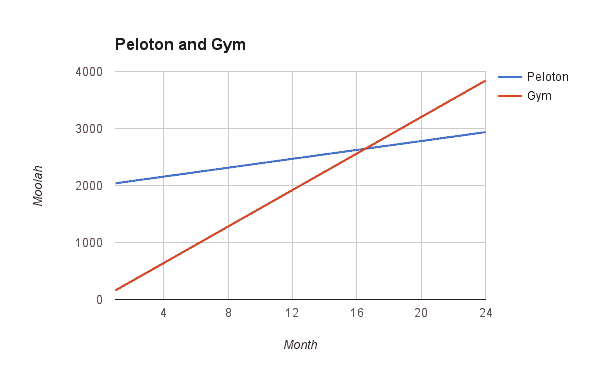
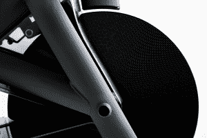

# Peloton 推出针对健身房的健身自行车 

> 原文：<https://web.archive.org/web/https://techcrunch.com/2017/01/06/peloton-commercial-at-ces/>

Peloton 公司的家用健身车取得了巨大成功。如今，该公司正在将其产品范围扩大一倍(达到两种)，推出了一款针对商业用户的自行车。经得起“不要温柔，这是租来的”酒店和健身房人群更粗犷，自带更适合健身房使用的软件。

这款商用自行车配有一个 22 英寸的“防汗”触摸屏和升级的机械装置，以承受许多骑行者之间共享的虐待。

这款新自行车的重量约为 3000 美元，与工业级健身自行车的价格相当。家用自行车原价 2000 美元。对于一辆自行车来说，这听起来是一大笔钱，但该公司报告称，人们非常乐意支付这个价格。

“到目前为止，我们已经卖出了大约 75，000 辆自行车，”John Foley 解释道。“根据官方说法，我们只在美国销售，但 23 个国家的客户都在使用我们的自行车。他们在这里购买，然后进口到他们各自的国家。我听说理查德·布兰森在内克岛的[有六个这样的人。他对我们的自行车很着迷。”](https://web.archive.org/web/20230122171350/http://www.virginlimitededition.com/en/necker-island)

现在，如果一想到 2000 美元的健身车就让你起哄，你并不孤单。弗利习惯于提出一个有力的价格点，尤其是来自其早期投资者的观点。

“我从一开始就完全相信这是人们想要和需要的产品，”福利说，但他承认投资者花了一段时间才明白公司的意图。

老实说，这很有道理。如果有人向你推销一家建议自己生产电脑(自行车前部的触摸屏是定制设计的平板电脑)、健身设备、应用程序、分销网络、内容和软件的公司，你会告诉他们走开。然而，这正是 Peloton 所能做到的。75，000 名客户每月支付 39 美元进行 4，000 多种不同的锻炼。该公司实时播放 SoulCycle 风格的课程，同时还有一个庞大的课程库，从悠闲到“哦，我的上帝，我感觉不到我的腿了，我还有腿吗？我的腿怎么了？我现在死了吗？”

“我们拥有整个过程，”福利解释说，这表明 Peloton 比苹果有更紧密的垂直整合。“我们制作自己的内容，我们创造自行车，我们交付自行车，我们只在自己的商店和网上销售，我们出售订阅，这样人们就可以继续使用这些内容。”

每月 39 美元的订阅价格无疑很高，但考虑到公司面临的形势，这个价格点确实有意义。如果您的家庭中有两个人每月支付 80 美元的健身房会员费，或者订阅一份 39 美元的 Peloton 内容，选择可能很简单。是的，花 2000 美元买一辆自行车不仅仅是你沙发后面几个月积累的零钱，但你可以在不到一年半的时间里补偿两个人的费用，所以也许这比看起来更好。

大约 17 个月后，2000 美元+39 美元的套餐对两个人来说比每个人每月支付 80 美元的健身房会员费要便宜。

当然，费用并不是这里唯一的考虑因素——毕竟，健身房的活动不止是骑健身车，对一些人来说，去健身房还有社交方面的考虑。然而，珀洛东有一些支持它的论点。通过游戏化的运动体验和让自行车在你家里很容易获得，珀洛东声称它的参与水平比健身房高得多。

## 低流失率，高参与度

从商业角度来看，这是有道理的:如果您已经为一辆自行车支付了 2000 美元，但如果您停止支付订阅费，这辆自行车就失去了大部分魅力，那么您可能不会停止支付订阅费。这反映在客户的行为上:福利声称公司只有 0.3%的流失率(每月取消订阅的人数)，这在*任何*行业几乎是闻所未闻的。例如，健身房每月仅流失 0.3%的顾客。假设珀洛东自行车盈利(这实际上抵消了等式)，珀洛东的商业模式使它看起来像一个相当有利可图的 SaaS 业务。

今天推出的新自行车有两个目标。

“人们会沉迷于珀洛东，”福利说，“但我们的成员旅行，他们错过了能够参加演习时，他们在路上。能够在您的酒店接受培训并持续跟踪您的进展非常棒。”

一定喜欢一些好的色情材料。Phwoarh。

当然，在任何特定的酒店中，Peloton 的用户数量都将少得惊人——售出的 75000 辆自行车令人印象深刻，但与使用酒店健身房的人数相比就相形见绌了，这让我们想到了自行车的第二个目标。

“我们在商业自行车上做营销，”福利苦笑着解释道。他认为，公司商业战略的一部分是由客户获取驱动的。“你可以在酒店骑的自行车上轻敲几下显示屏，买一辆你自己的佩莱顿自行车。”

## 扩展到自行车以外

然而，该公司不仅仅生产自行车；很容易看出类似的模式如何适用于举重机、划船机和跑步机。当被问及下一步是否会推出这些产品时，Foley 耸了耸肩，眨了眨眼，并表示该公司正在对家用健身设备进行广泛的研究，并正在积极评估下一步将推出哪些产品。如果我是一个赌徒，这意味着该公司可能有一个或多个这样的产品。

该公司正在寻求积极的扩张。今年，Peloton 将在墨西哥和加拿大开始运营，但这似乎主要是 2018 年计划在亚洲和欧洲推出之前的一次热身。

“我们已经在五轮中筹集了 1.2 亿美元，世界其他地方对我们开始运输 Peloton 自行车的需求很大，”福利说。

Peloton 自行车的商业版将于春季上市。

除了新款自行车，Peloton 还在 CES 上宣布了与 Fitbit 的合作。从现在开始，Peloton 骑行指标现在可以直接同步到 Fitbit 应用程序，让骑行者更容易看到骑行对他们统计数据的影响。漂亮。

“我们为快速增长感到自豪，”福利说，并解释说，该公司的 400 多人的团队仍有很长的路要走。“我们的研究表明，有 400 万人愿意并有能力为我们这样的服务支付 2000 美元外加月费。我们已经取得了一些良好的进展，但旅程才刚刚开始。”