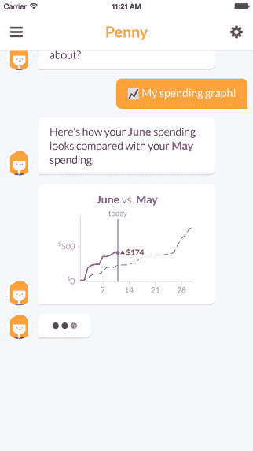

# Penny 是一个基于聊天的个人理财蔻驰 

> 原文：<https://web.archive.org/web/https://techcrunch.com/2015/10/15/penny-is-a-chat-based-personal-finance-coach/>

# 佩妮是一个基于聊天的个人理财蔻驰

你有没有想过为什么在经济上负责会如此困难？可能是因为大部分资金管理工具对于一般用户来说太过复杂和不堪重负。

一款新的个人理财应用 Penny 通过简单的聊天界面向用户提供个性化的理财建议，解决了这个问题。

当你第一次打开这个应用程序时，Penny 就会开始和你说话，就好像你在给你的银行家发短信一样。就连传统上繁琐的将银行账户链接到新应用程序的过程，也只需与 Penny 聊天即可完成。

在你的账户绑定到应用程序后，你可以和佩妮说话，让她做一些事情，比如显示你 10 月份在食物上花了多少钱，或者显示你过去两个月的收入与支出的图表。

Penny 还会向你推送信息，比如提醒用户本周在食物上花了多少钱等等。

Penny 的一个缺点是用户不能只输入请求。相反，该应用程序会给你预先写好的提示，比如“十月过得怎么样”，或者“我的账户活动”。

然而，该公司解释说，提供预先写好的回答会减少用户的摩擦。基本上，一些年轻用户可能不知道该问什么关于他们财务状况的问题，如果他们必须问自己的问题，他们也不会使用 Penny。

也就是说，该公司最终希望加入自然语言处理，这样用户就可以自己制作提示。然而，即使没有自定义消息，Penny 已经提供了 100 种不同的潜在对话，每个对话都有多种选择。

为了更仔细地了解佩妮，请查看我们上面的 TC 应用程序评论，或者从 [iOS 应用程序商店](https://web.archive.org/web/20230129104832/https://itunes.apple.com/app/id995705434?mt=8)和[谷歌 Play 商店](https://web.archive.org/web/20230129104832/https://play.google.com/store/apps/details?id=com.pennyapp&referrer=adjust_reftag%3Dci245zGQoRoko)下载佩妮。