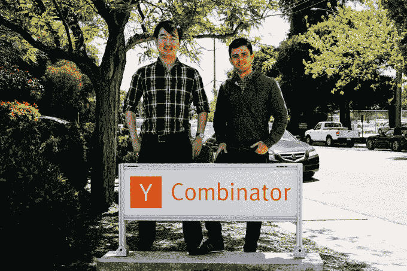
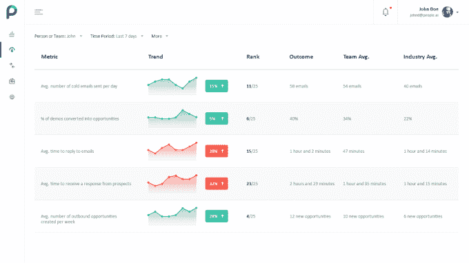
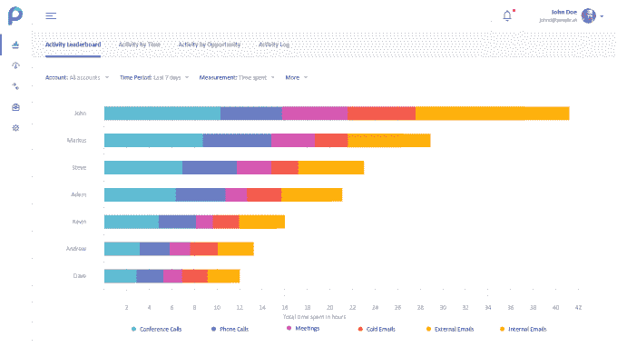

# People.ai 正在使用机器学习来重写销售运营剧本 

> 原文：<https://web.archive.org/web/https://techcrunch.com/2016/08/02/people-ai-is-using-machine-learning-to-rewrite-the-sales-ops-playbook/>

将机器学习算法引入销售业务的公司 People.ai 正在悄然崛起。该平台使用机器学习技术为销售代表提供所谓的预测剧本，告诉他们如何根据过去的成功达成交易。People.ai 还向经理们展示团队成员在这一标准方面的表现。该公司是 Y Combinator 夏季批次的一部分。

People.ai 试图解决的问题是缺乏销售人员的数据。联合创始人兼首席执行官 Oleg Rogynskyy 将销售成功的过程与开发人员的过程进行了比较，他解释说:“当你在查看开发人员的工作时，你知道他们是如何思考的，因为你可以查看他们的代码和 GitHub。你可能不知道他们到底在做什么，但你可以看到他们是怎么做的。”

凯文·杨和奥列格·罗根斯基

跟踪销售人员的过程通常相反。你可以看到他们发了多少封电子邮件，打了多少个电话，什么时候打的，这是达成交易的每一步。不知何故，它神奇地变成了收入——但几乎没有可见性。People.ai 希望为跟踪销售团队的关键数据和确定成功的原因提供基础。

该服务通过扫描电子邮件、日历、电话、WebEx、会议工具和其他数据源来工作。它记录了销售人员使用的不同平台上发生的所有事件，并确定了共同的线索。然后，它会找出它认为达成交易的最佳方式。因此，技术人员不仅能够看到销售人员做对了什么，还能看到他们哪里偏离了剧本。

这些算法已经能够发现非生产性行为，例如销售人员在交易的某些阶段没有花费正确的时间。除了帮助跟踪销售进度，People.ai 还可以用于监控入职进度和培训轨迹，并可能成为招聘人员优化招聘的有用工具。

那么，Salesforce 不是已经这么做了吗？Rogynskyy 坚持认为，使用 Salesforce 的痛点是手动数据输入和耗时的活动记录，没有人真正做到这一点，这导致了不准确的分析，并且不能反映交易进展的全部情况。People.ai 自动化了录入流程。“我们是第一批在销售人员的所有活动中获得 100%覆盖率的公司。所以这些数据是完全可靠的、一致的和标准化的。”

People.ai 目前雇佣了一个 10 多人的小团队，该产品已经被大约 50 家 B2B 公司部署。这项努力得到了 Y Combinator 和几个天使投资者的支持。

