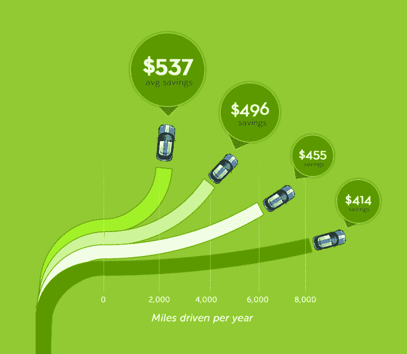
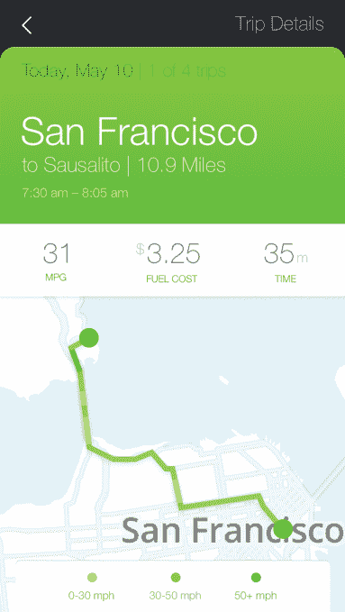

# Metromile 推出每英里汽车保险，可为加州人节省 40%的费用

> 原文：<https://web.archive.org/web/https://techcrunch.com/2014/07/16/per-mile-car-insurance/>

把 Metromile 的免费小发明插到你的车里，如果你是那 70%一年驾驶里程不到 10，000 英里的人之一，你就可以停止为汽车保险支付过高的费用。继打破俄勒冈州、华盛顿州和伊利诺伊州的传统保险后，今天[地铁](https://web.archive.org/web/20230404081202/https://www.metromile.com/)将其[每英里汽车保险](https://web.archive.org/web/20230404081202/https://techcrunch.com/2013/11/19/metromile/)扩展到[加利福尼亚州。它还改进了免费应用程序，可以告诉你你的车是否坏了，帮助你避免街道清洁罚单，找到你停车的地方，教你更好的路线和时间表，以最大限度地减少通勤时间，最大限度地提高燃油效率。](https://web.archive.org/web/20230404081202/http://blog.metromile.com/blog/2014/7/15/pay-per-mile-insurance-how-it-works)

如果你住在城市里，不经常开车，Metromile 可以让你更容易拥有一辆车。司机可以在方便的时候使用优步和 Lyft 等拼车服务，只有在需要自己的车去远足时才支付保险。

关于 Metromile 如何运作的细节，请阅读我在 11 月份发布的《深度探索》。本质上，在不知道谁开了多少车的情况下，汽车保险公司历史上不得不向大多数人多收费，以补贴高里程数的司机。

但由于移动技术的进步，Metromile 发明了一种蜂窝 GPS 远程信息处理设备，它可以插入你汽车仪表板下的诊断端口，并报告你行驶了多少英里。这家初创公司从第一轮风险投资公司、SV Angel、NEA 和 Index Ventures 获得了 1400 万美元的资金，让他们放弃了远程信息处理设备，并为一家主要的保险公司贴上了每英里系统的白标。

 Metromile 首席执行官[丹·普雷斯顿](https://web.archive.org/web/20230404081202/http://www.crunchbase.com/person/dan-preston)解释道:“与保险相关的租金的 70%来自高速行驶的汽车。很少有人会把它停在你的车库或街道上。”如果你不经常开车，你就不太可能发生保险公司必须赔偿的事故，所以地铁公司可以少收你一些钱。

普雷斯顿告诉我，“如果你每年行驶不到 5000 英里，换成 Metromile，你的汽车保险将节省 40%到 50%”。

与此同时，其他保险公司则被其陈旧的商业模式所束缚。如果他们提供每英里保险，他们所有的现金牛低里程司机将转向它，他们将不得不向高里程司机收取更高，更公平的费率。基本上他们的整个系统都会崩溃。

这种情况无论如何都有可能发生，因为那些利润丰厚的低里程数司机会溜到每英里数提供商那里去。该公司告诉我“不到一百万人”已经在使用 Metromile 的保险，尽管总共只有大约 2400 万人可以使用。

这仍然是一个艰难的销售过程。Metromile 没有值得信赖的品牌认知度，尽管它的后端由一家稳定的 80 亿美元的保险公司管理。这是一笔可以吓得人们不敢做决定的大额购买。赠送这些设备并不便宜，而且大多数人都高估了他们的驾驶量，直到他们插上这些设备中的一个。

不过，我会换成地铁。我住在旧金山，喜欢开着自己的车去城外冒险或进行史诗般的旅行。但是在城里，我经常玩滑板或者乘坐优步和 T2 地铁。我花了太多的保险费，而我的车却停在车库里，补贴一些不停开车的陌生人。但不会了。

*加州、俄勒冈州、华盛顿州和伊利诺伊州的司机现在可以获得两分钟报价，并注册 Metromile 的每英里保险，如果这能为他们省钱的话。*